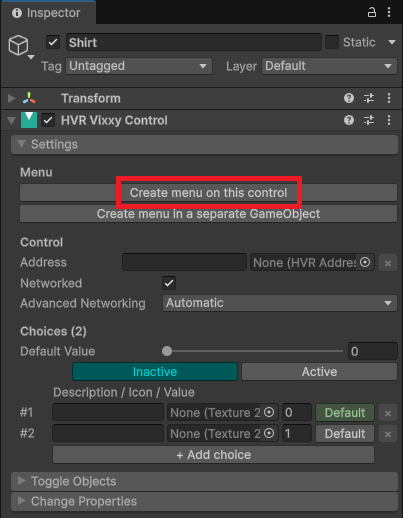
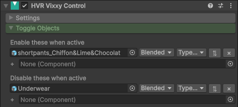
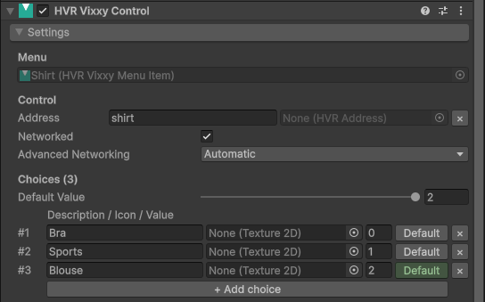
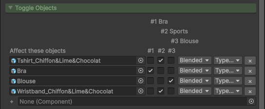
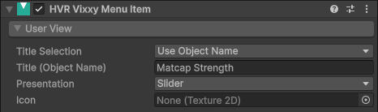
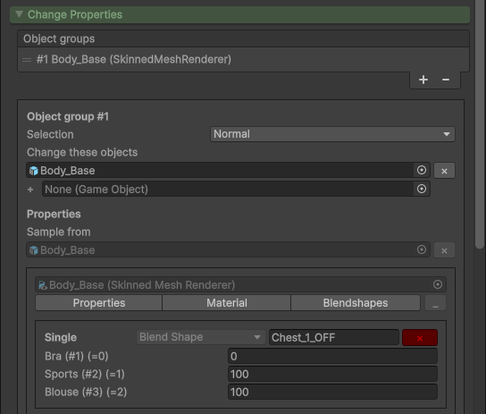

# Vixxy (Development branch)

import {HaiTags} from "/src/components/HaiTags";
import {HaiTag} from "/src/components/HaiTag";
import {HaiVideo} from "/src/components/HaiVideo";

<HaiTags>
<HaiTag requiresBasis={true} />
</HaiTags>

:::danger
This is the documentation for the development branch of Vixxy, which is **not** available in the Basis Demonstration software and repository yet.
:::

*Vixxy* is a user-accessible interface to toggle or trigger effects on an avatar in Basis.

This component is primarily intended to be used through the Unity inspector directly by non-programmer users.

<HaiVideo src="../img/gX02sy0QQp-f.mp4"></HaiVideo>

## Install

:::danger
This is the documentation for the development branch of Vixxy, which is **not** available in the Basis Demonstration software and repository yet.
:::

Vixxy is included by default with the official Basis Framework repository, in the `Basis/Packages/dev.hai-vr.basis.comms/` folder,
since the 1st of May 2026.

If you are a participant in the Basis Demo application, follow the regular instructions for making avatars.

## Create a toggle

Create a new GameObject in your avatar and add a **HVR Vixxy Control** component to it.

Then in the *Settings* category, click the *"Create menu on this control"* button.

:::warning
This documentation will skim through the configuration; some options will not be explained as they will only become useful later
in the development of Vixxy.

Therefore, you do not need to touch anything else in the *Settings* category.
- Leave the *Address* field empty.
- Keep the *Networked* setting checked.
:::

:::info
**TODO: Replace this graphic**

:::

Drag objects into the *Toggle Objects* category.

Checkboxes will appear next to each object. The checkbox defines the visibility of the object for each choice.

- The #1 corresponds to the menu being **OFF**. Checking that makes the object visible when the menu is turned OFF. Unchecking makes it invisible when OFF.
- The #2 corresponds to the menu being **ON**. Checking that makes the object visible when the menu is turned ON. Unchecking makes it invisible when ON.

If you want to toggle a component instead of the object itself, drag the object into the *Toggle Objects* category, and then choose the desired component in the dropdown.

:::info
**TODO: Replace this graphic**

:::

## Use more than two choices

If you want more than two choices, open the *Settings* category and click the *"+ Add choice"* button.

After adding choices, you should give each choice a description. This description will be displayed in the menu.

Toggles will be displayed with more checkboxes for each new choice (#3, #4, etc.). Tick or untick the checkboxes to affect the state
of each object depending on the choice.

## Menu

You may change the type of menu through the component created earlier when you clicked the *"Create menu on this control"* button,
in the *HVR Vixxy Menu Item* component.

There are three different types of controls achievable:
- A toggle between two choices (OFF/ON).
- A dropdown selection between three choices or more.
- A slider, which can be used between any number of choices.

These controls are accessible in-app through *"Settings > Avatar Customization"*:

## Change Properties

If you need to change the value of blendshapes or change the values inside shaders, open the *Change Properties* category.

### Create the first object group

In the Properties category, click + to create a group.

Drag the objects to change into that group.

### Search for properties

In the components that will show up below, click one of *Properties*, *Materials*, *BlendShapes* to start looking for properties to affect.

A search field will appear at the top. Type a few letters corresponding to the property you're looking for, and press the *"Add"* button to add it.

When done, press the _ button at the top right to minimize the search.

You can then edit the property.

### Available functions

The following is possible as of the current version:
- ✅ Toggle GameObjects and many Component types ON/OFF (using the *Toggle Objects* section previously explained).
- ✅ Change the value of blendshapes.
- ✅ Change float values in material properties.
- ✅ Change color values in material properties.
- ✅ Change texture slots in material properties.
- ✅ Change the text string of a TextMeshPro / TextMeshProUGUI / Text component, with float number formatting.

The following is not yet available as of the current version.
- ❌ Cannot change material slot in a Renderer.
- ❌ Cannot change any other property.
- ❌ Cannot translate, scale, or rotate objects.

### Multiple object groups

If you need to change the properties of different objects in a different way, press + to create another group.

### Display a number inside TextMeshPro

The text inside TextMeshPro components and Text components can be modified. Here are some examples to get you started:

You can display absolute values using `{0}`, `{0:0}`, or `{0:0.00}`.

For a value of 93.1234:

- `Heart rate: {0}` shows *Heart rate: 93.1234*
- `Heart rate: {0:0}` shows *Heart rate: 93*
- `Heart rate: {0:0.0}` shows *Heart rate: 93.1*
- `Heart rate: {0:0.00}` shows *Heart rate: 93.12*

If your values use 0.0 to represent 0% and 1.0 to represent 100%, they can be displayed as a percentage
using `{1}`, `{1:0}`, or `{1:0.00}`. You do not need to display the percent sign if you wish not to.

For a value of 0.123456:

- `Power: {1}%` shows *Power: 12.3456%*
- `Power: {1:0}%` shows *Power: 12%*
- `Power: {1:0.0}%` shows *Power: 12.3%*
- `Power: {1:0.00}%` shows *Power: 12.34%*

A period `.` will always be displayed for the decimal separator, even if the computer OS language is set to French.

## Additional settings

### Networking

When the **Networked** option is checked, the state of this object will be made visible to other users.

The *Advanced Networking* dropdown currenlty has no effect.

## Transitions

:::info
This feature is introduced starting from NEW_VIXXY_VERSION.
:::

You can choose to introduce a transition duration before your toggle turns completely ON and OFF.

- **Smooth towards value**: The transition starts quickly and progresses slower as it reaches the target value.
  - This is great for sliders or some controls where the intermediate values are as relevant as the ones at the extremes.
- **Linear towards value**: The transition progresses linearly towards the value.
  -  This is nice for both toggles and sliders.
- *Linear towards value* is nicely combined with **Curve**: The input value can be remapped to follow a curve.
  - Combining *Linear towards value* with *Curve* is great for toggles, but not great for sliders.
  - When combining with *Linear towards value* with *Curve*, the *Curve* should usually be the last item in the list.

**Curve** can also be used independently, without any transition duration effect if you want to apply some particular thresholding on the input value.

## Special inputs

Toggling and triggering effects on the avatar are not limited to menus.

### Voice

:::info
This feature is introduced starting from NEW_VIXXY_VERSION.
:::

Effects can be triggered based on your voice.

After creating a control, instead of clicking the *"Create menu on this control"* button, click a button under the **Voice** category.

:::note
Voice effects depend on your audio range settings. If the person wearing the avatar is outside someone else's audio range, that other person
may not see the effect that would be normally be triggered by the voice.
:::

### Measurements

:::info
This feature is introduced starting from NEW_VIXXY_VERSION.
:::

The **HVR Measure** component can be used to measure things on the avatar. The resulting values may be used to trigger effects on your avatar.

#### Measurement types

- **Distance**: Measures the distance between two objects.
- **Angle**: Measures the angle between three objects in degrees.
- **Rotation**: Measures the difference in the rotation of two objects.
- **Raycast**: Measures the raycast distance to a collider.
- **Speed**: Measures the speed of an object.

#### Remap

*Remap* changes the input range to the output range.

For example, in the case of an *Angle* measurement, remapping from (30, 180) to (0, 1) will make the angle of
30 degrees output 0.0, and the angle of 180 degrees output 1.0. The angle of 105 degrees, which is halfway between 30 degrees and 180 degrees, will be 0.5.

The *Clamp to bounds* checkbox limits the output range to that specific range. Taking the same example as above, an angle of 0 degrees would become 0.0 when *Clamp to bounds* is checked,
or an angle of 0 degrees would become -0.2 when *Clamp to bounds* is unchecked.
