import {HaiTags} from "/src/components/HaiTags";
import {HaiTag} from "/src/components/HaiTag";
import {HaiStartingFromTag} from "/src/components/HaiStartingFromTag";
import {HaiVideo} from "/src/components/HaiVideo";

# Toggle or trigger effects using Vixxy

<HaiTags>
<HaiTag requiresBasis={true} />
</HaiTags>

**Vixxy** is a user-accessible interface to toggle or trigger effects on your avatar in Basis.

It is primarily intended to be used through the Unity inspector directly by **non-programmer users**.

<HaiVideo src="../img/gX02sy0QQp-f.mp4"></HaiVideo>

Effects may be triggered based on the menu, voice, various measurements on the avatar, face tracking, or inputs received from external hardware and software.

It can toggle objects ON and OFF, change shader material settings, blendshapes, textures inside materials, and the text inside TextMeshPro components.

<HaiVideo src="./img/bdH9zKqkQE-f.mp4"></HaiVideo>

## Install

*Vixxy* is included by default with the official Basis Framework repository, in the `Basis/Packages/dev.hai-vr.basis.comms/` folder,
since the 1st of May 2026.

If you are a participant in the Basis Demo application, follow the regular instructions for making avatars.

## Preface for developers

*Vixxy* is **one of various ways** to create effects in Basis. Although it is primarily designed to be accessible for non-programmer users, it can be used by developers as well.

That said, if you are a software developer, you may consider using other approaches:
- Directly use the Basis Framework avatar communication API if you are an application developer, or
- Consider using scripting through [Cilbox](https://docs.basisvr.org/en/docs/scripting/scripting) to modify GameObjects and Components directly.

The networking of *Vixxy* is built using the Basis Framework avatar communication API; the rest is just plain Unity software.
A large portion of the *Vixxy* code can be used in single-player without depending on any of the Basis Framework APIs.

## Create a toggle with a menu

Create a new GameObject in your avatar and add a **HVR Vixxy Control** component to it.

In *What activates this control* click *Select...* and choose **Menu Item**. Clicking this button will automatically create a **HVR Vixxy Menu**
component above this one.

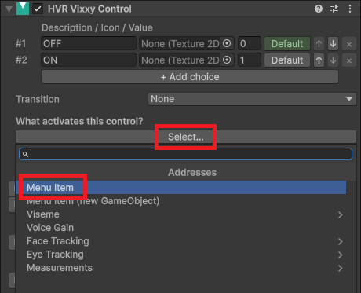

Drag objects into the *Toggle Objects* category.

Checkboxes will appear next to each object. The checkbox defines the visibility of the object for each choice.

- The #1 corresponds to the menu being **OFF**. Checking that makes the object visible when the menu is turned OFF. Unchecking makes it invisible when OFF.
- The #2 corresponds to the menu being **ON**. Checking that makes the object visible when the menu is turned ON. Unchecking makes it invisible when ON.

To change the default value of the menu, click the **Default** button of the corresponding choice at the top.

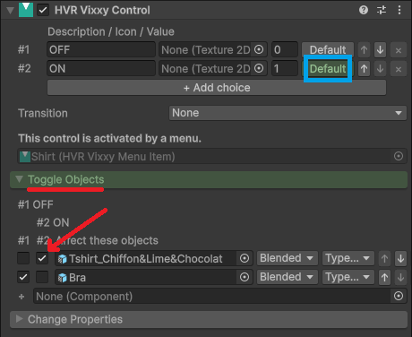

If you want to toggle a component instead of the object itself, drag the object into the *Toggle Objects* category, and then choose the desired component in the dropdown.

:::note
When you added the *HVR Vixxy Control* component, it should have added a prefab in your avatar called *HVR.Networking*.

This component is responsible for the network communication of your avatar. Keep this prefab at the root.
:::

## Use more than two choices

If you want more than two choices, click the *"+ Add choice"* button at the top.

After adding choices, you should give each choice a description. This description will be displayed in the menu.

Toggles will be displayed with more checkboxes for each new choice (#3, #4, etc.). Tick or untick the checkboxes to affect the state
of each object depending on the choice.

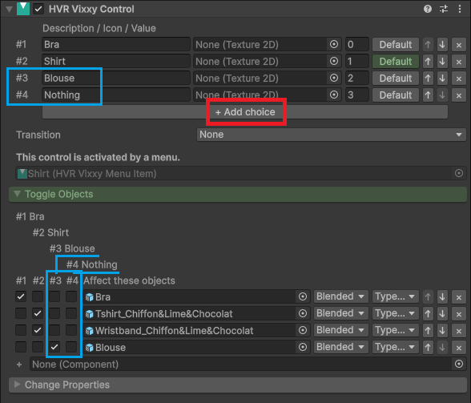

## Configure the menu

You may change the type of menu through the component that was created earlier in the *HVR Vixxy Menu Item* component.

There are three different types of controls achievable:
- A toggle between two choices (OFF/ON).
- A dropdown selection between three choices or more.
- A slider, which can be used between any number of choices.

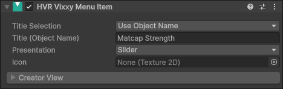

:::info
Menus are not the only way to toggle objects and trigger effects. Effects can also be triggered using various measurements or the voice.

This is explained later on this page, documented in **[Trigger effects without a menu](#trigger-effects-without-a-menu)**.
:::

These controls are accessible in-app through *"Settings > Avatar Customization"*:

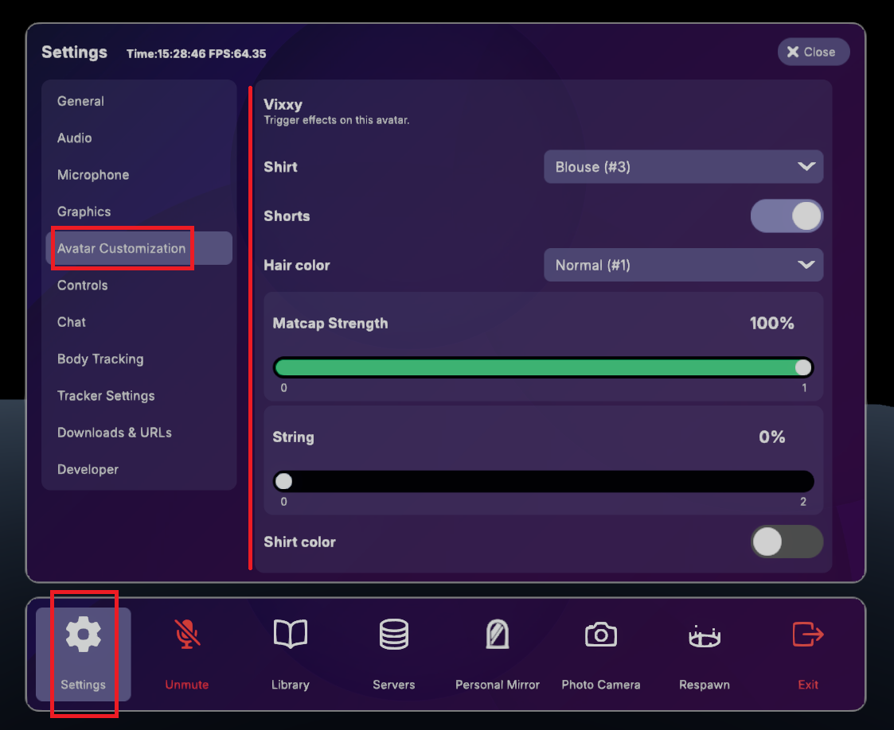

## Change properties (blendshapes, shader, ...)

If you need to change the value of blendshapes or change the values inside materials to affect the shaders, open the *Change Properties* category.

### Create the first object group

In the *Properties* category, click + to create a group.

Drag the objects you want to change into that group.

### Search for properties

In the components that will show up below, click one of *Properties*, *Materials*, *BlendShapes* to start looking for properties to affect.

A search field will appear at the top. Type a few letters corresponding to the property you're looking for, and press the *"Add"* button to add it.

When done, press the _ button at the top right to minimize the search.

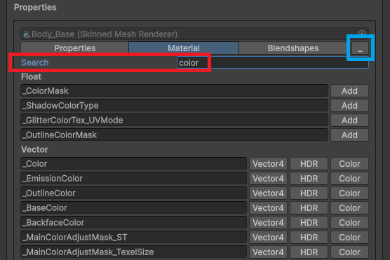

### Edit the property

Edit the property by giving a different value for each choice.

You can press the downwards arrow button `⤓` at the right of the value to sample the current value from the scene.

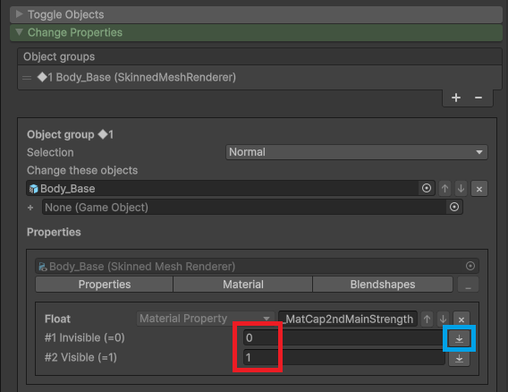

### Available functions

The following is possible as of the current version:
- ✅ Toggle GameObjects and many Component types ON/OFF (using the *Toggle Objects* section previously explained).
- ✅ Change the value of blendshapes.
- ✅ Change float values in material properties.
- ✅ Change color values in material properties.
- ✅ Translate, rotate, or scale objects. <HaiStartingFromTag version={"21st of May 2026"} small={true} />

The following is possible and worth a special mention as they were not possible if you were used to animation-based systems:
- ✅ Change texture slots in material properties.
- ✅ Change the text string of a TextMeshPro / TextMeshProUGUI / Text component, with float number formatting.

The following is not yet available as of the current version.
- ❌ Cannot change material slot in a Renderer.
- ❌ Cannot change any other property.

### Multiple object groups

If you need to change the properties of different objects in a different way, press + to create another group.

### Display a number inside TextMeshPro

The text inside TextMeshPro components and Text components can be modified. Here are some examples to get you started:

You can display absolute values using `{0}`, `{0:0}`, or `{0:0.00}`.

For a value of 93.1234:

- `Heart rate: {0}` shows *Heart rate: 93.1234*
- `Heart rate: {0:0}` shows *Heart rate: 93*
- `Heart rate: {0:0.0}` shows *Heart rate: 93.1*
- `Heart rate: {0:0.00}` shows *Heart rate: 93.12*

If your values use 0.0 to represent 0% and 1.0 to represent 100%, they can be displayed as a percentage
using `{1}`, `{1:0}`, or `{1:0.00}`. You do not need to display the percent sign if you wish not to.

For a value of 0.123456:

- `Power: {1}%` shows *Power: 12.3456%*
- `Power: {1:0}%` shows *Power: 12%*
- `Power: {1:0.0}%` shows *Power: 12.3%*
- `Power: {1:0.00}%` shows *Power: 12.34%*

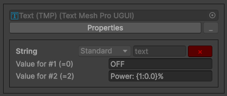

A period `.` will always be displayed for the decimal separator, even if the computer OS language is set to French.

## Transitions

<HaiTags><HaiStartingFromTag version={"21st of May 2026"} /></HaiTags>

You can choose to introduce a transition duration before your toggle turns completely ON or OFF.

The **Transition** setting is always shown, and it is located at near top, under the choices. There is no transition by default.

### Simplified Transition

By setting the **Transition** setting to **Simplified**, you can specify a transition duration in seconds.

The transition duration is the time it takes to go from the choice with the minimum value to the choice with the maximum value.

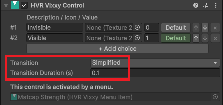

### Advanced Transitions

By setting the **Transition** setting to **Advanced**, a new tab will be shown in the **Advanced** section called **Advanced Transition**.

- **Smooth towards value**: The transition starts quickly and progresses slower as it reaches the target value.
    - This is great for sliders or some controls where the intermediate values are as relevant as the ones at the extremes.
- **Linear towards value**: The transition progresses linearly towards the value.
    -  This is nice for both toggles and sliders.
- *Linear towards value* is nicely combined with **Curve**: The input value can be remapped to follow a curve.
    - Combining *Linear towards value* with *Curve* is great for toggles, but not great for sliders.
    - When combining with *Linear towards value* with *Curve*, the *Curve* should usually be the last item in the list.

The *Simplified* transition uses two filters:
- On the first slot: *Linear towards value* with a Seconds Per Unit equal to `(Maximum - Minimum) * TransitionDuration`
- On the second slot: *Curve* equal to going from `t=Minimum, value=Minimum` to `t=Maximum, value=Maximum`, in an ease in-out shape.

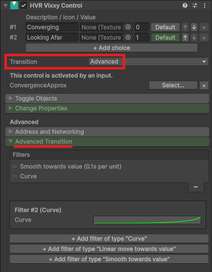

#### Add a transition curve

In the **Transitions** section, **Curve** can also be used independently, without any transition duration effect if you want to apply some particular
thresholding on the input value.

It is not recommended to use a transition curve when using *Smooth towards value*.

#### Seconds per unit

The transition duration is defined in **seconds per unit**, but in many cases you can think of it as being the same as the **transition duration in seconds** and leave it at that.

If you want the transition to take 0.5 seconds, then set it to 0.5.

:::note
Here are the gritty details: It means the seconds it takes to go from a value of 0 to a value of 1.

If you have only two choices, such as in the case of a simple toggle, and you kept the default values for the choices, then *duration in seconds per unit* just means **duration in seconds**:
- a transition from the value of 0 to 1 would take 1 second at *1 second per unit*,
- a transition from the value of 0 to 1 would take 0.5 seconds at *0.5 second per unit*.

**However,** when you have a multiple-choice slider, each choice is assigned a value, and if you have not changed the value of the choices, those values may be 0, 1, **2**. In this case:
- a transition from the value of 0 to **2** would take 2 seconds at *1 second per unit*,
- a transition from the value of 0 to **2** would take 1 second at *0.5 second per unit*.

You could also change the choice values to become 0, 0.5, 1, or anything you'd like.
:::

## Trigger effects without a menu

<HaiTags><HaiStartingFromTag version={"21st of May 2026"} /></HaiTags>

Toggling and triggering effects on the avatar are not limited to menus.

### Face Tracking

If you use face tracking on your avatar, you can specify existing face tracking addresses to trigger an effect on your avatar, such as connecting
the ears of your avatar to the expression of your mouth, for example `FT/v2/MouthStretchLeft`.

Use the *Select...* button, then open the *Face Tracking* category to choose the address you want to use.

If you want to learn more, see [Face Tracking addresses](./face-tracking-addresses).

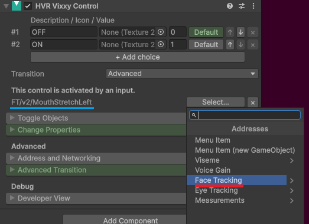

### Voice

Effects can be triggered based on your voice.

- If you want to trigger an effect based on your voice gain, click the *Select...* button, then select *Voice Gain*.
- If you want to trigger an effect based on a specific viseme, click the *Select...* button, then open the *Viseme* category to choose the address you want to use.

:::note
Voice effects depend on audio range settings. If the person wearing the avatar is outside someone else's audio range, that other person
may not see the effect that would normally be triggered by the voice.
:::

### Measurements

The **HVR Measure** component can be used to measure things on the avatar. The resulting values may be used to trigger effects on your avatar.

- **Distance**: Measures the distance between two objects.
- **Angle**: Measures the angle between three objects.
- **Rotation Difference**: Measures the difference in the rotation of two objects.

*Additional measurement types may be available in the future, such as Speed and Raycast.*

To learn more, [see the page about the Measure component](/docs/basis/avatar-customization/measure).

<HaiVideo src="./img/bdH9zKqkQE-f.mp4"></HaiVideo>

## Additional settings

### Networking

When the **Networked** option is checked, the state of this object will be made visible to other users.

The *Advanced Networking* dropdown currently has no effect.
