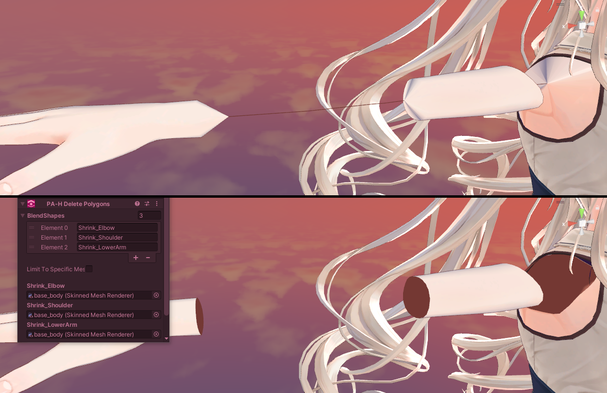

---
title: Prefabulous Avatar
---

## 1.9.0

### Update [Assign UV Tile](/docs/products/prefabulous-avatar/hai-components/assign-uv-tile)

Add "Entire Mesh" mode to "Assign UV Tile":
- UV Tile can now be assigned to an entire MeshRenderer or SkinnedMeshRenderer.
- There is now a mode selection between BlendShapes and EntireMesh.
- If a mesh is used by both a EntireMesh component and a BlendShapes component, EntireMesh is applied first, so that the BlendShapes components can further refine into other UV tiles.

(NDMF Compatibility) Make sure UV Tile assignments are done before any large scale mesh optimization causes a loss of reference:
- Delete Polygons now runs before com.anatawa12.avatar-optimizer
- Assign UV Tile now runs before com.anatawa12.avatar-optimizer

## 1.8.0

### Update [Recalculate Normals](/docs/products/prefabulous-avatar/hai-components/recalculate-normals)

Recalculate Normals should now properly work on avatars that were not posed like the model, or had a different orientation than the model.

## 1.7.1

Assign UV tile has been rectified to work with shaders like SCSS that expect the UVs to be shifted rather than overridden.

This patch was pushed before any 1.7.0 social media announcement.

## 1.7.0

### New component: [Assign UV Tile](/docs/products/prefabulous-avatar/hai-components/assign-uv-tile)

A new component, [Assign UV Tile](/docs/products/prefabulous-avatar/hai-components/assign-uv-tile), has been added to Prefabulous Avatar.

Sets the UV Tile of vertices that are moved by a blendshape.

This is meant to be used in tandem with shader features, especially [Poiyomi Toon UV Tile Discard](https://www.poiyomi.com/special-fx/uv-tile-discard),
and may also be used with [SCSS's Inventory System](https://gitlab.com/s-ilent/SCSS/-/wikis/Manual/Inventory-System).

<video controls muted width="816">
    <source src={require('/docs/products/prefabulous-avatar/img/13rQ7HGwPr.mp4').default}/>
</video>

### Technical notes

Add Assign UV Tile:
- Assign UV Tile will change the UVs of vertices moved by a blendshape.
- This component is built to closely match Poiyomi "UV Tile Discard" feature.
- It uses the same vertex selection algorithm as Delete Polygons.
- The UV tile has an offset of 0.5.

### Update [Delete Polygons](/docs/products/prefabulous-avatar/hai-components/delete-polygons)

Delete Polygons now has Keep Partial Polygons option:
- Add "Keep Partial Polygons" option.
- When "Keep Partial Polygons" is enabled, vertices of blendshapes that are marked as such will be preserved if that vertex is still connected to a triangle that has at least one vertex that is not deleted.
- In effect, this preserves polygons that are still connected to the rest of the mesh.
- This might help with some avatar models that rely on the conflict prevention blendshape to intersect polygons with clothing.

## 1.6.0

### New component: [Delete Polygons](/docs/products/prefabulous-avatar/hai-components/delete-polygons)

A new component, [Delete Polygons](/docs/products/prefabulous-avatar/hai-components/delete-polygons), has been added to Prefabulous Avatar.

Delete polygons affected by conflict prevention blendshapes, and other unused decorations hidden inside the mesh
(such as star-shaped eyes and other eye decorations; piercings, bandages, and other accessories).

### Technical notes

Add Delete Polygons:
- Delete Polygons will delete polygons associated with moved vertices of a blendshape.
- It will not delete polygons if the vertex of that blendshape is not moved, even if the normal or tangent changes.
- Portions of d4rkpl4y3r's https://github.com/d4rkc0d3r/d4rkAvatarOptimizer (MIT License) is used as a reference for the mesh reconstruction.

### Other

Make Recalculate Normals editor animator introspection aware of Prefabulous components:
- Recalculate Normals editor introspects animators from the descriptor, however, it was not aware of Prefabulous Blank/Replace Animator components.
- It no longer introspects playable layers affected by Blank Animator components.
- It no longer introspects playable layers affected by Replace Animator components.
- It now introspects the controllers from Replace Animator components.

### Special thanks

- [d4rkpl4y3r](https://github.com/d4rkc0d3r/) for the references on [mesh reconstruction](https://github.com/d4rkc0d3r/d4rkAvatarOptimizer)!

## 1.5.0

### New component: [HaiXT Generate Blendshapes for Face Tracking Extensions](/docs/products/prefabulous-avatar/hai-components/haixt-generate-blendshapes-for-face-tracking-extensions)

A new component, [HaiXT Generate Blendshapes for Face Tracking Extensions](/docs/products/prefabulous-avatar/hai-components/haixt-generate-blendshapes-for-face-tracking-extensions), has been added to Prefabulous Avatar.

If you have an avatar that already supports face tracking, this will generate additional non-standard blendshapes for use with [HaiXT Face Tracking Extensions](/docs/products/prefabulous-avatar/hai-components/haixt-face-tracking-extensions).

When your eyes are closed, the shape of your eyes will change when you're smiling.

<video controls muted width="816">
<source src={require('/docs/products/prefabulous-avatar/img/smile-f.mp4').default}/>
</video>

### Fixes

- Try to fix compatibility issues with Unity 2019.

### Technical notes

Add Generate Blendshapes for Face Tracking Extensions:

- Generate Blendshapes for Face Tracking Extensions can add extension blendshapes to avatar that already support face tracking.
- Add support for generating the HaiXT_EyeClosedInverse_Smile blendshapes.
- The blendshapes will be generated only under these conditions:
  - the face mesh must be called Body, and
  - the avatar must already have EyeClosedLeft or EyeClosedRight blendshapes, and
  - the avatar must NOT already have the HaiXT_EyeClosedInverse_SmileLeft or HaiXT_EyeClosedInverse_SmileRight blendshapes
- All of these evaluations are done right before this NDMF handler executes:
  - These conditions do not need to be true during Edit mode.
  - A non-destructive processor running before this NDMF handler may still be able to cause these conditions to pass, or conversely, invalidate it.

In addition:
- Recalculate Normals NDMF handler is now constrainted to run after PrefabulousHaiGenerateBlendshapesFTEPlugin.

## 1.4.0

### Update [Recalculate Normals](/docs/products/prefabulous-avatar/hai-components/recalculate-normals)

Recalculate Normals now has [Erase Custom Split Normals](/docs/products/prefabulous-avatar/hai-components/recalculate-normals#option-erase-custom-split-normals) option:
- Add "Erase Custom Split Normals" option.
- When "Erase Custom Split Normals" is enabled, the recalculation will perform a second pass where all vertices that have a non-zero delta pos or a non-zero recalculated delta normals will have new deltas calculated: instead of calculating the difference from the base recalculated mesh, it will calculate the difference from the original mesh.
- In effect, this erases custom split normals data for that blendshape.
- Since this only affects some vertices (non-zero delta pos or a non-zero recalculated delta normals), this prevents incorrect delta normals from contaminating unrelated vertices in the mesh.

:::danger
Enabling Erase Custom Split Normals can lead to **worse results** in meshes that don't have custom split normals.

Only give this a try on blendshapes where shading defects are clearly visible only after you've tried Recalculate Normals first without this option.

In all other cases, **keep this option off!**

For more details, [please consult the Erase Custom Split Normals documentation](/docs/products/prefabulous-avatar/hai-components/recalculate-normals#option-erase-custom-split-normals).
:::

### Update [Change Avatar Scale](/docs/products/prefabulous-avatar/component-reference/change-avatar-scale)

Change Avatar Scale now uses the Avatar Descriptor view position as the source size:
- ChangeAvatarScale reads the Avatar Descriptor view position Y coordinate and uses it as the source size.
- This is now the default behaviour.
- Old behaviour can be restored by checking "Custom Source Size".

### Fixes

- Edit Mesh Anchor Override: Fix NDMF PrefabulousEditAllMeshAnchorOverridePlugin build step is now correctly named "Edit Mesh Anchor Override".
- Update Recalculate Normals conflict prevention filter to include "hidemesh_".
- Fix Recalculate Normals will no longer process the same blendshapes multiple times when they are specified multiple times.

## 1.3.0

### New component: [Recalculate Normals](/docs/products/prefabulous-avatar/hai-components/recalculate-normals)

A new component, [Recalculate Normals](/docs/products/prefabulous-avatar/hai-components/recalculate-normals), has been added to Prefabulous Avatar.

This component improves the shading of SkinnedMeshRenderers by recalculating select blendshape normals (and tangents).

<video controls width="816" autostart="false">
    <source src={require('/docs/products/prefabulous-avatar/img/mS1cQ7EheE.mp4').default}/>
</video>

### Technical notes

- Recalculate Normals will recalculate select blendshape normals of SkinnedMeshRenderers (and tangents).
- Blendshape delta normals (and tangents) are usually zero on avatar uploads.
  - This may cause the avatar shading to look abnormal, especially on blendshapes that flatten part of the body, or significantly push it out.
- This component attempts to recalculate normals of individual blendshapes by doing the following:
  - Bake a static mesh of a SMR mesh when 0 blendshapes are running
  - Build a data structure describing vertices that have same position and normal
  - Use [RecalculateNormals](https://docs.unity3d.com/ScriptReference/Mesh.RecalculateNormals.html). This is done even when 0 blendshapes are active, so that the delta is calculated based on Unity's judgement of what's the normal data at rest.
  - Using that previous data structure, rebuild normal data by averaging and renormalizing vertex normals that had the same position and normal
    - This is done to fix an issue where an artist-authored vertex is part of an UV seam, causing the mesh data to split that vertex into multiple, effectively causing the RecalculateNormals output to have different normals for that vertex.
  - Use [RecalculateTangents](https://docs.unity3d.com/ScriptReference/Mesh.RecalculateTangents.html).
  - Do all of the above again for each blendshape to recalculate, and use that to calculate a delta normal and a delta tangent.
  - Once all blendshapes are processed, effectively rewrite all of the mesh blendshapes with these modifications.

## 1.2.1

- Fix a compatibility issue with Unity 2022
- Allow installation with VRChat Avatars SDK 3.5.x

## 1.2.0

First public experimental release.
