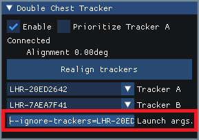

# Double Hip Tracker

Double Hip Tracker lets you use two hip trackers on VRChat.

When one of the trackers temporarily loses tracking, the other one is used instead.

This uses VRChat’s OSC trackers, and therefore is only compatible with VRChat and not any other VR application.

## Download

Double Hip Tracker is currently available to Patreon supporters at any tier ([https://www.patreon.com/vr_hai](https://www.patreon.com/vr_hai)).

## **Installation instructions**

- If you don't have it already, download .NET 7.0 Runtime "Run console apps" [https://dotnet.microsoft.com/en-us/download/dotnet/7.0/runtime](https://dotnet.microsoft.com/en-us/download/dotnet/7.0/runtime)
- Download the application on Patreon

## How to use

- Start SteamVR
- Start `double-hip-tracker.exe`
- Wear your double hip tracker; ideally the trackers should be on opposite sides of the belt, but they don't have to
- Shake your hips for 2 seconds and the OSC tracker should appear
- In VRChat, click Calibrate

## O**ther info**

- You must enable OSC in VRChat, Settings > Avatars > OSC
- In VRChat, Settings > Tracking and IK, make sure you lower the calibration radius so that the double hip trackers don't try to bind themselves as being a chest tracker
- If you need to readjust your tracking belt because some of your trackers have moved, you may need to click the "Realign trackers" button on the window, and maybe recalibrate in VRChat

## Optional: Double Chest Tracker

In addition to the Double Hip Tracker, you can also enable the Double Chest Tracker.

### Configuration of the Double Chest Tracker

Once enabled, you need to select the serial numbers of your two chest trackers by hand.

You can find out which tracker is the correct one by spinning your tracker quickly, and an indicator `<<<` will show up in the list of available hardware.

[Spin your tracker to find it using the <<< indicator](double-hip-tracker-img/double-hip-tracker_pFdyyLdeVF.mp4)

Spin your tracker to find it using the <<< indicator

### Ignore trackers in VRChat

If you try to calibrate in VRChat, there is no guarantee that our Double Chest Tracker will be the one bound to the chest in VRChat. Unlike the hip, there is a good chance that one of the two hardware trackers will be closer to the chest than our tracker.

To fix this, you need to tell VRChat to ignore the serial numbers of your trackers.

On the Double Chest Tracker tab panel, select and copy the line called *Launch args.*

On your Steam library, right click VRChat, and select *Properties…*

Paste the line you copied in the Launch options, and make sure the serial numbers are correct (for example, the last characters could be missing).

Once done, VRChat should no longer try to bind to those hardware trackers during calibration.

### Optional: Prioritize Tracker A

If you are wearing your two chest trackers in locations where one of the trackers is more advantageous than the other in terms of tracking quality, you can choose to Prioritize Tracker A.

For example, if you’re wearing a tracker on the chest like you normally would, and a tracker somewhere below your armpit, it could be advantageous to prioritize the tracker located on the chest.

Select the serial number of the tracker that has a better position in the **Tracker A** slot.

Check the Prioritize Tracker A checkbox.

By using Prioritize Tracker A, the Double Chest Tracker will be positioned at the same position as the Tracker A. It will no longer act as an average measurement of the two chest trackers.

The position of the Tracker B will be ignored completely, unless Tracker A loses tracking.

When Tracker A loses tracking, the position of the Tracker A will be simulated using the known position of the Tracker B.

You must tell VRChat to [ignore the serial number of the trackers](https://www.notion.so/Double-Hip-Tracker-8a4f8784444344c89edd561f2b8efbab?pvs=21) when using Prioritize Tracker A.

# FAQ

### What counts as a loss of tracking?

Whenever a tracker loses sight of the lighthouses, or the tracker loses radio signal, or the tracker turns off, it is considered as a loss of tracking.

Double Hip Tracker only makes use of the internal tracker status provided by the driver to figure out if a tracker has been lost (`Running_OK` status).

It doesn’t guess if a tracker has been lost in any other way. In particular, if your room has reflective surfaces, or if SteamVR thinks the tracker is healthy but still incorrectly estimates the position of a tracker, Double Hip Tracker will not be able to help during those situations.

### Can it be used alongside IMU-based trackers/pose estimators?

No, you should not use it alongside IMU-based trackers or pose estimators. The majority of IMU-based trackers rely on a pose estimator software, so any tracker mixing should be handled on that pose estimator software.

If your hip is driven by a lighthouse tracker, then the pose estimator must also reposition your feet accordingly, therefore it is the job of the pose estimator to take into account lighthouse trackers.

Also, this application has only been tested with lighthouse-based trackers. I do not know if this system works or not with [self-tracking trackers](https://developer.vive.com/resources/tracker/).

### Does it run on Unity?

Double Hip Tracker is not an Unity application.

It is written in C#, and uses the OpenVR API directly, with a standalone math library.

The idea is to keep Double Hip Tracker as lightweight and as pragmatic as I can.

### Third party acknowledgements

You can find third party acknowledgements here:

[Double Hip Tracker: Third party acknowledgements](https://www.notion.so/Double-Hip-Tracker-Third-party-acknowledgements-cefe0ac8d42a4f5d9b2e3a8e4154b9e1?pvs=21)