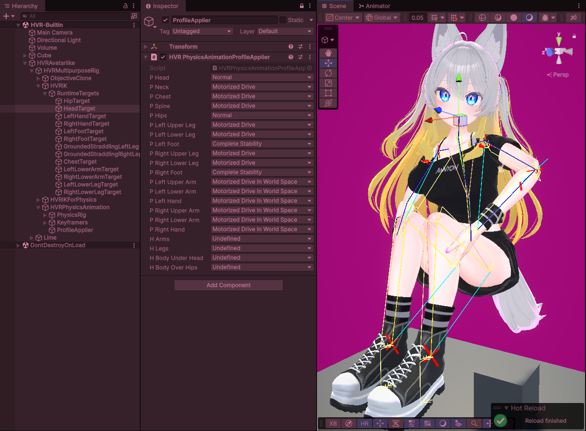

Physics Animation
=====

*Physics Animation* in HVR refers to a concept that may also be known as *powered ragdolls* or a *control rig*.

It is the act of modifying characteristics of rigidbodies and applying forces on individual rigidbodies and joints of a ragdoll
(generally humanoid) to make it match a pose.

That pose may come from an animation, or it could come from the result of an IK solver.

Different characteristics may be applied to different limbs of the ragdoll to produce different responses to physical interactions.

The *Physics Animation* components in HVR are heavily inspired by a GDC talk called [**Physics Animation in Uncharted 4: A Thief's End**
by *Michal Mach* presented at GDC 2017](https://www.youtube.com/watch?v=7S-_vuoKgR4), however, the implementation in HVR is vastly inferior
to the implementation described in the talk.

Other VR games like [Boneworks](https://store.steampowered.com/app/823500/) and [Hard Bullet](https://store.steampowered.com/app/1294760/)
are notorious for using similar forms of physics animation, so HVR is not unique in this regard.

## Physics Animation Profiles

The main way to control a Physics Animation in HVR is by setting up an *[HVR Avatarlike](avatarlike)* component,
and enabling **Use Physics Animation** in that component.

Then, in the hierarchy of the *HVR Avatarlike* object, go to:
- *HVRMultipurposeRig → HVRIK → RuntimeTargets*, and move the child targets to define a new pose.
- *HVRMultipurposeRig → HVRPhysicsAnimation → ProfileApplier*, and edit the profile settings of each limb to get the physics reaction you need.

