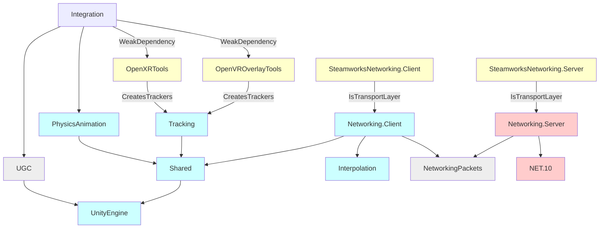

Structure
=====

```mermaid
graph TD;
    PhysicsAnimation-->Shared:::focus;
    Tracking-->Shared:::focus;
    OpenXRTools:::vendor-->|CreatesTrackers|Tracking:::focus;
    OpenVROverlayTools:::vendor-->|CreatesTrackers|Tracking:::focus;
    
    Integration-->|WeakDependency|OpenXRTools;
    Integration-->|WeakDependency|OpenVROverlayTools;
    Integration-->PhysicsAnimation:::focus;
    Integration-->UGC:::neutral;
    
    Networking.Client:::focus-->Interpolation:::focus;
    Networking.Client-->NetworkingPackets:::neutral;
    Networking.Client-->Shared:::focus;
    
    UGC-->UnityEngine:::neutral;
    Shared-->UnityEngine:::focus;
    
    Networking.Server:::server-->NetworkingPackets
    Networking.Server-->NET.10:::server;
    
    SteamworksNetworking.Client:::vendor-->|IsTransportLayer|Networking.Client
    SteamworksNetworking.Server:::vendor-->|IsTransportLayer|Networking.Server
    
    classDef disabled fill:#CCC
    classDef neutral fill:#EEE
    classDef roots fill:#FCC
    classDef focus fill:#CFF
    classDef server fill:#FCC
    classDef vendor fill:#FFC
```