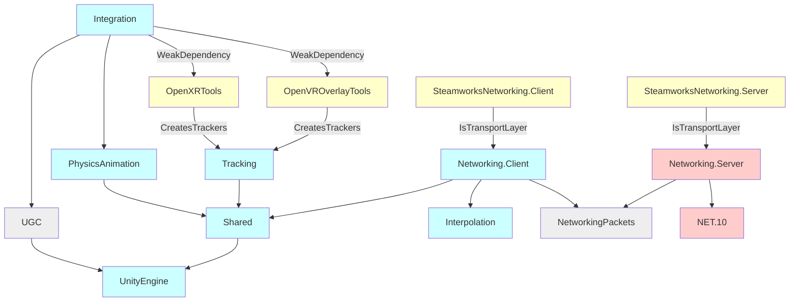

Structure
=====

*HVR* is made of three packages and one side project:
- **HVR.Core** contains all the Unity components, except the *HVRUGC* components.
- **HVR.UGC** only contains *HVRUGC* components such as the *HVRUGC Avatar* component, and is intended to be able to be installed
  separately from *HVR* if needed.
- **HVR.NetworkingPackets** contains the packets shared between the client and server.
- **HVR.Server** is a .NET 10 project that contains the server code.

Despite being a package, *HVR.Core* has many assembly definitions in it, which are described below.

