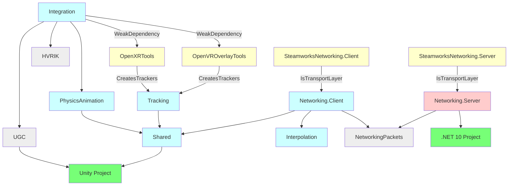

Structure
=====

*HVR* is made of three packages and one side project:
- **HVR.Core** contains all the Unity components, except the *HVRUGC* components.
- **HVR.UGC** only contains *HVRUGC* components such as the *HVRUGC Avatar* component, and is intended to be able to be installed
  separately from *HVR* if needed.
- **HVR.NetworkingPackets** contains the packets shared between the client and server.
- **HVR.Server** is a .NET 10 project that contains the server code.

*HVR* depends on one package that was previously separated from this project:
- **HVR.IK** contains the [IK solver](ik).

Despite being a package, *HVR.Core* has many assembly definitions in it, which are described below.

## Vendors

Apart from Unity itself, HVR tries to keep vendor dependencies weak so that they may be amputated from the project if necessary.
- VR/XR/Tracking:
  - *OpenXRTools* creates trackers for OpenXR through the *HVR.Tracking* module.
  - *OpenVROverlayTools* creates trackers for OpenVR through the *HVR.Tracking* module.
  - Trackers created in this way are advertised to *HVR.Integration*, which then uses them to control the VR camera, calibration, and other tracking facilities.
- Networking:
  - *Steamworks* raises incoming messages and transmits outbound messages through the *HVR.NetworkingPackets* module.
