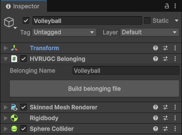

# Belonging

A personal Belonging is an item specifically **tied to a person**.

Like a smartphone or house keys, you would never leave personal belongings behind at a restaurant:
You can spawn Belongings, but **Belongings disappear when you leave the server**.

:::note
On the other hand, items like post-it notes, photos, or business cards are **not** personal belongings. It can make sense to leave
such items behind when you leave the server so that they can continue to exist and be used in your absence.

Belongings are explicitly intended to disappear upon your departure.
:::

A personal belonging can sometimes be thought as something that could be an integral part of an avatar but which can be
separated from it. It is probably *not* suitable for costumes or individual pieces of clothing.

Each Belonging is built into a file so that it may be loaded in-game.

## Building a personal belonging

- Create a *HVRUGC Belonging* component on the object that you want to turn into a personal belonging.
- Edit the **Belonging Name** field. This will be used as the file name of your personal belonging.
- If your personal belonging has any Rigidbody components in it, you must set the Rigidbody interpolation setting to **Interpolate**.
  - You are allowed to put this component directly on a Rigidbody or on the parent of a Rigidbody; it won't make a difference.
- Then you can press **Build belonging file** button.
