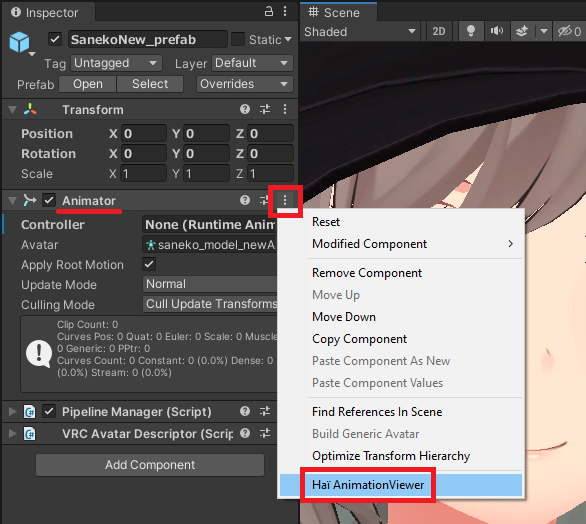

import uYmmptha2T from './animation-viewer-img/sx_2022-02-02_03-27-39_uYmmptha2T.mp4';
import QdOYmOWyly from './animation-viewer-img/sx_2022-02-02_03-05-20_QdOYmOWyly.mp4';

# Animation Viewer

*Animation Viewer* lets you preview animations in the Project view browser.

:::tip
This does not require VRChat to run. It has been tested to work on Unity 2019, and should work on newer versions.
:::

<video controls width="816" autostart="false">
    <source src={uYmmptha2T}/>
</video>

## Download

The tool is free for download.

- GitHub ([https://github.com/hai-vr/blendshape-viewer](https://github.com/hai-vr/blendshape-viewer))
- Booth.pm ([Animation Viewer - hai-vr - BOOTH](https://hai-vr.booth.pm/items/3625699))

## How to use

- Select your Animator. In the inspector, click the three dots, and select “Haï AnimationViewer”.

- Move the camera in the scene, and hover your cursor over the Project view to refresh the pictures.
- When the Animation Viewer is activated, the performance of the editor will be impacted. Click “Activate Viewer” to toggle it on/off. The button is red when it is active.

## Options

- **Animator**: The animator to use as a preview base.

- **Auto Update On Focus**: If you change the scene camera position, hovering your cursor over the Project view window will refresh the pictures.
- **Continuous Updates**: If you change the scene camera position, it will immediately refresh the pictures. This will lead to a dramatic slow down of the editor.
- **Update Speed**: Specifies the number of animations files to update per batch.
A lower value such as 5 causes the Project view to update 5 thumbnails per update tick, which will result in slower load times but less hitches in folders that contain a lot of animation files.
A higher value like 20 causes the Project view to update 20 thumbnails per update tick, which will result in faster load times but more hitches in folders that contain a lot of animation files.
- **Thumbnail Size**: Change the thumbnail size of the Project view. This can be larger than the Project view allows (Unity’s maximum value is normally 96).

- **Activate Viewer button**: Click to enable the previews.
When the Animation Viewer is activated, the performance of the editor will be impacted. Click “Activate Viewer” to toggle it on/off. The button is red when it is active.

- **Update button**: Click to refresh the pictures.
- **Force button**: Click to refresh the pictures, additionally clearing the thumbnail cache.
- **Advanced/Focused Bone**: When animations are playing, the animator’s muscles will move.
This option specifies on which bone to attach the camera. By default, it is focusing on the Head bone.
- **Advanced/Normalized Time**: The normalized time at which the animation will be sampled. By default, the first frame of the animation will be sampled.
- **Advanced/Base Pose**: Animator pose to use before the animation is applied.
This lets you preview the avatar in a different pose than the bicycle pose (see Additional notes below).
- **Advanced/Update On Activate**: When this is turned off, the thumbnails will not refresh when pressing Activate Viewer. This can let you toggle the thumbnail on and off and keep the same thumbnails after having moved the Scene view around.

## Additional notes

- Remember you can change the field of view of the scene camera.

- Use **Advanced/Base Pose** to specify an animation that applies before the animation is previewed.
This can be used to choose a pose to preview clothing toggle animations.
This can also be used to hide hats and other objects, letting you generate more relevant previews.
    
<video controls width="816" autostart="false">
    <source src={QdOYmOWyly}/>
</video>
