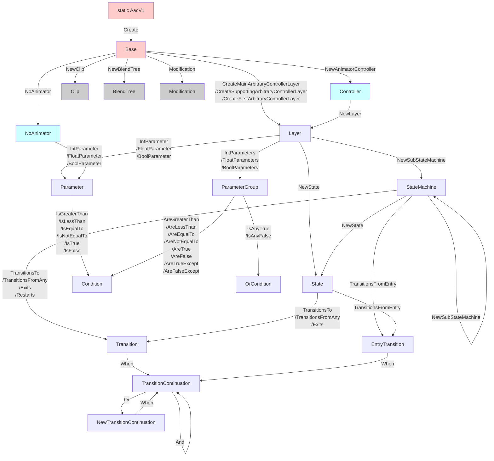
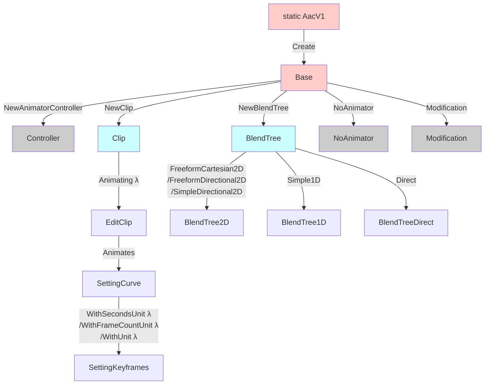

# Functions

:::info
New additions in V1 are indicated with a light bulb 💡 icon.
:::

#### Animator creation overview

#### Asset creation overview

## Animator As Code (AacV1)

- `static AacFlBase Create(AacConfiguration configuration)` 
Create an Animator As Code (AAC) base.

## Base (AacFlBase)

#### Create assets

- `AacFlClip NewClip()` 
Create a new clip. The asset is generated into the container.

- `AacFlClip CopyClip(AnimationClip originalClip)` 
Create a new clip that is a copy of `originalClip`. The asset is generated into the container.

- `AacFlNonInitializedBlendTree NewBlendTree()`💡 
Create a new BlendTree asset. The asset is generated into the container.

- `BlendTree NewBlendTreeAsRaw()` 
Create a new BlendTree asset and returns a native BlendTree object. The asset is generated into the container.💡 You may use NewBlendTree() instead to obtain a fluent interface.

- `AacFlClip NewClip(string name)` 
Create a new clip with a name. However, the name is only used as a suffix for the asset. The asset is generated into the container.

- `AacFlNonInitializedBlendTree NewBlendTree(string name)` (🛠️ Will be added in 1.3.0) 
Create a new BlendTree asset with a name. However, the name is only used as a suffix for the asset. The asset is generated into the container.

- `BlendTree NewBlendTreeAsRaw(string name)` (🛠️ Will be added in 1.3.0) 
Create a new BlendTree asset with a name and returns a native BlendTree object. However, the name is only used as a suffix for the asset. The asset is generated into the container. You may use NewBlendTree() instead to obtain a fluent interface.

- `AacFlClip DummyClipLasting(float numberOf, AacFlUnit unit)` 
Create a new clip which animates a dummy transform for a specific duration specified in an unit (Frames or Seconds).

- `AacFlController NewAnimatorController()`💡 
Create a new animator controller. The asset is generated into the container.

- `AacFlController NewAnimatorController(string name)`💡 
Create a new animator controller with a name. However, the name is only used as a suffix for the asset. The asset is generated into the container.

- `T DuplicateAsset<T>(T assetToDuplicate) where T : Object`💡 
Duplicate a new asset into the container and return it. For example, use this to create modified material variants. This asset will be removed the same way as other generated assets.

- `AacFlModification Modification()` (🛠️ Will be added in 1.3.0) 
  Returns a new AacFlModification instance, [granting you access to the destructive modification API](./modification). You will need to reuse this instance throughout. 
  

#### Reference VRChat assets

:::info
See functions specific to [VRChat](./vrchat#base-aacflbase).
:::

#### Maintain assets

- `void ClearPreviousAssets()` 
  Removes all assets from the asset container matching the specified asset key.

#### Create layers (Destructive workflow)

:::info
For VRChat-specific functions, see [VRChat (Destructive workflow)](./vrchat-destructive-workflow#extensions-for-base-aacflbase)
:::

- `AacFlLayer CreateMainArbitraryControllerLayer(AnimatorController controller)` 
Create a main layer for an arbitrary AnimatorController, clearing the previous one of the same system. You are not obligated to have a main layer.

- `AacFlLayer CreateSupportingArbitraryControllerLayer(AnimatorController controller, string suffix)` 
Create a supporting layer for an arbitrary AnimatorController, clearing the previous one of the same system and suffix. You can create multiple supporting layers with different suffixes, and you are not obligated to have a main layer to create a supporting layer.

- `AacFlLayer CreateFirstArbitraryControllerLayer(AnimatorController controller)` 
Clears the topmost layer of an arbitrary AnimatorController, and returns it.

#### Remove layers (Destructive workflow)

:::info
See functions specific to [VRChat (Destructive workflow)](./vrchat-destructive-workflow#extensions-for-base-aacflbase)
:::

#### Create parameters without an animator💡

- `AacFlNoAnimator NoAnimator()`💡 
If you are not creating an animator, this returns an object from which you can obtain animator parameter objects. You should use this class if you are creating BlendTree assets without any animator controllers to back it. Otherwise, it is strongly recommended to obtain animator parameter objects directly from the layer objects instead of using NoAnimator(), as the use of NoAnimator() will not result in the registration of any parameters inside the animator controller.

## Controller (AacFlController)💡

- `AnimatorController AnimatorController`
Exposes the underlying Unity AnimatorController.

- `AacFlLayer NewLayer(string suffix)`💡 
Create a new layer with a specific suffix. You cannot create multiple layers with the same suffix on the same controller.

- `AacFlLayer NewLayer()`💡 
Create a new layer. You cannot invoke this method multiple times on the same controller.

## Layer (AacFlLayer)

- `AacFlStateMachine StateMachine =>` 
Exposes the underlying AnimatorAsCode StateMachine object of this layer.

- `AacFlState NewState(string name)` 🔺 
Create a new state, initially positioned below the last generated state of this layer. 
🔺 If the name is already used, a number will be appended at the end.

- `AacFlState NewState(string name, int x, int y)` 🔺 
Create a new state at a specific position `x` and `y`, in grid units. The grid size is defined in the DefaultsProvider of the AacConfiguration of AAC. `x` positive goes right, `y` positive goes down. 
🔺 If the name is already used, a number will be appended at the end.

- `AacFlStateMachine NewSubStateMachine(string name)`💡 
  Create a new state machine, initially positioned below the last generated state of this layer. 
🔺 If the name is already used, a number will be appended at the end.

- `AacFlStateMachine NewSubStateMachine(string name, int x, int y)`💡 
  Create a new state machine at a specific position `x` and `y`, in grid units. The grid size is defined in the DefaultsProvider of the AacConfiguration of AAC. `x` positive goes right, `y` positive goes down. 
🔺 If the name is already used, a number will be appended at the end.

#### Create layer transitions

- `AacFlTransition AnyTransitionsTo(AacFlState destination)` 
Create a transition from Any to the `destination` state.

- `AacFlTransition AnyTransitionsTo(AacFlStateMachine destination)` 
Create a transition from Any to the `destination` state machine.

- `AacFlEntryTransition EntryTransitionsTo(AacFlState destination)` 
Create a transition from the Entry to the `destination` state.

- `AacFlEntryTransition EntryTransitionsTo(AacFlStateMachine destination)` 
Create a transition from the Entry to the `destination` state machine.

#### Create parameters

- `AacFlBoolParameter BoolParameter(string parameterName)` 
Create a Bool parameter in the animator.

- `AacFlBoolParameter TriggerParameterAsBool(string parameterName)` 
Create a Trigger parameter in the animator, but returns a Bool parameter for use in AAC.

- `AacFlFloatParameter FloatParameter(string parameterName)` 
Create a Float parameter in the animator.

- `AacFlIntParameter IntParameter(string parameterName)` 
Create an Int parameter in the animator.

#### Create parameter groups

- `AacFlBoolParameterGroup BoolParameters(params string[] parameterNames)` 
Create multiple Bool parameters in the animator, and returns a group of multiple Bools.

- `AacFlBoolParameterGroup TriggerParametersAsBools(params string[] parameterNames)` 
Create multiple Trigger parameters in the animator, but returns a group of multiple Bools for use in AAC.

- `AacFlFloatParameterGroup FloatParameters(params string[] parameterNames)` 
Create multiple Float parameters in the animator, and returns a group of multiple Bools.

- `AacFlIntParameterGroup IntParameters(params string[] parameterNames)` 
Create multiple Int parameters in the animator, and returns a group of multiple Bools.

- `AacFlBoolParameterGroup BoolParameters(params AacFlBoolParameter[] parameters)` 
Combine multiple Int parameters into a group.

- `AacFlBoolParameterGroup TriggerParametersAsBools(params AacFlBoolParameter[] parameters)` 
Combine multiple Trigger parameters into a group. FIXME: This is a pointless function because BoolParameters already exists.

- `AacFlFloatParameterGroup FloatParameters(params AacFlFloatParameter[] parameters)` 
Combine multiple Int parameters into a group.

- `AacFlIntParameterGroup IntParameters(params AacFlIntParameter[] parameters)` 
Combine multiple Int parameters into a group.
  
#### Set animator parameter value

- `AacFlLayer OverrideValue(AacFlBoolParameter toBeForced, bool value)` 
Set the Bool value of `toBeForced` parameter to `value` in the animator.

- `AacFlLayer OverrideValue(AacFlFloatParameter toBeForced, float value)` 
Set the Float value of `toBeForced` parameter to `value` in the animator.

- `AacFlLayer OverrideValue(AacFlIntParameter toBeForced, int value)` 
Set the Int value of `toBeForced` parameter to `value` in the animator.

- `AacFlLayer CopyParametersAndOverridesTo(AacFlLayer otherLayer)💡 
Copy all created parameters to the other layer, and overrides it with a value if a value was stored.

#### Edit avatar mask

- `AacFlLayer WithAvatarMask(AvatarMask avatarMask)` 
Set the Avatar Mask of the layer.

- `AacFlLayer WithAvatarMaskNoTransforms()` 
Set the Avatar Mask of the layer to be an Avatar Mask which denies all transforms. The asset is generated into the container.

- `AacFlLayer ResolveAvatarMask(Transform[] paths)` 
Set the Avatar Mask of the layer to be an Avatar Mask that allows the specified transforms. If `paths` is an empty array, all transforms are denied, which is effectively the same as calling `.WithAvatarMaskNoTransforms()`. The asset is generated into the container.

#### Edit layer attributes

- `AacFlLayer WithWeight(float weight)`  
Set the weight of the layer.

- `AacFlLayer WithBlendingMode(AnimatorLayerBlendingMode blendingMode)`  
Set the blending mode of the layer.

## Sub State Machine (AacFlStateMachine)💡

- `AnimatorStateMachine Machine;` 
Exposes the underlying Unity AnimatorStateMachine object of this state machine.

- `AacFlStateMachine NewSubStateMachine(string name)`💡 
Create a new state machine, initially positioned below the last generated state of this layer. 
🔺 If the name is already used, a number will be appended at the end.

- `AacFlNewTransitionContinuation Restarts()`💡 
Creates a new transition of the entire state machine node to itself, which is evaluated after the state machine commits to an exit transitions.

- `AacFlNewTransitionContinuation Exits()`💡 
Create a transition from this state machine node to the exit.
  

## No Animator (AacFlNoAnimator)💡

:::warning
You should use this class if you are creating BlendTree assets without any animator controllers to back it.

Otherwise, it is strongly recommended to obtain animator parameter objects directly from the [layer objects](#create-parameters) instead of using NoAnimator(), as the use of NoAnimator() will not result in the registration of any parameters inside the animator controller.
:::

- `AacFlFloatParameter FloatParameter(string parameterName)`💡 
Create a Float parameter, for use without a backing animator.

- `AacFlIntParameter IntParameter(string parameterName)`💡 
Create an Int parameter, for use without a backing animator.

- `AacFlBoolParameter BoolParameter(string parameterName)`💡 
Create a Bool parameter, for use without a backing animator.

- `AacFlNoAnimator OverrideValue(AacFlFloatParameter toBeForced, float value)`💡 
Stores the Float value of `toBeForced` parameter to `value`, which will be used in the CopyParametersAndOverridesTo() function.

- `AacFlNoAnimator OverrideValue(AacFlIntParameter toBeForced, int value)`💡 
Stores the Int value of `toBeForced` parameter to `value`, which will be used in the CopyParametersAndOverridesTo() function.

- `AacFlNoAnimator OverrideValue(AacFlBoolParameter toBeForced, bool value)`💡 
Stores the Bool value of `toBeForced` parameter to `value`, which will be used in the CopyParametersAndOverridesTo() function.

- `AacFlNoAnimator CopyParametersAndOverridesTo(AacFlLayer otherLayer)`💡 
Copy all created parameters to the other layer, and overrides it with a value if a value was stored.

## State (AacFlState)

- `AnimatorState State` 
Expose the underlying AnimatorState object.

### Graph Positioning

- `AacFlState LeftOf(AacFlState otherState)` 
Move the node the left of the other node in the graph.

- `AacFlState RightOf(AacFlState otherState)` 
Move the node the right of the other node in the graph.

- `AacFlState Over(AacFlState otherState)` 
Move the node to be over the other node in the graph.

- `AacFlState Under(AacFlState otherState)` 
Move the node to be under the other node in the graph.

- `AacFlState LeftOf()` 
Move the node to the left of the last created node of the state machine this belongs to in the graph.

- `AacFlState RightOf()` 
Move the node to the right of the last created node of the state machine this belongs to in the graph.

- `AacFlState Over()` 
Move the node to be over the last created node of the state machine this belongs to in the graph.

- `AacFlState Under()` 
Move the node to be under the last created node of the state machine this belongs to in the graph.

- `At(int x, int y)` 
Move the node to be at a specific position in grid units, where x positive goes right, and y positive goes down.

- `AacFlState Shift(AacFlState otherState, int shiftX, int shiftY)` 
Move the state to be shifted next to the other state in the graph, in grid units. shiftX positive goes right, shiftY positive goes down.

- `AacFlState Shift(Vector3 otherPosition, int shiftX, int shiftY)` 
Given another position in non-grid units, move the state to be shifted next to that position, in grid units. shiftX positive goes right, shiftY positive goes down.

### Paths

- `string ResolveRelativePath(Transform item)` 
Resolve the path of an item relative to the AnimatorRoot.

### Attributes

- `AacFlState WithAnimation(Motion clip)` 
Set a specific raw Motion for the state. This could be a blend tree.

- `AacFlState WithAnimation(AacFlClip clip)` 
Set a specific clip for the state. See `(AacFlBase).NewClip()` and similar.

- `AacFlState WithAnimation(AacFlBlendTree clip)`💡 
Set a specific blend tree for the state. See `(AacFlBase).NewBlendTree()` and similar.

- `AacFlState WithMotionTime(AacFlFloatParameter floatParam)` 
Set the Motion Time to a parameter. This was formerly known as Normalized Time.

- `AacFlState WithCycleOffset(AacFlFloatParameter floatParam)`💡 
Set the Cycle Offset to a parameter.

- `AacFlState WithCycleOffsetSetTo(float cycleOffset)`💡 
Set the Cycle Offset to a specific value.

- `AacFlState WithSpeed(AacFlFloatParameter parameter)`💡 
Set the Speed to a parameter.

- `AacFlState WithSpeedSetTo(float speed)`💡 
Set the Speed to a specific value.

- `AacFlState WithWriteDefaultsSetTo(bool shouldWriteDefaults)` 
Set Write Defaults. If you need to do this to many states, consider changing the AacConfiguration DefaultsProvider when creating the AnimatorAsCode instance.

- ~`AacFlState MotionTime(AacFlFloatParameter floatParam)`~ 
Obsolete. 
Set the Motion Time to a parameter. This was formerly known as Normalized Time. 
This is identical to `WithMotionTime()`. This function is preserved for compatibility.

### Transitions

- `AacFlTransition TransitionsTo(AacFlState destination)` 
Create a new transition from this state to the `destination` state.

- `AacFlTransition TransitionsTo(AacFlStateMachine destination)` 
Create a new transition from this state to the `destination` state machine.

- `AacFlTransition TransitionsFromAny()` 
Create a new transition from Any to this state.

- `AacFlEntryTransition TransitionsFromEntry()` 
Create a new transition from Entry to this state. Note that the first created state is the default state, so generally this function does not need to be invoked onto the first created state. 
Calling this function will not define this state to be the default state.

- `AacFlState AutomaticallyMovesTo(AacFlState destination)` 
Create a transition with no exit time to the `destination` state. 
Calling this function does not return the transition.

- `AacFlState AutomaticallyMovesTo(AacFlStateMachine destination)` 
Create a transition with no exit time to the `destination` state machine. 
Calling this function does not return the transition.

- `AacFlTransition Exits()` 
Create a transition from this state to the exit.

### State behaviours

:::info
See functions specific to [VRChat](./vrchat#state-aacflstate).
:::

## Clip (AacFlClip)

- `AnimationClip Clip;`   
Expose the underlying Clip object.

### Attributes

- `AacFlClip Looping()` 
Set the clip to be looping.

- `AacFlClip NonLooping()` 
Set the clip to be non-looping.

### Single-frame Animations

:::info
Single-valued overloads do not tolerate null values, and will intentionally fail when provided with a null value.

Array overloads tolerate arrays that contain null values, but does not tolerate the array itself being null.
:::

- `AacFlClip BlendShape(SkinnedMeshRenderer renderer, string blendShapeName, float value)` 
Change a blendShape of a skinned mesh. This lasts one frame.

- `AacFlClip BlendShape(SkinnedMeshRenderer[] rendererWithNulls, string blendShapeName, float value)` 
Change a blendShape of multiple skinned meshes. This lasts one frame. The array can safely contain null values.

- `AacFlClip Toggling(GameObject gameObject, bool value)` 
 Enable or disable a GameObject. This lasts one frame.

- `AacFlClip Toggling(GameObject[] gameObjectsWithNulls, bool value)` 
  Enable or disable GameObjects. This lasts one frame. The array can safely contain null values.

- `AacFlClip TogglingComponent(Component[] componentsWithNulls, bool value)` 
Toggle several components. This lasts one frame. The runtime type of each individual component will be used. The array can safely contain null values.

- `AacFlClip TogglingComponent(Component component, bool value)` 
Toggle a component. This lasts one frame. The runtime type of the component will be used.

- `AacFlClip SwappingMaterial(Renderer renderer, int slot, Material material)` 
Swap a material of a Renderer on the specified slot (indexed at 0). This lasts one frame.

- `AacFlClip SwappingMaterial(ParticleSystem particleSystem, int slot, Material material)` 
Swap a material of a Particle System on the specified slot (indexed at 0). This lasts one frame. 
In practice, this will animate the ParticleSystemRenderer of that particle system.

### Single-frame Transformation Animations💡

:::info
Single-valued overloads do not tolerate null values, and will intentionally fail when provided with a null value.

Array overloads tolerate arrays that contain null values, but does not tolerate the array itself being null.
:::

- `AacFlClip Positioning(Transform transform, Vector3 localPosition)`💡 
  Change the position of a Transform in local space. This lasts one frame.

- `AacFlClip Positioning(GameObject gameObject, Vector3 localPosition)`💡 
  Change the position of a GameObject in local space. This lasts one frame.

- `AacFlClip Positioning(Transform[] transformsWithNulls, Vector3 localPosition)`💡 
  Change the position of Transforms in local space. This lasts one frame. The array can safely contain null values.

- `AacFlClip Positioning(GameObject[] gameObjectsWithNulls, Vector3 localPosition)`💡 
  Change the position of GameObjects in local space. This lasts one frame. The array can safely contain null values.

- `AacFlClip Scaling(Transform transform, Vector3 scale)`💡 
  Change the local scale of a Transform. This lasts one frame.

- `AacFlClip Scaling(GameObject gameObject, Vector3 scale)`💡 
  Change the local scale of a GameObject. This lasts one frame.

- `AacFlClip Scaling(Transform[] transformsWithNulls, Vector3 scale)`💡 
  Change the local scale of Transforms. This lasts one frame. The array can safely contain null values.

- `AacFlClip Scaling(GameObject[] gameObjectsWithNulls, Vector3 scale)`💡 
  Change the local scale of GameObjects. This lasts one frame. The array can safely contain null values.

### Single-frame Rotation Animations💡

:::info
Single-valued overloads do not tolerate null values, and will intentionally fail when provided with a null value.

Array overloads tolerate arrays that contain null values, but does not tolerate the array itself being null.
:::

#### Euler interpolation

:::info
Euler interpolation and Quaternion interpolation are not equivalent.

Calling either function will lead to different results in the behaviour of the animated object in various contexts.

Please [consult this forum page](https://forum.unity.com/threads/new-animationclip-property-names.367288/#post-2384172).
:::

- `AacFlClip RotatingUsingEulerInterpolation(Transform transform, Vector3 localEulerAngles)`💡 
  Change the rotation of a Transform in local space, with Euler interpolation. This lasts one frame.

- `AacFlClip RotatingUsingEulerInterpolation(GameObject gameObject, Vector3 localEulerAngles)`💡 
  Change the rotation of a GameObject in local space, with Euler interpolation. This lasts one frame.

- `AacFlClip RotatingUsingEulerInterpolation(Transform[] transformsWithNulls, Vector3 localEulerAngles)`💡 
  Change the rotation of Transforms in local space, with Euler interpolation. This lasts one frame. The array can safely contain null values.

- `AacFlClip RotatingUsingEulerInterpolation(GameObject[] gameObjectsWithNulls, Vector3 localEulerAngles)`💡 
  Change the rotation of GameObjects in local space, with Euler interpolation. This lasts one frame. The array can safely contain null values.

#### Quaternion interpolation

:::info
Euler interpolation and Quaternion interpolation are not equivalent.

Calling either function will lead to different results in the behaviour of the animated object in various contexts.

Please [consult this forum page](https://forum.unity.com/threads/new-animationclip-property-names.367288/#post-2384172).
:::

- `AacFlClip RotatingUsingQuaternionInterpolation(Transform transform, Quaternion localQuaternionAngles)`💡 
  Change the rotation of a Transform in local space, with Quaternion interpolation. This lasts one frame.

- `AacFlClip RotatingUsingQuaternionInterpolation(GameObject gameObject, Quaternion localQuaternionAngles)`💡 
  Change the rotation of a GameObject in local space, with Quaternion interpolation. This lasts one frame.

- `AacFlClip RotatingUsingQuaternionInterpolation(Transform[] transformsWithNulls, Quaternion localQuaternionAngles)`💡 
  Change the rotation of Transforms in local space, with Quaternion interpolation. This lasts one frame. The array can safely contain null values.

- `AacFlClip RotatingUsingQuaternionInterpolation(GameObject[] gameObjectsWithNulls, Quaternion localQuaternionAngles)`💡 
  Change the rotation of GameObjects in local space, with Quaternion interpolation. This lasts one frame. The array can safely contain null values.

### Multi-frame Animations💡

:::info
Single-valued overloads do not tolerate null values, and will intentionally fail when provided with a null value.

Array overloads tolerate arrays that contain null values, but does not tolerate the array itself being null.
:::

- `AacFlClip BlendShape(SkinnedMeshRenderer renderer, string blendShapeName, AnimationCurve animationCurve)`💡 
Change a blendShape of a skinned mesh, with an animation curve.

- `AacFlClip BlendShape(SkinnedMeshRenderer[] rendererWithNulls, string blendShapeName, AnimationCurve animationCurve)`💡 
Change a blendShape of multiple skinned meshes, with an animation curve. The array can safely contain null values.

### Clip Editing

- `AacFlClip Animating(Action<AacFlEditClip> action)` 
Start editing the clip with a lambda expression.

## Clip editing (AacFlEditClip)

:::tip
Consider using [Property Finder](../../property-finder) to locate the animatable properties that you are interested in.

:::

- `AnimationClip Clip;`   
Expose the underlying Clip object.

- `AacFlSettingCurve Animates(string path, Type type, string propertyName)` 
Animates a path the traditional way.

- `AacFlSettingCurve Animates(Transform transform, Type type, string propertyName)` 
Animates an object in the hierarchy relative to the animator root, the traditional way.

- `AacFlSettingCurve Animates(GameObject gameObject)` 
Animates the active property of a GameObject, toggling it.

- `AacFlSettingCurve Animates(Component anyComponent, string property)` 
Animates the property of a component. The runtime type of the component will be used.

- `AacFlSettingCurve Animates(Component[] anyComponentsWithNulls, string property)` 
Animates the property of several components. The runtime type of the component will be used. The array can safely contain null values.

- `AacFlSettingCurve AnimatesAnimator(AacFlParameter floatParameter)` 
Animates a Float parameter of the animator (may sometimes be referred to as an Animated Animator Parameter, or AAP).

- `AacFlSettingCurveColor AnimatesColor(Component anyComponent, string property)` 
Animates a color property of a component. The runtime type of the component will be used.

- `AacFlSettingCurveColor AnimatesColor(Component[] anyComponentsWithNulls, string property)` 
Animates a color property of several components. The runtime type of the component will be used. The array can safely contain null values.

- `AacFlSettingCurveColor AnimatesHDRColor(Component anyComponent, string property)`💡 
Animates an HDR color property of a component (uses XYZW instead of RGBA). The runtime type of the component will be used.

- `AacFlSettingCurveColor AnimatesHDRColor(Component[] anyComponentsWithNulls, string property)`💡 
Animates an HDR color property of several components (uses XYZW instead of RGBA). The runtime type of the component will be used.

- `AacFlSettingCurveObjectReference AnimatesObjectReference(Component anyComponent, string property)`💡 
Animates an object reference of a component. The runtime type of the component will be used.

- `AacFlSettingCurveObjectReference AnimatesObjectReference(Component[] anyComponentsWithNulls, string property)`💡 
Animates an object reference of several components. The runtime type of the component will be used.

- `EditorCurveBinding BindingFromComponent(Component anyComponent, string propertyName)` 
Returns an EditorCurveBinding of a component, relative to the animator root. The runtime type of the component will be used. This is meant to be used in conjunction with traditional animation APIs.

### Curve of type Float (AacFlSettingCurve)

- `void WithOneFrame(float desiredValue)` 
Define the curve to be exactly one frame by defining two constant keyframes, usually lasting 1/60th of a second, with the desired value.

- `void WithFixedSeconds(float seconds, float desiredValue)` 
Define the curve to last a specific amount of seconds by defining two constant keyframes, with the desired value.

- `void WithSecondsUnit(Action<AacFlSettingKeyframes> action)` 
Start defining the keyframes with a lambda expression, expressing the unit to be in seconds.

- `void WithFrameCountUnit(Action<AacFlSettingKeyframes> action)` 
Start defining the keyframes with a lambda expression, expressing the unit in frames.

- `void WithUnit(AacFlUnit unit, Action<AacFlSettingKeyframes> action)` 
Start defining the keyframes with a lambda expression, expressing the unit.

- `void WithAnimationCurve(AnimationCurve animationCurve)` 
Define the curve as the parameter. The duration is encoded inside the curve itself.

### Curve of type Color (AacFlSettingCurveColor)

- `void WithOneFrame(Color desiredValue)` 
Define the curve to be exactly one frame by defining two constant keyframes, usually lasting 1/60th of a second, with the desired color value.

- `void WithUnit(AacFlUnit unit, Action<AacFlSettingKeyframesColor> action)`💡 
  Start defining the keyframes with a lambda expression, expressing the unit.

- ~`void WithKeyframes(AacFlUnit unit, Action<AacFlSettingKeyframesColor> action)`~ 
  Obsolete. Use `WithUnit()` instead. 
  Start defining the keyframes with a lambda expression, expressing the unit.

### Curve of type ObjectReference (AacFlSettingCurveObjectReference)💡

- `void WithOneFrame(Object objectReference)`💡 
Define the curve to be exactly one frame by defining two constant keyframes, usually lasting 1/60th of a second, with the desired object reference value.

- `void WithUnit(AacFlUnit unit, Action<AacFlSettingKeyframesObjectReference> action)`💡 
Start defining the keyframes with a lambda expression, expressing the unit.

- ~`void WithKeyframes(AacFlUnit unit, Action<AacFlSettingKeyframesObjectReference> action)`~ 
Obsolete. Use `WithUnit()` instead. 
Start defining the keyframes with a lambda expression, expressing the unit.

### Keyframes of type Float (AacFlSettingKeyframes)

- `AacFlSettingKeyframes Easing(float timeInUnit, float value)` 
Create a curved spline keyframe. The unit is defined by the function that invokes this lambda expression.

- `AacFlSettingKeyframes Linear(float timeInUnit, float value)` 
Create a linear keyframe. The unit is defined by the function that invokes this lambda expression.

- `AacFlSettingKeyframes Constant(float timeInUnit, float value)` 
Create a constant keyframe. The unit is defined by the function that invokes this lambda expression.

### Keyframes of type Color (AacFlSettingKeyframesColor)

- `AacFlSettingKeyframesColor Easing(int frame, Color value)` 
Create a curved spline keyframe. The unit is defined by the function that invokes this lambda expression.

- `AacFlSettingKeyframesColor Linear(float frame, Color value)` 
Create a linear keyframe. The unit is defined by the function that invokes this lambda expression.

- `AacFlSettingKeyframesColor Constant(int frame, Color value)` 
Create a constant keyframe. The unit is defined by the function that invokes this lambda expression.

### Keyframes of type ObjectReference (AacFlSettingKeyframesObjectReference)💡

- `AacFlSettingKeyframesObjectReference Setting(int timeInUnit, Object value)`💡 
Create a keyframe for an object reference. The unit is defined by the function that invokes this lambda expression.

## Blend Trees (AacFlBlendTree)💡

- `BlendTree BlendTree;`💡 
Exposes the underlying Unity BlendTree asset.

### Initialization (AacFlNonInitializedBlendTree : AacFlBlendTree)💡

- `AacFlBlendTree2D FreeformCartesian2D(AacFlFloatParameter parameterX, AacFlFloatParameter parameterY)`💡 
Define this BlendTree as being FreeformCartesian2D.

- `AacFlBlendTree2D FreeformDirectional2D(AacFlFloatParameter parameterX, AacFlFloatParameter parameterY)`💡 
Define this BlendTree as being FreeformDirectional2D.

- `AacFlBlendTree2D SimpleDirectional2D(AacFlFloatParameter parameterX, AacFlFloatParameter parameterY)`💡 
Define this BlendTree as being SimpleDirectional2D.

- `AacFlBlendTree1D Simple1D(AacFlFloatParameter parameter)`💡 
Define this BlendTree as being Simple1D.

- `AacFlBlendTreeDirect Direct()`💡 
Define this BlendTree as being Direct.

### 2D Blend Tree (AacFlBlendTree2D : AacFlBlendTree)💡

- `AacFlBlendTree2D WithAnimation(AacFlBlendTree blendTree, Vector2 pos)`💡 
Add a BlendTree in the specified coordinates.

- `AacFlBlendTree2D WithAnimation(AacFlBlendTree blendTree, float x, float y)`💡 
Add a BlendTree in the specified `x` and `y` coordinates.

- `AacFlBlendTree2D WithAnimation(AacFlClip clip, Vector2 pos)`💡 
Add a Clip in the specified coordinates.

- `AacFlBlendTree2D WithAnimation(AacFlClip clip, float x, float y)`💡 
Add a Clip in the specified `x` and `y` coordinates.

- `AacFlBlendTree2D WithAnimation(Motion motion, Vector2 pos)`💡 
Add a raw motion in the specified coordinates.

- `AacFlBlendTree2D WithAnimation(Motion motion, float x, float y)`💡 
Add a raw motion in the specified `x` and `y` coordinates.

### 1D Blend Tree (AacFlBlendTree1D : AacFlBlendTree)💡

:::info
It is safe to declare points in a Simple1D blend tree in a different order (i.e. 0, 1, -1), because we will always sort the list after each newly added animation.

In native blend trees, it would not have been safe to do so.
:::

- `AacFlBlendTree1D WithAnimation(AacFlBlendTree blendTree, float threshold)`💡 
Add a BlendTree in the specified threshold.

- `AacFlBlendTree1D WithAnimation(AacFlClip clip, float threshold)`💡 
Add a Clip in the specified threshold.

- `AacFlBlendTree1D WithAnimation(Motion motion, float threshold)`💡 
Add a raw motion in the specified threshold.

### Direct Blend Tree (AacFlBlendTreeDirect : AacFlBlendTree)💡

- `AacFlBlendTreeDirect WithAnimation(AacFlBlendTree blendTree, AacFlFloatParameter parameter)`💡 
Add a BlendTree driven by the specified parameter.

- `AacFlBlendTreeDirect WithAnimation(AacFlClip clip, AacFlFloatParameter parameter)`💡 
Add a Clip driven by the specified parameter.

- `AacFlBlendTreeDirect WithAnimation(Motion motion, AacFlFloatParameter parameter)`💡 
Add a raw motion driven by the specified parameter.

### Further define a blend tree child (AacFlBlendTreeChildMotion)💡

All the `WithAnimation` methods above have an overload with an additional parameter `Action<AacFlBlendTreeChildMotion> furtherDefiningChild = null`.

When invoking the method without this parameter, by default, the timeScale is 1, cycle offset is 0, mirror is false.

- `AacFlBlendTreeChildMotion WithTimeScaleSetTo(float timeScale)`💡 
Set the time scale. The time scale value is 1 by default.

- `AacFlBlendTreeChildMotion WithMirrorSetTo(bool mirror)`💡 
Set the mirror option. The mirror option value is false by default.

- `AacFlBlendTreeChildMotion WithCycleOffsetSetTo(float cycleOffset)`💡 
Set the cycle offset. The cycle offset value is 0 by default.

## Transitions

`AnimatorTransitionBase Transition;`   
Expose the underlying Transition object (from AacFlNewTransitionContinuation)

### Attributes (AacFlTransition : AacFlNewTransitionContinuation)

- `AacFlTransition WithTransitionDurationSeconds(float transitionDuration)` 
Set a fixed transition duration in seconds.

- `AacFlTransition WithTransitionDurationNormalized(float transitionDurationNormalized)`💡 
Set a non-fixed transition duration in a normalized amount.

- ~`AacFlTransition WithTransitionDurationPercent(float transitionDurationNormalized)`~ 
  Set a non-fixed transition duration in a normalized amount. 
  Note: Percent is a misnomer. You are expected to provide a value expressed as a normalized value (where 1 represents the clip duration). 
  This function behaves identically to `WithTransitionDurationNormalized(float)`

- `AacFlTransition WithTransitionToSelf()` 
Enable transition to self.

- `AacFlTransition WithNoTransitionToSelf()` 
Disable transition to self.

- `AacFlTransition AfterAnimationFinishes()` 
Set an exit time at 1, where the animation finishes.

- `AacFlTransition Automatically()` 
Set an exit time at 0, so that it may transition almost immediately.

- `AacFlTransition AfterAnimationIsAtLeastAtNormalized(float exitTimeNormalized)`💡 
Set the exit time at a specific normalized amount.

- ~`AacFlTransition AfterAnimationIsAtLeastAtPercent(float exitTimeNormalized)`~ 
  Set the exit time at a specific normalized amount. 
  Note: Percent is a misnomer. You are expected to provide a value expressed as a normalized value (where 1 represents the clip duration). 
  This function behaves identically to `AfterAnimationIsAtLeastAtNormalized(float)`

#### Interruption source

- `AacFlTransition WithInterruption(TransitionInterruptionSource interruptionSource)`💡 
  Set interruption source set to that value.

- `AacFlTransition WithSourceInterruption()` 
  Set interruption source to be Source. // FIXME: Clunky interface.

#### Interruption order

- `AacFlTransition WithOrderedInterruption()` 
  Enable ordered interruption.

- `AacFlTransition WithNoOrderedInterruption()` 
  Disable ordered interruption.

### Chaining conditions

#### Starting Conditions (AacFlNewTransitionContinuation) & (AacFlEntryTransition : AacFlNewTransitionContinuation)

- `AacFlTransitionContinuation When(IAacFlCondition action)` 
Start defining conditions.

- `AacFlMultiTransitionContinuation When(IAacFlOrCondition actionsWithOr)` 
Applies a series of conditions, and this series may contain Or operators. All And operators that follow will apply to all the conditions generated by this series, until the next Or operator.

- `AacFlTransitionContinuation When(Action<AacFlTransitionContinuationWithoutOr> actionsWithoutOr)` 
Applies a series of conditions to this transition, but this series of conditions cannot include an Or operator.

- `AacFlTransitionContinuationOnlyOr When(Action<AacFlNewTransitionContinuation> actionsWithOr)` 
Applies a series of conditions, and this series may contain Or operators. However, the result can not be followed by an And operator. It can only be an Or operator.

- `AacFlTransitionContinuation WhenConditions()` 
Provides a handle to start defining conditions using the And operator, for use in loops. The Or operator may be invoked at any point.

#### Single-transition continuation (AacFlTransitionContinuation : AacFlTransitionContinuationAbstractWithOr)

- `AacFlTransitionContinuation And(IAacFlCondition action)` 
Add another condition to this transition. A transition requires all of its conditions to pass.

- `AacFlTransitionContinuation And(Action<AacFlTransitionContinuationWithoutOr> actionsWithoutOr)` 
Add another condition to this transition. A transition requires all of its conditions to pass.

#### Multi-transition continuation (AacFlMultiTransitionContinuation : AacFlTransitionContinuationAbstractWithOr)

- `AacFlMultiTransitionContinuation And(IAacFlCondition action)` 
Add another condition to all of the transitions generated by the previous conditions since the last When operator invocation. A transition requires all of its conditions to pass.

- `AacFlMultiTransitionContinuation And(Action<AacFlTransitionContinuationWithoutOr> actionsWithoutOr)` 
Add another condition to all of the transitions generated by the previous conditions since the last When operator invocation. A transition requires all of its conditions to pass.

#### Continuation (AacFlTransitionContinuationAbstractWithOr)

- `AacFlNewTransitionContinuation Or()` 
Creates a single new transition, copying the attributes of the one this was invoked on. This has no conditions yet, so invoking a When operator immediately after this is expected here.

#### Continuation wihtout Or (AacFlTransitionContinuationWithoutOr)

- `AacFlTransitionContinuationWithoutOr And(IAacFlCondition action)` 
Add another condition to this transition. A transition requires all of its conditions to pass.

- `AacFlTransitionContinuationWithoutOr AndWhenever(Action<AacFlTransitionContinuationWithoutOr> action)` 
Add additional conditions using a lambda expression that cannot contain Or operators. A transition requires all of its conditions to pass.

## Conditions (IAacFlCondition, IAacFlOrCondition)

#### AacFlFloatParameter

- `IsGreaterThan(float other)` 
Float is greater than `other`. 
When used on some platforms, you need to be careful as the remote value may not be the same as the local value.

- `IsLessThan(float other)` 
Float is less than `other`. 
When used on some platforms, you need to be careful as the remote value may not be the same as the local value.

#### AacFlIntParameter

- `IsGreaterThan(int other)` 
Int is strictly greater than `other`

- `IsLessThan(int other)` 
Int is strictly less than `other`

- `IsEqualTo(int other)` 
Int is equal to `other`

- `IsNotEqualTo(int other)` 
Int is not equal to `other`

#### AacFlEnumIntParameter\<TEnum> where TEnum : Enum

- `IsEqualTo(TEnum other)` 
Int is not equal to `(int)other`

- `IsNotEqualTo(TEnum other)` 
Int is equal to `(int)other`

- `IsGreaterThan(int other)` 
(inherited from AacFlIntParameter) Int is strictly greater than `other`

- `IsLessThan(int other)` 
(inherited from AacFlIntParameter) Int is strictly less than `other`

- `IsEqualTo(int other)` 
(inherited from AacFlIntParameter)

- `IsNotEqualTo(int other)` 
(inherited from AacFlIntParameter)

#### AacFlBoolParameter

- `IsTrue()` 
Bool is true

- `IsFalse()` 
Bool is false

- `IsEqualTo(bool other)` 
Bool is equal to `other`

- `IsNotEqualTo(bool other)` 
Bool is not equal to `other`

#### AacFlFloatParameterGroup

- `AreGreaterThan(float other)` 
All of the Floats are greater than `other`. 
When used on some platforms, you need to be careful as the remote value may not be the same as the local value.

- `AreLessThan(float other)` 
All of the Floats are less than `other`. 
When used on some platforms, you need to be careful as the remote value may not be the same as the local value.

#### AacFlIntParameterGroup

- `AreGreaterThan(float other)` 
All of the Ints are strictly greater than `other`

- `AreLessThan(float other)` 
All of the Ints are strictly less than `other`

- `AreEqualTo(float other)` 
All of the Ints are equal to `other`

- `AreNotEqualTo(float other)` 
All of the Ints are not equal to `other`

#### AacFlBoolParameterGroup

- `AreTrue()` 
All of the Bools are true

- `AreFalse()` 
All of the Bools are false

- `AreEqualTo(bool other)` 
All of the Bools are equal to `other`

- `AreFalseExcept(AacFlBoolParameter exceptThisMustBeTrue)` 
All the Bools except `exceptThisMustBeTrue` are false, and the Bool of `exceptThisMustBeTrue` must be true.

- `AreFalseExcept(params AacFlBoolParameter[] exceptTheseMustBeTrue)` 
All the Bools except those in `exceptTheseMustBeTrue` are false, and all of the Bools in `exceptTheseMustBeTrue` must be true.

- `AreFalseExcept(AacFlBoolParameterGroup exceptTheseMustBeTrue)` 
All the Bools except those in `exceptTheseMustBeTrue` are false, and all of the Bools in `exceptTheseMustBeTrue` must be true.

- `AreTrueExcept(AacFlBoolParameter exceptThisMustBeFalse)` 
All the Bools except `exceptThisMustBeTrue` are true, and the Bool of `exceptThisMustBeTrue` must be false.

- `AreTrueExcept(params AacFlBoolParameter[] exceptTheseMustBeFalse)` 
All the Bools except those in `exceptTheseMustBeTrue` are true, and all of the Bools in `exceptTheseMustBeTrue` must be false.

- `AreTrueExcept(AacFlBoolParameterGroup exceptTheseMustBeFalse)` 
All the Bools except those in `exceptTheseMustBeTrue` are true, and all of the Bools in `exceptTheseMustBeTrue` must be false.

- `IsAnyTrue()` -> returns `IAacFlOrCondition`, can only be used inside `.When(...)` 
Generates multiple transitions, verifying whether any Bool is true. This can only be used inside `.When(...)`

- `IsAnyFalse()` -> returns `IAacFlOrCondition`, can only be used inside `.When(...)` 
Generates multiple transitions, verifying whether any Bool is false. This can only be used inside `.When(...)`
