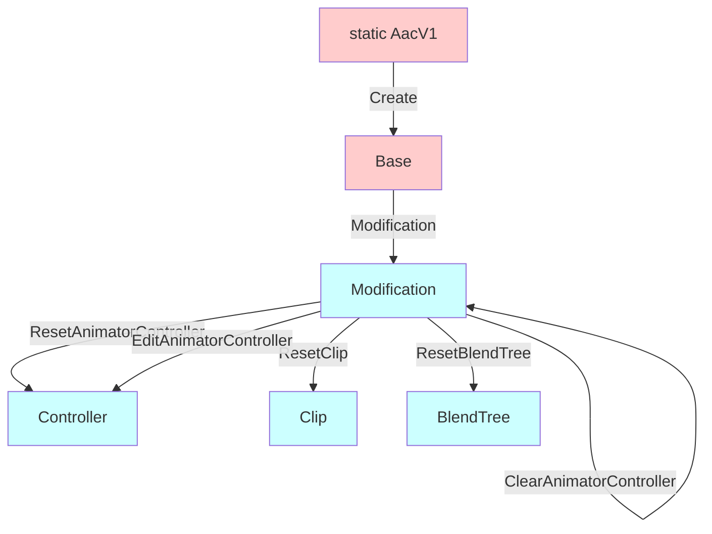

---
sidebar_position: 5
title: "Modification API"
---

# Functions: Modification API

The Modification API is an upcoming API that is being introduced to 1.3.0. It is currently part of 1.3.0-alpha.1.

It is designed specifically for the **creation and distribution of modular prefabs**, where you generate assets on your developer machine
and distribute those generated assets to your users. Your users will not need to install Animator As Code.

When using the Modification API, you will provide references to existing AnimatorController, AnimationClip, and BlendTree assets.
These assets will be emptied and their contents replaced with the newly generated content. This is a **destructive process**, conversely intended
for the creation of **non-destructive prefabs**.

The Modification API can be accessed by calling `(AacFlBase).Modification()`

#### Minimum version

- The Modification API requires 1.3.0 minimum.

#### Animator creation overview



## Base (AacFlBase)

- `AacFlModification Modification()`<br/>
  Returns a new AacFlModification instance, granting you access to this destructive modification API. You will need to reuse this instance throughout.

## Modification (AacFlModification)

### Set Dirty

- `void SetDirtyAll()`<br/>
  Calls `EditorUtility.SetDirty(...)` on every single AnimatorController, AnimationClip, and BlendTree asset instances previously memorized by this AacFlModification instance.

### Reset

All functions beginning with *Reset* clear the asset.

- `AacFlController ResetAnimatorController(AnimatorController controllerToReset)`<br/>
  Immediately removes all layers and all parameters from the given AnimatorController, and returns a AacFlController that will edit the given AnimatorController.<br/>
  This AnimatorController instance is memorized in the current AacFlModification instance memory.<br/>
  Note: The AnimatorController class is editor-only, so they can't be referenced inside scene components or asset objects. If you have a RuntimeAnimatorController instance, you should cast it to AnimatorController.

- `AacFlClip ResetClip(AnimationClip clipToReset)`<br/>
  Immediately removes all curves on the clip, and returns a AacFlClip that will edit the given AnimationClip.<br/>
  This does not reset any other attribute of the clip (e.g., is looping, etc.).<br/>
  This AnimationClip instance is memorized in the current AacFlModification instance memory.
  
- `AacFlNonInitializedBlendTree ResetBlendTree(BlendTree blendTreeToReset)`<br/>
  Immediately clears the list of children in the given BlendTree, sets the parameters to empty strings, and returns a AacFlNonInitializedBlendTree that will edit the given BlendTree.<br/>
  This does not reset any other attribute of the blend tree (e.g., automatic thresholds, etc.).<br/>
  This BlendTree instance is memorized in the current AacFlModification instance memory.<br/>
  Note: The BlendTree class is editor-only, so they can't be referenced inside scene components or asset objects. If you have a Motion instance that is a BlendTree instance, you should cast it to BlendTree.

### Clear

- `AacFlModification ClearAnimatorController(AnimatorController controllerToReset)`<br/>
  Immediately removes all layers and all parameters from the given AnimatorController.<br/>
  This AnimatorController instance is memorized in the current AacFlModification instance memory.<br/>
  Note: The AnimatorController class is editor-only, so they can't be referenced inside scene components or asset objects. If you have a RuntimeAnimatorController instance, you should cast it to AnimatorController.

### Edit

- `AacFlController EditAnimatorController(AnimatorController controllerToReset)`<br/>
  Returns a AacFlController that will edit the given AnimatorController. This does not reset the AnimatorController.<br/>
  This AnimatorController instance is memorized in the current AacFlModification instance memory.<br/>
  Note: The AnimatorController class is editor-only, so they can't be referenced inside scene components or asset objects. If you have a RuntimeAnimatorController instance, you should cast it to AnimatorController.

## Example

Here's an example of how to use the Modification API:

```csharp
using System;
using UnityEngine;

#if UNITY_EDITOR
using AnimatorAsCode.V1;
using UnityEditor;
using UnityEditor.Animations;
#endif

public class Internal_MyExampleBehaviour : MonoBehaviour
{
    public Transform avatarRootTransform;
    
    public RuntimeAnimatorController animatorController;
    public AnimationClip animationClipZero;
    public AnimationClip animationClipOne;
    public Motion blendTree;

    public GameObject toggle;
}

#if UNITY_EDITOR
[CustomEditor(typeof(Internal_MyExampleBehaviour))]
public class Internal_MyBehaviourEditor : Editor
{
    public override void OnInspectorGUI()
    {
        var my = (Internal_MyExampleBehaviour)target;

        DrawDefaultInspector();

        if (GUILayout.Button("(DEVELOPER ONLY) Generate")) Generate(my);
        if (GUILayout.Button("(DEVELOPER ONLY) Create a new blend tree asset"))
        {
            var bt = new BlendTree();
            AssetDatabase.CreateAsset(bt, $"Assets/example_{Guid.NewGuid().ToString().Substring(0, 9)}.asset");
            EditorGUIUtility.PingObject(bt);
        }
    }

    private void Generate(Internal_MyExampleBehaviour my)
    {
        if (my.blendTree is not BlendTree) throw new ArgumentException("The blendTree inside the component must be a BlendTree instance.");
        
        var useWriteDefaults = true;
        
        var aac = AacV1.Create(new AacConfiguration
        {
            SystemName = "MySystemName",
            AnimatorRoot = my.avatarRootTransform,
            DefaultValueRoot = my.avatarRootTransform,
            DefaultsProvider = new AacDefaultsProvider(useWriteDefaults),
            
            // As long as you only use the Modification API, the following are irrelevant:
            AssetKey = GUID.Generate().ToString(),
            ContainerMode = AacConfiguration.Container.Never,
            AssetContainer = null,
            AssetContainerProvider = null,
        });
        var modification = aac.Modification();

        var ctrl = modification.ResetAnimatorController(my.animatorController as AnimatorController);
        var layer = ctrl.NewLayer("ExampleLayer");

        var blendTree = modification.ResetBlendTree(my.blendTree as BlendTree)
            .Simple1D(layer.FloatParameter("MyValue"))
            .WithAnimation(modification.ResetClip(my.animationClipZero).Toggling(my.toggle, false), 0f)
            .WithAnimation(modification.ResetClip(my.animationClipOne).Toggling(my.toggle, true), 1f);

        layer.NewState("Blend").WithAnimation(blendTree);
    }
}
#endif
```