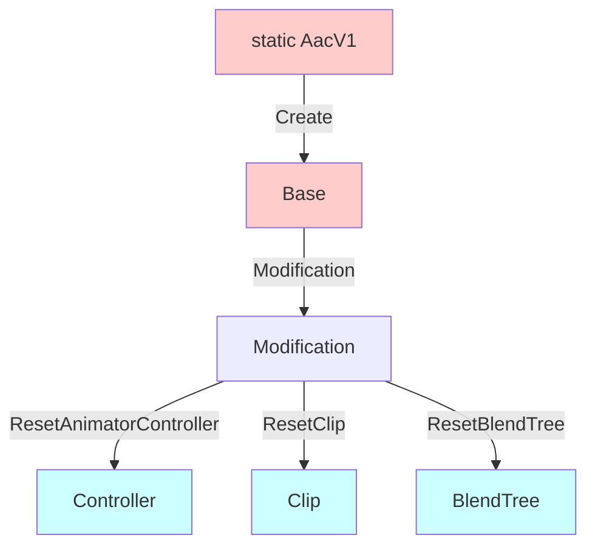

---
sidebar_position: 5
title: "Modification API"
unlisted: true
---

# Functions: Modification API

The Modification API is an upcoming API that is being introduced to 1.3.0. It is not currently available for use.

It is designed specifically for the **creation and distribution of modular prefabs**, where you generate assets on your developer machine
and distribute those generated assets to your users. Your users will not need to install Animator As Code.

When using the Modification API, you will provide references to existing AnimatorController, AnimationClip, and BlendTree assets.
These assets will be emptied and their contents replaced with the newly generated content. This is a **destructive process**, conversely intended
for the creation of **non-destructive prefabs**.

#### Minimum version

- The Modification API requires 1.3.0 minimum.

#### Animator creation overview

## Base (AacFlBase)

- `AacFlModification Modification()` 
  Returns an AacFlModification, granting you access to this destructive modification API. You will need to reuse this object throughout.

## Modification (AacFlModification)

- `AacFlController ResetAnimatorController(RuntimeAnimatorController controllerToReset)` 
  Immediately removes all layers and all parameters from the given AnimatorController, and returns a AacFlController that will edit the given AnimatorController. 
  This AnimatorController instance is memorized in the current AacFlModification instance memory.

- `AacFlClip ResetClip(AnimationClip clipToReset)` 
  Immediately removes all curves on the clip, resets all attributes of the clip asset, and returns a AacFlClip that will edit the given AnimationClip. 
  This AnimationClip instance is memorized in the current AacFlModification instance memory.
  
- `AacFlNonInitializedBlendTree ResetBlendTree(BlendTree blendTreeToReset)` 
  Immediately clears the list of children in the given BlendTree, sets the parameters to empty strings, and returns a AacFlNonInitializedBlendTree that will edit the given BlendTree. 
  This BlendTree instance is memorized in the current AacFlModification instance memory.

- `void SetDirtyAll()` 
  Calls `EditorUtility.SetDirty(...)` on every single AnimatorController, AnimationClip, and BlendTree asset instances that were previously memorized by this AacFlModification instance.
