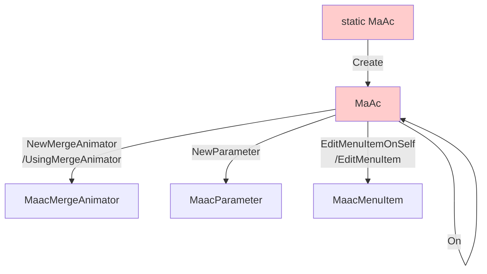

---
sidebar_position: 7
title: "Modular Avatar"
---

# Functions: Modular Avatar

:::danger
This is the work-in-progress documentation for Animator As Code **V1**, which has not yet been released. The last public version of Animator As Code is V0.
:::

:::warning
The API contract for Modular Avatar As Code V1 is highly unstable. Use at your own risk.
:::

*Modular Avatar As Code* contains facilities to automate the creation of [Modular Avatar](https://modular-avatar.nadena.dev/) components.

The functionality of this library is strictly limited to the handling of animators and parameters, therefore only the following components are covered:

- [MA Merge Animator](https://modular-avatar.nadena.dev/docs/reference/merge-animator)
- [MA Parameters](https://modular-avatar.nadena.dev/docs/reference/parameters)
- [MA Menu Item](https://modular-avatar.nadena.dev/docs/reference/menu-item)

For other components, you need to create them by hand.

To use the Modular Avatar As Code functions, add `using ModularAvatarAsCode.V1;` to your class imports.

#### Component creation overview

## Modular Avatar As Code (MaAc)

- `static MaAc Create(GameObject root, bool setDirty = true)` 
Create a Modular Avatar As Code base, targeting the root object. The root object is the object that you will attach the Merge Armature component to.

## Base (MaAc)

- `MaAc On(GameObject otherRoot)` 
Create a new instance of MaAc targeting another object. Beware that this new instance of MaAc forgets all previous method invocations, so invoking some stateful functions like "NewMergeAnimator" may cause different results.

#### Parameters

- `MaAc ImportParameters(VRCExpressionParameters parameters)` 
Import parameters from an existing VRCExpressionParameters asset. This creates a ModularAvatarParameters on the targeted object if it doesn't already exist.

- `MaacParameter<float> NewParameter(MaacParameterType parameterType, string parameter)` 
Declare a new parameter of the given type. If you use Animator As Code, you can reuse the parameters using the other `NewParameter` method overloads or the `NewBoolToFloatParameter` method. Function calls on the resulting objects will affect all parameters of that group. This creates a ModularAvatarParameters on the targeted object if it doesn't already exist.

- `MaacParameter<float> NewParameter(AacFlFloatParameter aacParameter)` 
Declare a new Float parameter, by default saved and synced. This creates a ModularAvatarParameters on the targeted object if it doesn't already exist.

- `MaacParameter<int> NewParameter(AacFlIntParameter aacParameter)` 
Declare a new Int parameter, by default saved and synced. This creates a ModularAvatarParameters on the targeted object if it doesn't already exist.

- `MaacParameter<bool> NewParameter(AacFlBoolParameter aacParameter)` 
Declare a new Bool parameter, by default saved and synced. This creates a ModularAvatarParameters on the targeted object if it doesn't already exist.

- `MaacParameter<bool> NewBoolToFloatParameter(AacFlFloatParameter aacParameter)` 
Declare a new Bool parameter, acknowledging that the animator has exposed it as a Float. By default it is saved and synced. This creates a ModularAvatarParameters on the targeted object if it doesn't already exist.

#### Parameter groups

- `MaacParameter<float> NewParameter(MaacParameterType parameterType, params string[] parametersWithNulls)` 
  Declare new parameters of the given type. If you use Animator As Code, you can reuse the parameters using the other `NewParameter` method overloads or the `NewBoolToFloatParameter` method. The array can safely contain null values. This creates a ModularAvatarParameters on the targeted object if it doesn't already exist.

- `MaacParameter<float> NewParameter(AacFlFloatParameterGroup aacParameterGroup)` 
Declare new Float parameters, by default saved and synced. This creates a ModularAvatarParameters on the targeted object if it doesn't already exist. Function calls on the resulting objects will affect all parameters of that group.

- `MaacParameter<int> NewParameter(AacFlIntParameterGroup aacParameterGroup)` 
Declare new Int parameters, by default saved and synced. This creates a ModularAvatarParameters on the targeted object if it doesn't already exist. Function calls on the resulting objects will affect all parameters of that group.

- `MaacParameter<bool> NewParameter(AacFlBoolParameterGroup aacParameterGroup)` 
Declare new Bool parameters, by default saved and synced. This creates a ModularAvatarParameters on the targeted object if it doesn't already exist. Function calls on the resulting objects will affect all parameters of that group.

- `MaacParameter<bool> NewBoolToFloatParameter(AacFlFloatParameterGroup aacParameterGroup)` 
Declare new Bool parameters, acknowledging that the animator has exposed them as Floats. By default it is saved and synced. This creates a ModularAvatarParameters on the targeted object if it doesn't already exist. Function calls on the resulting objects will affect all parameters of that group.

#### Merge Animator

- `MaacMergeAnimator NewMergeAnimator(AacFlController controller, VRCAvatarDescriptor.AnimLayerType layerType)` 
Declare a new animator to be merged. Every call to NewMergeAnimator will create an additional ModularAvatarMergeAnimator component. The path mode is set to Absolute.

- `MaacMergeAnimator NewMergeAnimator(AnimatorController animator, VRCAvatarDescriptor.AnimLayerType layerType)` 
Declare a new raw animator to be merged. Every call to NewMergeAnimator will create an additional ModularAvatarMergeAnimator component. The path mode is set to Absolute.

- `MaacMergeAnimator UsingMergeAnimator(ModularAvatarMergeAnimator mergeAnimator, AacFlController controller, VRCAvatarDescriptor.AnimLayerType layerType)` 
Writes over an existing MergeAnimator component, setting the controller and layer type to be merged. The path mode is set to Absolute.

- `MaacMergeAnimator UsingMergeAnimator(ModularAvatarMergeAnimator mergeAnimator, AnimatorController animator, VRCAvatarDescriptor.AnimLayerType layerType)` 
Writes over an existing MergeAnimator component, setting the raw controller and layer type to be merged. The path mode is set to Absolute.

#### Menu items

- `MaacMenuItem EditMenuItemOnSelf()` 
Edit one menu item on this object. It is not possible to declare multiple menu items on the same object.

- `MaacMenuItem EditMenuItem(GameObject receiver)` 
Edit one menu item on the receiver object. It is not possible to declare multiple menu items on that same object.

- `MaacMenuItem EditMenuItem(params GameObject[] receiversWithNulls)` 
Edit one menu item on all the receiver objects. It is not possible to declare multiple menu items on those same objects. Function calls on the resulting object will affect all of those menu items. Use this in case you have multiple identical menu items scattered across different menus. The array can safely contain null values.

#### Special

- `static MaAc Dummy()`
Create a dummy Modular Avatar As Code base that doesn't create or modify anything when you call any of its methods.
- If you need to disable the creation of Modular Avatar components without heavily modifying the code, use this.
- Calling the methods will still return appropriate objects that do nothing.

## Merge Animator (MaacMergeAnimator)

- `MaacMergeAnimator Relative()` 
Mark the path mode as relative. By default, merge animators are made absolute.

## Parameter (MaacParameter\<T>)

- `MaacParameter<T> NotSynced()` 
Mark this parameter as not synced. By default, newly created parameters are synced.

- `MaacParameter<T> NotSaved()` 
Mark this parameter as not saved. By default, newly created parameters are saved.

- `MaacParameter<T> WithDefaultValue(T value)` 
Set the default value of this parameter. No errors are raised if you try to set values outside legal range.

## Menu item (MaacMenuItem)

- `MaacMenuItem Name(string menuItemName)` 
Set the menu item name to be displayed on the menu.

- `MaacMenuItem WithIcon(Texture2D icon)` 
Set the menu item icon.

#### Toggle

- `MaacMenuItem Toggle(AacFlBoolParameter parameter)` 
Set the menu item type as Toggle for a Bool parameter.

- `MaacMenuItem ToggleBoolToFloat(AacFlFloatParameter parameter)` 
Set the menu item type as Toggle for a Bool parameter, which is exposed as a Float in the animator.

- `MaacMenuItem ToggleSets(AacFlIntParameter parameter, int value)` 
Set the menu item type as Toggle for a Int parameter, setting the value when toggled.

- `MaacMenuItem ToggleSets(AacFlFloatParameter parameter, float value)` 
Set the menu item type as Toggle for a Float parameter, setting the value when toggled.

- `MaacMenuItem ToggleForcesBoolToFalse(AacFlBoolParameter parameter)` 
Set the menu item type as Toggle for a Bool parameter. However, when toggled, the value of the bool will be forced to false. Toggling will never set the value to true.

#### Button

- `MaacMenuItem Button(AacFlBoolParameter parameter)` 
Set the menu item type as Button for a Bool parameter.

- `MaacMenuItem ButtonBoolToFloat(AacFlFloatParameter parameter)` 
Set the menu item type as Button for a Bool parameter, which is exposed as a Float in the animator.

- `MaacMenuItem ButtonSets(AacFlIntParameter parameter, int value)` 
Set the menu item type as Button for a Int parameter, setting the value when pressed.

- `MaacMenuItem ButtonSets(AacFlFloatParameter parameter, float value)` 
Set the menu item type as Button for a Float parameter, setting the value when pressed.

- `MaacMenuItem ButtonForcesBoolToFalse(AacFlBoolParameter parameter)` 
Set the menu item type as Button for a Bool parameter. However, when pressed, the value of the bool will be forced to false. Pressing will never set the value to true.

#### Radial

- `MaacMenuItem Radial(AacFlFloatParameter floatParam)` 
Set the menu item type as Radial for a Float parameter.
