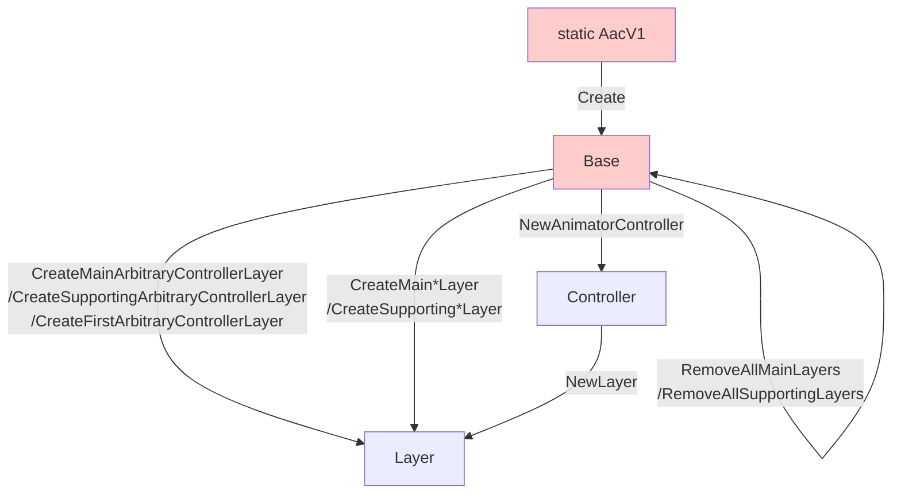

---
sidebar_position: 6
title: "VRChat (Destructive workflow)"
---

# Functions: VRChat (Destructive workflow)

:::danger
This is the work-in-progress documentation for Animator As Code **V1**, which has not yet been released. The last public version of Animator As Code is V0.
:::

These functions will create and delete layers within the animator controllers inside the VRCAvatarDescriptor, hence destructive workflow.

As times are changing, it is recommended that you switch to a non-destructive workflow using tools such as *Modular Avatar* or *VRCFury*, by creating an animator controller using `AacFlBase.NewAnimatorController()`. Alternatively, you can use functions contained in `AacFlBase` to destructively edit an arbitrary animator controller asset.

To use these functions, use the extensions functions in `AacVRCDestructiveWorkflowExtensions`:

- Add `using AnimatorAsCode.V1.VRCDestructiveWorkflow;` in your class imports.
- If you use assembly definitions, add the `AnimatorAsCodeFramework.V1.VRCDestructiveWorkflow` assembly reference.

#### Animator creation overview

## Extensions for Base (AacFlBase)

#### Destructive workflow: Create layers (AacVRCDestructiveWorkflowExtensions)

- `AacFlLayer CreateMainFxLayer()`  
  Create the main Fx layer of that system, clearing the previous one of the same system. You are not obligated to have a main layer.

- `AacFlLayer CreateMainGestureLayer()`  
  Create the main Gesture layer of that system, clearing the previous one of the same system. You are not obligated to have a main layer.

- `AacFlLayer CreateMainActionLayer()`  
  Create the main Action layer of that system, clearing the previous one of the same system. You are not obligated to have a main layer.

- `AacFlLayer CreateMainIdleLayer()`  
  Create the main Idle layer of that system, clearing the previous one of the same system. You are not obligated to have a main layer.

- `AacFlLayer CreateMainLocomotionLayer()`  
  Create the main Locomotion layer of that system, clearing the previous one of the same system. You are not obligated to have a main layer.

- `AacFlLayer CreateMainAv3Layer(VRCAvatarDescriptor.AnimLayerType animLayerType)`  
  Create the main layer of that system for a specific type of layer, clearing the previous one of the same system. You are not obligated to have a main layer.

- `AacFlLayer CreateSupportingFxLayer(string suffix)`  
  Create a supporting Fx layer for that system and suffix, clearing the previous one of the same system and suffix. You can create multiple supporting layers with different suffixes, and you are not obligated to have a main layer to create a supporting layer.

- `AacFlLayer CreateSupportingGestureLayer(string suffix)`  
  Create a supporting Gesture layer for that system and suffix, clearing the previous one of the same system and suffix. You can create multiple supporting layers with different suffixes, and you are not obligated to have a main layer to create a supporting layer.

- `AacFlLayer CreateSupportingActionLayer(string suffix)`  
  Create a supporting Action layer for that system and suffix, clearing the previous one of the same system and suffix. You can create multiple supporting layers with different suffixes, and you are not obligated to have a main layer to create a supporting layer.

- `AacFlLayer CreateSupportingIdleLayer(string suffix)`  
  Create a supporting Idle layer for that system and suffix, clearing the previous one of the same system and suffix. You can create multiple supporting layers with different suffixes, and you are not obligated to have a main layer to create a supporting layer.

- `AacFlLayer CreateSupportingLocomotionLayer(string suffix)`  
  Create a supporting Locomotion layer for that system and suffix, clearing the previous one of the same system and suffix. You can create multiple supporting layers with different suffixes, and you are not obligated to have a main layer to create a supporting layer.

- `AacFlLayer CreateSupportingAv3Layer(VRCAvatarDescriptor.AnimLayerType animLayerType, string suffix)`  
  Create a supporting layer for that system and suffix, clearing the previous one of the same system and suffix. You can create multiple supporting layers with different suffixes, and you are not obligated to have a main layer to create a supporting layer.

#### Destructive workflow: Remove layers (AacVRCDestructiveWorkflowExtensions)

- `void RemoveAllMainLayers()`  
  Remove all main layers matching that system from all animators of the Avatar descriptor.

- `void RemoveAllSupportingLayers(string suffix)`  
  Remove all supporting layers matching that system and suffix from all animators of the Avatar descriptor.