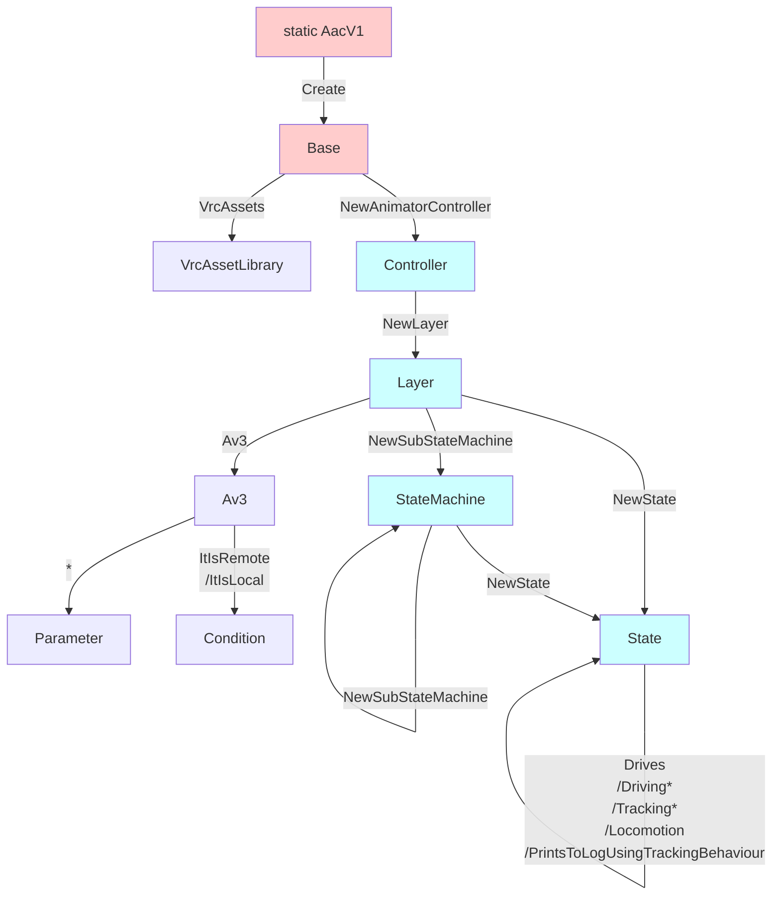

---
sidebar_position: 5
title: "VRChat"
---

# Functions: VRChat

:::danger
This is the work-in-progress documentation for Animator As Code **V1**, which has not yet been released. The last public version of Animator As Code is V0.
:::

These functions are specific to the VRChat Avatars SDK. For more functions, see [Destructive workflow](./vrchat-destructive).

To use these functions, use the extensions functions in `AacVRCExtensions`:

- Add `using AnimatorAsCode.V1.VRC;` in your class imports.
- If you use assembly definitions, add the `AnimatorAsCodeFramework.V1.VRC` assembly reference.

#### Animator creation overview

## Base (AacFlBase)

#### Reference VRChat assets (AacVRCExtensions)

- `AacVrcAssetLibrary VrcAssets()`  
  Return an AacVrcAssetLibrary, which lets you select various assets from VRChat.

## Layer (AacFlLayer)

#### Create VRChat parameters

- `AacAv3 Av3()`  
  Return an AacAv3 object, letting you select various standard Avatars 3.0 Animator Parameters. Subsequently invoking its functions will create invoked parameters in that layer.

## Avatars 3.0 (AacAv3)

### Parameters

- `AacFlBoolParameter IsLocal`  
  Create a Bool parameter in the animator named IsLocal.

- `AacFlEnumIntParameter<Av3Viseme> Viseme`  
  Create an Int parameter in the animator named Viseme.

- `AacFlEnumIntParameter<Av3Gesture> GestureLeft`  
  Create an Int parameter in the animator named GestureLeft.

- `AacFlEnumIntParameter<Av3Gesture> GestureRight`  
  Create an Int parameter in the animator named GestureRight.

- `AacFlFloatParameter GestureLeftWeight`  
  Create a Float parameter in the animator named GestureLeftWeight.

- `AacFlFloatParameter GestureRightWeight`  
  Create a Float parameter in the animator named GestureRightWeight.

- `AacFlFloatParameter AngularY`  
  Create a Float parameter in the animator named AngularY.

- `AacFlFloatParameter VelocityX`  
  Create a Float parameter in the animator named VelocityX.

- `AacFlFloatParameter VelocityY`  
  Create a Float parameter in the animator named VelocityY.

- `AacFlFloatParameter VelocityZ`  
  Create a Float parameter in the animator named VelocityZ.

- `AacFlFloatParameter Upright`  
  Create a Float parameter in the animator named Upright.

- `AacFlBoolParameter Grounded`  
  Create a Bool parameter in the animator named Grounded.

- `AacFlBoolParameter Seated`  
  Create a Bool parameter in the animator named Seated.

- `AacFlBoolParameter AFK`  
  Create a Bool parameter in the animator named AFK.

- `AacFlIntParameter TrackingType`  
  Create an Int parameter in the animator named TrackingType.

- `AacFlIntParameter VRMode`  
  Create an Int parameter in the animator named VRMode.

- `AacFlBoolParameter MuteSelf`  
  Create a Bool parameter in the animator named MuteSelf.

- `AacFlBoolParameter InStation`  
  Create a Bool parameter in the animator named InStation.

- `AacFlFloatParameter Voice`  
  Create a Float parameter in the animator named Voice.

### Supporting conditions

- `IAacFlCondition ItIsRemote()`  
  Verify that IsLocal is false. Create a Bool parameter in the animator named IsLocal.

- `IAacFlCondition ItIsLocal()`  
  Verify that IsLocal is true. Create a Bool parameter in the animator named IsLocal.

## Asset Library (AacVrcAssetLibrary)

- `AvatarMask LeftHandAvatarMask()`  
  Left Hand avatar mask asset.

- `AvatarMask RightHandAvatarMask()`  
  Right Hand avatar mask asset.

- `AnimationClip ProxyForGesture(AacAv3.Av3Gesture gesture, bool masculine)`  
  Gesture proxy animation asset. There are two idle animations for the neutral hand, the bool selects one or the other.

## State (AacFlState)

### Driver state behaviour

#### Local

- `AacFlState DrivingLocally()`  
  Set the driver to be Local only. Create an Avatar Parameter Driver state behaviour if it does not exist.

#### Set

- `AacFlState Drives(AacFlIntParameter parameter, int value)`  
  Drive the Int parameter to value. Create an Avatar Parameter Driver state behaviour if it does not exist.

- `AacFlState Drives(AacFlFloatParameter parameter, float value)`  
  Drive the Float parameter to value. Create an Avatar Parameter Driver state behaviour if it does not exist.

- `AacFlState Drives(AacFlBoolParameter parameter, bool value)`  
  Drive the Bool parameter to value. Create an Avatar Parameter Driver state behaviour if it does not exist.

- `AacFlState Drives(AacFlBoolParameterGroup parameters, bool value)`  
  Drive the Bool parameter to value. Create an Avatar Parameter Driver state behaviour if it does not exist.

#### Add

- `AacFlState DrivingIncreases(AacFlFloatParameter parameter, float additiveValue)`  
  Drive the Float parameter, incrementing it by `additiveValue`. Create an Avatar Parameter Driver state behaviour if it does not exist.

- `AacFlState DrivingDecreases(AacFlFloatParameter parameter, float positiveValueToDecreaseBy)`  
  Drive the Float parameter, decreasing it by the amount of `positiveValueToDecreaseBy`. Create an Avatar Parameter Driver state behaviour if it does not exist.

- `AacFlState DrivingIncreases(AacFlIntParameter parameter, int additiveValue)`  
  Drive the Int parameter, incrementing it by `additiveValue`. Create an Avatar Parameter Driver state behaviour if it does not exist.

- `AacFlState DrivingDecreases(AacFlIntParameter parameter, int positiveValueToDecreaseBy)`  
  Drive the Int parameter, decreasing it by the amount of `positiveValueToDecreaseBy`. Create an Avatar Parameter Driver state behaviour if it does not exist.

#### Random

- `AacFlState DrivingRandomizesLocally(AacFlFloatParameter parameter, float min, float max)`  
  Drive the Float parameter value to be random between min and max. Set the driver to be Local only. Create an Avatar Parameter Driver state behaviour if it does not exist.

- `AacFlState DrivingRandomizesLocally(AacFlIntParameter parameter, int min, int max)`  
  Drive the Int parameter value to be random between min and max. Set the driver to be Local only. Create an Avatar Parameter Driver state behaviour if it does not exist.

- `AacFlState DrivingRandomizesLocally(AacFlBoolParameter parameter, float chance)`  
  Drive the Bool parameter value to be random with the specified chance of being true. Set the driver to be Local only. Create an Avatar Parameter Driver state behaviour if it does not exist.

### Tracking state behaviours

- `AacFlState PrintsToLogUsingTrackingBehaviour(string value)`  
  Use an Animator Tracking Control to print logs to the avatar wearer. Create an Animator Tracking Control state behaviour if it does not exist.

- `AacFlState TrackingTracks(TrackingElement element)`  
  Use an Animator Tracking Control to set the element to be tracking. Create an Animator Tracking Control state behaviour if it does not exist.

- `AacFlState TrackingAnimates(TrackingElement element)`  
  Use an Animator Tracking Control to set the element to be animating. Create an Animator Tracking Control state behaviour if it does not exist.

- `AacFlState TrackingSets(TrackingElement element, VRC_AnimatorTrackingControl.TrackingType trackingType)`  
  Use an Animator Tracking Control to set the element to be the value of `trackingType`. Create an Animator Tracking Control state behaviour if it does not exist.
 
### Locomotion state behaviour

- `AacFlState LocomotionEnabled()`  
  Enable locomotion. Create an Animator Locomotion Control if it does not exist.

- `AacFlState LocomotionDisabled()`  
  Disable locomotion. Create an Animator Locomotion Control if it does not exist.