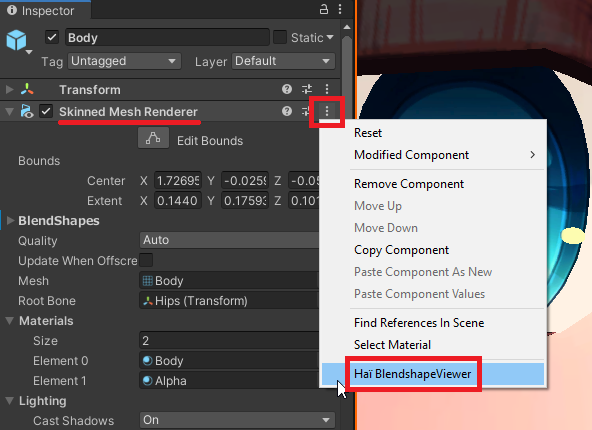

---
title: Blendshape Viewer
---
import {HaiTags} from "/src/components/HaiTags";
import {HaiTag} from "/src/components/HaiTag";
import {HaiVideo} from "/src/components/HaiVideo";

<HaiTags>
<HaiTag isUniversal={true} />
</HaiTags>

*Blendshape Viewer* lets you visually browse blendshapes.

:::tip[Compatibility notes]
- It has been tested to work on Unity 2019, Unity 2022, and Unity 6, and should work on newer versions.
- It is confirmed to work in <HaiTag requiresVRChat={true} short={true} /> and <HaiTag requiresBasis={true} short={true} /> projects. Other applications may be compatible.
:::

<HaiVideo src="./blendshape-viewer-img/sx_2022-01-15_00-25-45_Je9CWGeOH8.mp4"></HaiVideo>

## Download

The tool is free to download. It can also be downloaded using ALCOM.

### Direct download

- GitHub ([hai-vr/blendshape-viewer-vcc](https://github.com/hai-vr/blendshape-viewer-vcc))

### ALCOM

- Use this link to **[install our listing to ALCOM](vcc://vpm/addRepo?url=https://hai-vr.github.io/vpm-listing/index.json)**.
- Add *Haï ~ Blendshape Viewer* to your project using ALCOM.

## How to use

- Select your SkinnedMesh. In the inspector, click the three dots, and select “Haï BlendshapeViewer”.

- Move the camera in the scene, and click the window to refresh the pictures.
- Use the slider to change the blendshape values of the SkinnedMesh. This can be used during animation recording mode.

## Options

- **Skinned Mesh**: The skinned mesh to view blendshapes.

- **Show Differences**: Highlight the differences against the current settings of the Skinned Mesh.

- **Show Hotspots**: Draw the differences in red.

- **Auto Update On Focus**: If you change the scene camera position, clicking the BlendshapeViewer window will refresh the pictures.
- **Use Compute Shader**: Accelerates difference calculation when checked.
- **Thumbnail Size**: Size of the pictures.
- **Update button**: Click to refresh the pictures.
- **Search**: Filter the results further by adding search terms. You can separate search terms with a space, so the search query `eye down` can find results such as `eye_lookdown`.

## Additional notes

- Remember you can change the field of view of the scene camera.

- The tool can be used when recording animations.

<HaiVideo src="./blendshape-viewer-img/sx_2022-01-15_00-18-15_4Kdbs1Hlck.mp4"></HaiVideo>

- The text of the blendshape labels can be selected and copied.
- Press the icon next to the blendshape to copy the name your clipboard.

## Special thanks

- [Pema](https://github.com/pema99/) for the [Compute Shader](https://github.com/hai-vr/blendshape-viewer/commit/46db696df8be42d251f59c3f0fb240b117905c76)!