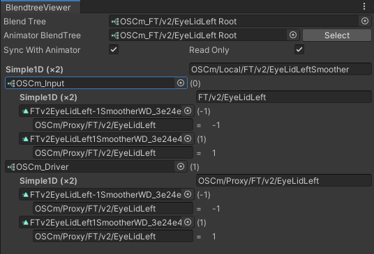

---
title: BlendTree Viewer
---

*BlendTree Viewer* lets you view large blend trees in a compact view.

:::tip
This does not require VRChat to run. It has been tested to work on Unity 2019, and should work on newer versions.
:::

## Download

The tool is free for download. It can also be downloaded using VCC.

- GitHub ([hai-vr/blendtree-viewer](https://github.com/hai-vr/blendtree-viewer))
- Booth.pm ([Blendshape Viewer - hai-vr - BOOTH](https://hai-vr.booth.pm/items/3582541))

### VCC

- Use this link to **[install our listing to VCC](vcc://vpm/addRepo?url=https://hai-vr.github.io/vpm-listing/index.json)**.
- Add *BlendTree Viewer* to your project using VCC.

## How to use

- Open *Window > Haï > BlendTree Viewer*.
- In Unity's Animator window, click on an animator state that contains a blend tree.
