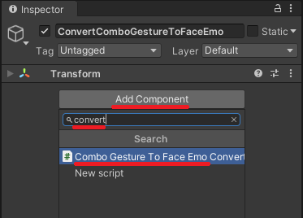

# Convert to FaceEmo

You can convert ComboGestureExpressions to **[FaceEmo](https://suzuryg.github.io/face-emo/)**
if you still have the ComboGesture components in your scene.

<video controls width="816">
<source src={require('./videos/NWB6b75D8N.mp4').default}/>
</video>

## Limitations

Conversion to FaceEmo has the following limitations:

- ComboGestureDynamics are not converted at all.
- Puppets cannot be converted. We will select only one animation from the puppet.
  - If a puppet is 2D, the animation at the origin is used, otherwise the first animation is used.
  - If a puppet is 1D, the rightmost animation is used.
- Fist animations are converted, but blinking prevention of analog fist animations will not carry over.
  - *FaceEmo does not appear to have options to let the user select whether an animation defined within a fist trigger should disable blinking.*
- You have the option to ignore analog fists entirely, which will make the fist animation play even when the trigger is not pressed.
  - In this case, the blinking prevention of fist animations will carry over.

## How to use

In VCC, install the additional package *Haï ~ Convert ComboGesture to FaceEmo*.

- In the scene that contains the ComboGesture components and your avatar, create a [New Expression Menu in FaceEmo](https://suzuryg.github.io/face-emo/docs/tutorials/simple-menu/)
or reuse the one you have.
- Outside the avatar, create a GameObject and add a *ComboGesture to FaceEmo Converter* component (search for "convert").

- Specify the ComboGestureCompiler component and the FaceEmo component.
- Choose whether you want to ignore fist triggers (see limitations above).
- Press Convert.
- When satisfied, you can safely delete the *ComboGesture to FaceEmo Converter* component from your scene.

:::warning
Don't use ComboGestureExpressions and FaceEmo simultaneously in the same avatar!

If you are going to use FaceEmo, make sure you have removed the CGE layers from your FX and Gesture layers,
along with any Expressions Menu and Expression Parameters related to CGE.
:::

When done, remove the package *Haï ~ Convert ComboGesture to FaceEmo* so that it doesn't interfere with the installation
of future FaceEmo updates.