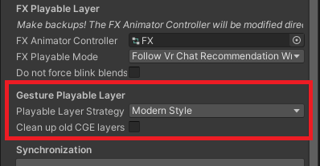

# Migration to VCC

Starting from versions 3.x and onwards, ComboGestureExpressions will be distributed on VCC.

The components used in ComboGestureExpressions V2 and V3 are the same. You will not lose your work.

### Installation

When installing ComboGestureExpressions V3, **the Assets/Hai/ComboGesture folder will be removed automatically**.
Please make sure you have never saved your own assets inside this folder!

- Use this link to **[install our listing to V<!-- -->CC](vcc://vpm/addRepo?url=https://hai-vr.github.io/vpm-listing/index.json)**.
- Add *Haï ~ ComboGestureExpressions* to your project using V<!-- -->CC.

### For users without VCC

It is not recommended to download CGE without VCC. However, if you really want to, you will need to download packages that CGE depends on:

- Animator As Code V1
- Animator As Code V1 - VRChat
- Animator As Code V1 - VRChat (Destructive workflow)

You will need to delete the `Assets/Hai/ComboGesture` folder if you already had V2 installed.

## Other features - End of the Gesture layer

In recent years, the Gesture layer is no longer popularly used for wing, ear, tail, and other animations.

For this reason, ComboGestureExpressions will now generate transform animations in the FX layer.
The Gesture playable layer is no longer used.

Check "Clean up old CGE layers" if you want to clear up an existing Gesture animator that was generated with the old style.

## Other features - Convert to FaceEmo

If you still have the ComboGesture components in your scene, [you can convert your ComboGestureExpressions components to FaceEmo](./convert-to-faceemo).
