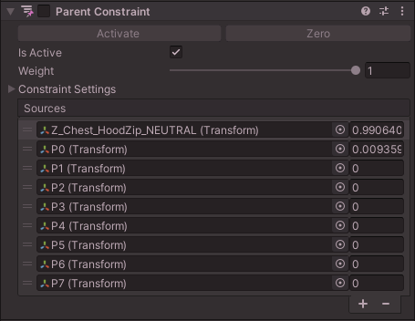
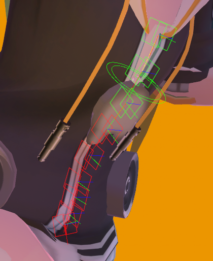

import KryfYW7TqN from './index-img/sx_2021-12-21_10-53-42_KryfYW7TqN.mp4';

# Constraint Track Animation Creator

*Constraint Track Animation Creator* is a Unity Editor tool which automates the creation of a gimmick that lets you animate an object to slide along a track using constraints.

:::warning
This tool requires VRChat, and is incompatible with other apps and platforms.
:::

This differs from blend shapes / shape keys, because bones moving along the track will lose their influence from the original bone they belonged from.

## Prerequisites

Creating Constraint Track Animations is **very hard**. You should be familiar with Unity animations and Unity constraint components.

Being comfortable with modeling tools such as Blender will let you achieve better results, since you’ll be able to split a bone in several parts, or add blend shapes. Avatar models are typically not designed to be used this way, so you will need to use your modeling skills at times to fill the gaps.

The experience will not be smooth and the mesh will sometimes clip through the model, so you need to accept those imperfections, or if you wish, further use your modeling skills to hide those imperfections by cleverly animating additional shape keys.

<video controls width="816" autostart="false">
    <source src={KryfYW7TqN}/>
</video>

## Principles

In a Constraint Track Animation, you have three things.

The **Constraint.** This is a Parent Constraint component that moves along the track.

The **Track.** These are the transforms through which the Constraint will slide. The track points are parented to various bones of the avatar.

The **Animation**. This animates the Constraint to move along the Track, and also animates the Track to disable them when not in use.

The Parent Constraint lets an object move as if it had multiple parents. Each “parent” has a weight representing how much that parent will influence the movement. This weight can be controlled by an animation. By animating the weight, the object will move between the “parents”. Here, each parent of the Constraint is a waypoint in the track.

Creating the Constraint, the Track, and the Animation is very hard to create by hand, and can result in mistakes.

The *Constraint Track Animation Creator* will automate most of the painful process to let you focus on the other difficult parts: Modeling, and composing the Track.

It will also create the Animator layers for you if you intend to use it on VRChat.

## Should you use a Constraint Track?

Before committing to creating a Constraint Track, ask yourself if you really want to use a Constraint Track.

A Constraint Track is useful when it **goes through various other bones that can be deformed relative to each other**. If it does not, then you can simply use a Transform animation.

Some effects are more easily done without a track. For example, if you’re building an umbrella, then you probably don’t need a track. You can either use a blend shape / shape key, or just use simple Transform animations.
