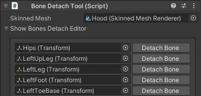

import hfr7itqHuk from './reference-img/sx_2021-12-25_09-13-53_hfr7itqHuk.mp4';
import minaCXRGZI from './reference-img/sx_2021-12-23_18-19-55_minaCXRGZI.mp4';
import bbssahrZts from './reference-img/sx_2021-12-22_14-49-00_bbssahrZts.mp4';
import MI4rQNf7hj from './reference-img/sx_2021-12-22_14-54-50_MI4rQNf7hj.mp4';
import rhqoXFd3f5 from './reference-img/sx_2021-12-28_22-51-31_rhqoXFd3f5.mp4';
import sbVJqWam30 from './reference-img/sx_2022-03-09_15-30-45_sbVJqWam30.mp4';
import otzZOfTPca from './reference-img/sx_2021-12-26_08-00-46_otzZOfTPca.mp4';
import cloakdr2expf2 from './reference-img/cloakdr2-exp-f2.mp4';

# Reference manual

This is the **reference manual!** This reference will go through the essentials of the tool.

:::warning
In the current version of this tool, the **VRChat Avatars 3.0 SDK is required** in order to generate the animations.
The system itself doesn’t need the VRChat SDK to function, so this limitation may be removed [at a later date](https://github.com/hai-vr/av3-constraint-track-animation-creator/issues/8).
:::

# Download

The tool is free for download.

- GitHub ([hai-vr/av3-constraint-track-animation-creator](https://github.com/hai-vr/av3-constraint-track-animation-creator))
- Booth.pm ([Constraint Track Animation Creator - hai-vr - BOOTH](https://hai-vr.booth.pm/items/3532857))

# Tutorial

⚠️ There is no in-depth tutorial yet, but it will be available at a later date.

The reference manual still follows the creation process in the logical order, but it does not go into detail onto why things are done and how to make the right choices.

In the meantime, you can use these videos as reference, which shows most of the process.

The following video shows in under 2 minutes an avatar being imported from scratch and an animation being created out of it.

<video controls width="816" autostart="false">
    <source src={hfr7itqHuk} />
</video>

[//]: # (<aside>)
⚠️ The following video is out of date, but demonstrates:

- the modification of a Neutral position
- how rotation of the Path waypoints affect the movement

Some of the video footage shows Lyuma’s https://github.com/lyuma/Av3Emulator, which is used to simulate the avatar inside the Unity Editor.
It needs to be installed separately, and the process is explained in this manual.

- Show video...

<video controls width="816" autostart="false">
    <source src={minaCXRGZI} />
</video>

[//]: # (</aside>)

# Create child bones for the clothes

In this reference manual:

- `YourBoneName` will be the name of one of the bones (i.e. `LeftHand`)
- `YourSystemName` will be the name of the system you’re animating (i.e. `HoodSleeveLeft`)

In order to move clothing, it needs to be detached from the original Humanoid bone, by creating a child bone.

There are several ways to create child bones for the clothes.

### Option 1: Simple copy using Unity

This is the simplest way and the one that I recommend.

Use the **Bone Detach Tool** component.

- Create a **Bone Detach Tool** component in a GameObject located somewhere in your scene (but it must not be inside an avatar).
- Select the SkinnedMesh of the piece of clothing that you want to detach the bones from.
- Click on “Show Bones Detach Editor”.
- Find the bones that you want to detach, and click “Detach Bone” on them.
    - Only bones that have vertices attached on this mesh will show up.
    - The number that shows in the middle is the total weight of all the vertices of the bone.
    - You might need the help of Blender to find out which bones are weight painted, and why.
      For example, some clothing going to the palm of the hands have bones for the fingers, and some clothing at the hip have bones for the spine.
- When done, **do not delete the tool**. Keep that object around:
    - If you update the original model file, you will sometimes need to click the “Fix Model Update” button if your mesh becomes messed up.
    - See: [Updating a model after using Bone Detach Tool](https://www.notion.so/Reference-manual-63e4ce5bddfb40c5849c2702aa9f1fea?pvs=21)

<aside>
⚠️ In some cases, detaching a bone that is located inside a Dynamic Bone can cause a change in the behaviour of the bone.
This is especially the case is the Dynamic Bone originally had only 1 child object.
Test the behaviour of your avatar after detaching. If it behaves differently, read below:

In the following example, the Dynamic Bone components are located in the Breast_L and Breast_R bones.
These bones only have 1 child object, which is more likely to cause issues.

Creating a detached bone will cause the dynamic bone to no longer function as it should, in this case the Breast_L and Breast_R bones may not rotate as they previously did, due to the presence of any additional child GameObject. This is the case even if the newly detached bones are in the Exclusion list of the Dynamic Bone:

A possible solution to this is to move the detached bone (and Neutral) to be children of the _end bones if they exist, and then add them to the Exclusions list of the Dynamic Bone:

</aside>

### Option 2: Simple copy using Blender

This is a more difficult option to do the same thing as Option 1, but in Blender.

If you used the Bone Detach Tool from Option 1, you don’t need to do this!

Duplicate your bone, make the duplicate a child of the original, and rename the Vertex Group in your clothing.

- Duplicate the `YourBoneName` bone. Rename the duplicate `Z_YourBoneName_YourSystemName`
- Set the parent `Z_YourBoneName_YourSystemName` to be `YourBoneName` (the duplicate becomes the child).
- In the Vertex Groups of your clothing mesh, rename the `YourBoneName` vertex group to `Z_YourBoneName_YourSystemName`

<aside>
ℹ️ The `Z_` prefix is used to ensure that when exported, the bone will not be the first in the hierarchy as this can cause issues with IK in-game.

</aside>

<video controls width="816" autostart="false">
    <source src={bbssahrZts}/>
</video>

Duplicate, the duplicate becomes the child.

<video controls width="816" autostart="false">
    <source src={MI4rQNf7hj}/>
</video>

Rename Vertex Groups of the clothing mesh.

### Advanced option: Splitting a unique bone into multiple parts

There could be no suitable bones; you will almost never find a Left Hip and a Right Hip for example.

For those, you need to split the Vertex Group of the mesh into multiple parts yourself using Blender or the modeling tool of your choice.

- Create new bones that are children of the bone you wish to split, and weight paint them accordingly.
- Remember that there is a hard limit of 4 bone per vertex in VRChat (as of December 2021; this may not be true for other platforms).
  Keep that limitation in mind when splitting a bone.

# Setup the tool

- Create a **Constraint Track Setup** component in a GameObject located **inside your avatar**.
    - Your avatar needs to have a VRCAvatarDescriptor in it. Also make sure you have a custom FX layer in your avatar, you will need it at the final step.
- Give your GameObject a name.
- Add the clothing bones to the list of bones.
- Click “Create Neutral Objects”

- **If necessary, move the Neutral objects to a location that better represents the bone.**
  In the following video, the Neutral object of the frill ribbon is moved away from the LeftUpLeg bone to be roughly the center of the frill ribbon.
  This new Neutral position better represents the rotation point of the frill, which will make it easier to slide through the leg.

<video controls width="816" autostart="false">
    <source src={rhqoXFd3f5}/>
</video>

- Click “Confirm Setup”.

# Build your track

Define the waypoint through which the bone will slide through.

- Select the `P0` object, and move it to start building your path.
- Duplicate it, and move it again to create additional waypoints in your path.
- The rotation of the `P0`, `P1`, `P2`, ... objects will rotate your bone.

If you feel comfortable, you can select multiple `P0` objects of different tracks, duplicate, and move them all at once to quickly create the waypoints.

# Parent Constraint your track to your armature

For each waypoint, use the Parent Constraint to attach it to the bones of the armature. This will make the waypoint follow the movement of your armature.

- Select the `P0` object, define the Parent Constraint sources.
- Click the Activate button.
- Do the same for the `P1`, `P2`, ... objects.
- If you choose to parent to multiple bones, remember you can select the weight of each bone.

# Parent the P0 object to a Proxy for non-important bones

Non-important bones are bones that have little impact on the object being animated, in such a way that they don’t deserve their own track. For example, this can be the Thumb bone of a piece of clothing that extends to the wrists.

For non-important bones such as these, the solution is to make a track that will slide it to another Proxy object; it will effectively make this non-important bone follow another track.

- Identify your non-important bones if you have some.
- Select the `P0` object, define the Parent Constraint sources to be a Proxy such as `Proxies/Z_SomeOtherBone_YourSystemName_Proxy`, and Activate it.
- Select the **Single Constraint Track** component at the root of your scene.
- Set Timing Scale to something small, like `0.2` so that animation for that non-important bone will end sooner.
- You can optionally set the Gizmo Scale to a small value, in order to declutter the Scene view.

# Play blend shapes / shape keys

This is optional.

- Select the **Constraint Track Animation** component at the root of your scene.
    - In Optional Animation Active, put an animation that animates your blend shape / shape keys. The animation is 10 seconds long most of the times.
    - In Optional Animation Inactive, put an animation that animates your blend shape to the rest position. The animation length should be exacly 2 keyframes (meaning it lasts 1/60 of a second).

# Generate the Animator (VRChat)

- Make sure your avatar already have a FX layer defined.
- Select the **Constraint Track VRC Generator** object.
- Choose `YourParameterName` for your Expressions menu.
- Click “Update All Constraint Tracks” button.
- Click “Update FX Animator” button.

# Control your animator

Choose how you want to control your animator. **You can choose one, several, or even all of them at the same time.**

- It is perfectly fine to create the AvatarDynamics PhysBone but not any Expression menu and parameters.
- If you choose to use the Expressions Menu, keep in mind Constraint Track Animation Creator does not automatically create Expressions menu and Expression parameters, you have to edit these yourself.

To control the animator:

- For Expression Menu Toggle, create a Bool called `YourParameterName_Auto`
    - This has priority over Avatar Dynamics.
    - You can set the animation duration in “Auto Duration Seconds”.
- For Expression Menu Radial Puppet, create a Float called `YourParameterName_Manual`
    - This has priority over Expression Menu Toggle and Avatar Dynamics.
- For Avatar Dynamics, write the complete parameter desired control.
    - For a Contact Receiver, it could be `YourContactReceiverParameter`
    - For a PhysBone, it could be `YourPhysBoneParameter_Stretch`

<video controls width="816" autostart="false">
    <source src={sbVJqWam30}/>
</video>

      The sleeve is just a PhysBone made of empty objects that can stretch. The main advantage is that this does not consume any synced parameter bits!

In addition, you can prevent the system from being triggered by locking it. This is optional.

Lock your system:

- To force your system to be at rest, create a Toggle with a Bool called `YourParameterName_AllowSystem`
    - When the parameter is true, the system can be used.
    - When the parameter is false, the system will be at rest.
    - The parameter name can be changed to the name of your choice in the Constraint Track VRC Generator component.

An extra parameter `YourParameterName_AutoFloat` exists, which behaves the same as `YourParameterName_Auto` but is a Float with the threshold at 0.5

- This is meant to be used inside animation files as an AAP, so that an animation clip can command the constraint to play automatically.

# Testing

To test in Editor, use [Lyuma’s Av3 Emulator](https://github.com/lyuma/Av3Emulator).

- Setup your track.
- Generate the Animator.
- Setup the Expression Menu or Avatar Dynamics accordingly.
- Add the Tools > Emulator in your scene.
    - Download and install ‣ if you don’t already have it.
        - To test Avatar Dynamics, make sure you use the latest version of Av3Emulator.
        - If you are using a version of Av3Emulator released before Avatar Dynamics, it will not work.
- Start Play mode.

Remember: If your edit your avatar while in Play mode, your changes will be lost once you exit Play mode!

# Finish editing

When you’re finished editing your track, in the Constraint Track VRC Generator component, click “Optimize”.

This is not a commitment, if you want to edit the paths again, click “Open For Editing”.

Optimizing will disable the constraints and the system for performance. They will be re-enabled by animation when the system is in use.

In any case:

- Do not remove the various components created by the setup.
  (Single Constraint Track, Constraint Track Animation, Constraint Track VRC Generator components)
- Do not remove the Bone Detach Tool if you have used it.

# Advanced topics

## Advanced: Timing

### Distance between waypoints

The animation is generated based on the distance between the waypoints of the Path.

If the waypoints of the Path are spaced well enough, this will result in a linear motion through the points of the track.

However, if two waypoints are too close to each other, that distance will be replaced with a minimum distance.

The minimum distance is specified in the Single Constraint Track component, in the “Timing Padding Distance” option.

### Delay between tracks

If you wish different Single Constraint Tracks to start at different times relative to each other, change the “Timing Delay Start Seconds” option. Tracks have a length of 10 seconds, so adding a delay of 3 seconds will make this track length 13 seconds.

### Make a track shorter than others

By changing the Timing Scale option, you can reduce the Track length. This is useful for non-important bones.

A Timing Scale of 0.2 will result in Track length of 2 seconds. If you add a delay of 3 seconds, that will result in a Track length of 5 seconds.

### Automatic mode

When playing an animation in Automatic mode, the delay and scale you specify is independent from the Constraint Track VRC Generator option “Auto Duration Seconds”, so this option specifies how long the system plays no matter what.

Even though the motion is linear through the points of the track, when using the *Automatic* mode, the motion will be eased in and out.

## Advanced: Scale Constraint

Scale Constraints are generated by default on the gimmick.

You can scale the individual path waypoints to scale the bone along the path.

It doesn’t have to be an uniform scale.

## Advanced: Gizmos

The Gizmo is the track that is displayed in the Scene view.

To make editing the paths easier, Gizmos of tracks are always visible.

You can change some of its settings in the Single Constraint Track component (remember you can select multiple of them at once).

If you uncheck “Gizmo Always Visible”, the Gizmo will only be visible when the track is selected.

You can change the “Gizmo Direction” to point at another direction. This is for visualization purposes and has no effect on your animation.

Change the “Gizmo Scale” to make your gizmos shorter or larger.

## Advanced: Updating a model after using Bone Detach Tool

If you have used the Bone Detach Tool, you can still update the model in Blender and add new bones.

When done editing, you need to click the “Fix Model Update” in your Bone Detach Tool component. That’s why it’s important to keep this component around.

If you encounter an issue when trying to Fix Model Update, post a message in **#constraint-track** channel on Discord:

[Join the Invitation Discord Server!](https://discord.com/invite/58fWAUTYF8)

## Advanced: Adding new bones / forgotten bones to an existing system

To add new bones or bones that you forgot to an existing system, temporaily create a new system with only the new bones, and move them over to the old system.

Step by step:

- Keep your original System.
- Create a new System with the same name, using a new GameObject.
- Run the Setup process again, with only the new bones to be added.
- When the System has been generated:
    - Move the new children of Proxies to the old System’s Proxies
    - Move the new children of Paths to the old System’s Paths
    - Copy the new tracks to the old System.
    - In the Constraint Track Animation, drag and drop the new tracks to the tracks list.
- Delete the new System.

## Advanced: Use a Track Animation Active to animate a property that will cause another track to Auto-play

For all of the parameters described in the “Control your Animator” section, if you know what you’re doing, you can drive the parameters yourself from another animator.

They can even be driven from an AAP (see [Avatars 3.0: Animated Animator Parameters, and Smoothing](https://www.notion.so/Avatars-3-0-Animated-Animator-Parameters-and-Smoothing-f128c71dd3184c2bb61a4cff8296ada5?pvs=21)).

A special float exists for this purpose that was not described in “Control your Animator”, called `YourParameterName_AutoFloat` present in version V0.1.2 (not yet released) and onwards.

This was created specifically to trigger an Automatic animation when another track reaches the end of the animation, by using an AAP inside an Optional Animation Active.

# A note about performance optimization of the Track

**Constraints are CPU expensive when used in a large quantity.** The performance will drop dramatically after a critical number of constraints are active at the same time.

For this reason, the Constraint Track Animation Creator has **built-in optimization tricks** that will reduce the number of active constraints to a minimum. The following optimizations are automatically applied when using Constraint Tracks:

- The Bones are already children of the actual Bone they originally belonged to, so constraints are not needed when the system is not in use.
- All constraints are disabled by default.
- When the system is used for the first time, the Bone constraint will activate.
- The Constraint will be located only between two Path objects at any point, so only the constraint of these two Path objects will be active; the other Path objects will have their constraint disabled.
- When the system is no longer used, the Bone constraint will remain active to follow the Neutral object. This is to make sure that the avatar looks correct even when your avatar animator is culled during the system deactivation.

This ensures that despite the large number of constraints, it will have some of the lowest performance impacts even when not in use.

<aside>
🚫 It is tempting to use Parent Constraints to parent the entire piece of apparel to the Humanoid. **I strongly advise against doing this for performance reasons.**

Constraint Track Animation Creator is the result of learning from past mistakes as I have built several avatars using this gimmick. By experience, this will result in a measurable performance loss that cannot be fixed.

</aside>

## Other options in the components

Some options in the components have been omitted in the manual because their default value should normally be good. They are explained here:

**Constraint Track Setup**

- Ignore Bone Rotation: When creating the Neutral Objects, Proxies and Paths, the objects are created aligned to the world instead of aligned with the bone. Since bones have arbitrary rotations, having the bones being aligned to the world instead will make it easier to visually create the waypoints.
- Ignore Bone Scale: When creating the Neutral Objects, Proxies and Paths, the objects are created without taking into account the bone scale.
- Generate Scale Constraints: When creating the Proxies and Paths, a Scale Constraint will be added in addition to the Parent Constraint. The scale will depend on the scale of each individual waypoint.
- Gizmo Direction: When creating the Tracks, this is the initial Gizmo Direction setting, which can be changed later. The circle is the representation of the Proxy orientation.
- Gizmo Scale: When creating the Tracks, this is the initial Gizmo Scale setting, which can be changed later.

**Single Constraint Track**

- Auto Update Path Names: The waypoints of the Path will be renamed to `P0`, `P1`, `P2`, ... when the Constraint Track is updated.
- Gizmo Include Transform Scale: The visual representation of the waypoint will be deformed by the scale of the waypoint.

**Constraint Track Animation**

- Parent Of All Tracks: This is the common parent in the hierarchy that contains all of the Proxies, Path, and other elements in the hierarchy within the avatar. This common parent will be disabled when the system in not in use, and it will also be disabled during optimization, in order to optimize for performance.

**Constraint Track VRC Generator**

- Layer Name: Name of the layer when generating the animator. The name will be prefixed and suffixed as several layers will be created.
- Parameter Prefix Name: Common prefix that will be used for creating all parameters.
    - This does not include the Avatar Dynamics parameter, not the Optional Allow System Parameter.
- System Is Allowed By Default: If this is on, the system will be allowed by default without needing your input. You will not need to create a custom synced parameter to toggle it, not drive its local value from your own animators.
- Optional Allow System Parameter: Custom name of the parameter to allow the system.
    - This is ignored if the system is allowed by default.

# Special techniques

Constraint Track Animation Creator is only a tool which is tackling part of the painful process.

You should combine the tool with other techniques to achieve specific effects.

Some of them are described in the following pages, but you should experiment yourself and find new techniques.

Here are some of those that I have learned myself while working on this gimmick:

### Special technique: Keep a nice SkinnedMesh deformation when moving in visually parallel tracks using Aim Constraints

Tracks are normally independent objects. The objects moving in the track is rigid and independent from other tracks.

Using Aim Constraints as children of your Proxies, you can move an object along a track and keep a nice deformation of the skinned mesh by changing the source of the Parent Constraints in the Bones. This will create a rotation axis going through the two tracks.

This technique is further described in the following page:

[Special technique: Keep a nice SkinnedMesh deformation when moving in visually parallel tracks using Aim Constraints](https://www.notion.so/Special-technique-Keep-a-nice-SkinnedMesh-deformation-when-moving-in-visually-parallel-tracks-using-4939ede76fc648bcbc6a4fddb56c32d5?pvs=21)

<video controls width="816" autostart="false">
    <source src={otzZOfTPca}/>
</video>

### Special technique: Drop in world space using World Constraints at the end of your track using custom animations

Using a [World Constraint](https://github.com/VRLabs/VRChat-Avatars-3.0#world-constraint), you can drop an object in world space at the end of your track. You need to use a custom animation to align the World Constraint with your object right before the object leaves the track.

I suggest that you move the World Constraint to another System, and trigger it separately using an Auto animation.

<aside>
🚧 This section is not available yet.

</aside>

<video controls width="816" autostart="false">
    <source src={cloakdr2expf2}/>
</video>

### Special technique: Moving several tracks in a sequence using delays and scaling

Some tracks are better moved in a sequence rather than all simultaneously.

<aside>
🚧 This section is not available yet.

</aside>

### Special technique: Parenting a track to follow another track mid-animation

Parenting a track to another track is normally done for non-important bones using the `P0` object, but this can also be done with the last Path object.

In effect, the Bones of an important track become non-important in the middle of an animation.

This is especially useful in order to drop multiple tracks in world space by making all tracks converge into a single proxy of another track.

<aside>
🚧 This section is not available yet.

</aside>

### Special technique: Use invisible Dynamic Bones located inside the System to make a an object dangle to gravity

By using invisible Dynamic Bones located inside the system, you can make an object dangle to gravity while moving along its track.

Since the Dynamic Bone is inside the system, they will be automatically disabled when the system is not in use.

<aside>
🚧 This section is not available yet.

</aside>

### Special technique: Add additional constraints located inside the System to describe complex movement

Objects located inside the system are only enabled when the system is in use. This makes it a great location to put additional constraints, as they will be disabled for performance reasons when the system is not in use. You can describe objects moving in a complex pattern using this.

For example, you may want to describe a rotation dictated by the current orientation of both of your arms relative to your body rotation.

<aside>
🚧 This section is not available yet.

</aside>

### Special technique: Use Timing Padding Distance to make an object rotate in-place at some point in the track

An object doesn’t have to just move on a track, it can also move and rotate on itself. You can take advantage of Timing Padding Distance to create waypoints stacked on top of each other which will rotate the bone in-place at some point during the track.

<aside>
🚧 This section is not available yet.

</aside>

## TODO

TODO:

- [ ]  Clarify the thumb proxies

## Other pages

[Work in progress](https://www.notion.so/Work-in-progress-e847185f167b427d8533d7109ed5fd21?pvs=21)
