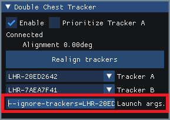

import pFdyyLdeVF from './img/double-hip-tracker_pFdyyLdeVF.mp4';

# Double Chest Tracker

In addition to the Double Hip Tracker, you can also enable the Double Chest Tracker.

:::info
The Double Chest Tracker is completely optional.
:::

## Configuration of the Double Chest Tracker

Once enabled, you need to select the serial numbers of your two chest trackers by hand.

You can find out which tracker is the correct one by spinning your tracker quickly, and an indicator `<<<` will show up in the list of available hardware.

<video controls width="816" autostart="false">
    <source src={pFdyyLdeVF}/>
</video>

Spin your tracker to find it using the `<<<` indicator, and then select them in the *Double Chest Tracker* tab panel.

## Ignore trackers in VRChat

If you try to calibrate in VRChat, there is no guarantee that our Double Chest Tracker will be the one bound to the chest in VRChat. Unlike the hip, there is a good chance that one of the two hardware trackers will be closer to the chest than our tracker.

To fix this, you need to tell VRChat to ignore the serial numbers of your trackers.

On the Double Chest Tracker tab panel, select and copy the line called *Launch args.*

On your Steam library, right click VRChat, and select *Properties…*

Paste the line you copied in the Launch options, and make sure the serial numbers are correct (for example, the last characters could be missing).

Once done, VRChat should no longer try to bind to those hardware trackers during calibration.

## Optional: Prioritize Tracker A

If you are wearing your two chest trackers in locations where one of the trackers is more advantageous than the other in terms of tracking quality, you can choose to Prioritize Tracker A.

For example, if you’re wearing a tracker on the chest like you normally would, and a tracker somewhere below your armpit, it could be advantageous to prioritize the tracker located on the chest.

<video controls width="816">
    <source src={require('./img/doublechesttrackerprio-f.mp4').default}/>
</video>

Select the serial number of the tracker that has a better position in the **Tracker A** slot.

Check the Prioritize Tracker A checkbox.

By using Prioritize Tracker A, the Double Chest Tracker will be positioned at the same position as the Tracker A. It will no longer act as an average measurement of the two chest trackers.

The position of the Tracker B will be ignored completely, unless Tracker A loses tracking.

When Tracker A loses tracking, the position of the Tracker A will be simulated using the known position of the Tracker B.

You must tell VRChat to [ignore the serial number of the trackers](#ignore-trackers-in-vrchat) when using Prioritize Tracker A.