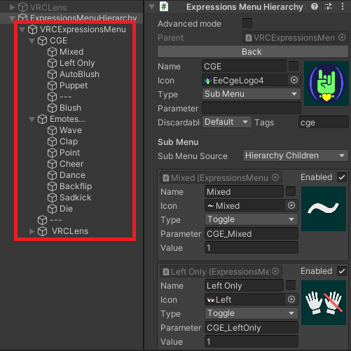
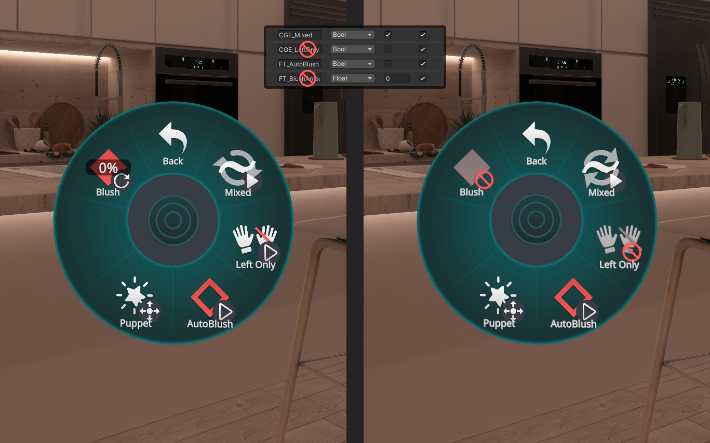
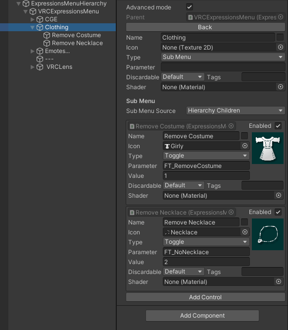
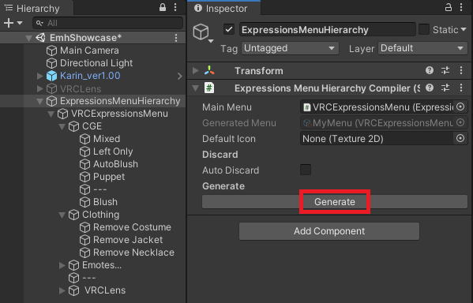
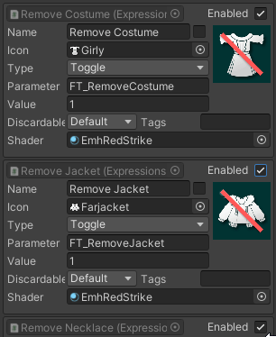
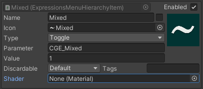

import qwusFjCQsC from './expressions-menu-hierarchy-editor-img/sx_2022-03-03_03-36-12_qwusFjCQsC.mp4'
import JfpvN3yRTz from './expressions-menu-hierarchy-editor-img/sx_2022-03-03_01-37-29_JfpvN3yRTz.mp4'
import {HaiTags} from "/src/components/HaiTags";
import {HaiTag} from "/src/components/HaiTag";

# Expressions Menu Hierarchy Editor

<HaiTags>
<HaiTag requiresVRChat={true} />
</HaiTags>

*Expressions Menu Hierarchy Editor* lets you edit Avatars 3.0 menus as if they were objects in your scene hierarchy, making it easier to edit the menu by duplicating and moving items around.

:::warning
This tool requires VRChat, and is incompatible with other apps and platforms.
:::

:::tip
If you use **[Modular Avatar](https://modular-avatar.nadena.dev/)**, you should use [Modular Avatar Menu Items](https://modular-avatar.nadena.dev/docs/tutorials/menu) instead.
:::

Additional functionality includes automatically disabling items in the menu when your Expression Parameters does not support it, and generating icons.

## Download

The tool is free for download.

- GitHub ([hai-vr/av3-expressions-menu-hierarchy-editor](https://github.com/hai-vr/av3-expressions-menu-hierarchy-editor))
- Booth.pm ([Expressions Menu Hierarchy Editor - hai-vr - BOOTH](https://hai-vr.booth.pm/items/3696355))

## How to set up

:::tip
If you use **[Modular Avatar](https://modular-avatar.nadena.dev/)**, you should use [Modular Avatar Menu Items](https://modular-avatar.nadena.dev/docs/tutorials/menu) instead.
:::

Expressions Menu Hierarchy Editor (EMH) assumes that you already have a menu set up for your avatar in the traditional way.

We will import your existing menu in order to create a new Expression Menu asset which is generated.

- Add the “Assets/Hai/ExpressionsMenuHierarchyEditor/ExpressionsMenuHierarchy” prefab in your scene.
- Select your avatar’s Expressions Menu.
- Click “Create new Expressions Menu...”.
- Choose a location to create your new Expressions Menu asset.

Your scene now contains the entire menu as a hierarchy of GameObjects!

<video controls width="816" autostart="false">
    <source src={qwusFjCQsC}/>
</video>

## Editing menus

### Making changes to your menu

Making change to your menu is as easy as moving items in the scene hierarchy.

If you want to create new items in your menu, you can duplicate an existing item as if you were to duplicate an object in the scene.

### Applying changes

Select the “ExpressionsMenuHierarchy” compiler, and click “Generate”.

### Creating new submenus

To create a new submenu, create a new item, and choose the type to be a SubMenu. Then, you can add new items as a child of that SubMenu in the hierarchy.

Another way to create submenus is to select multiple items, and choose “Group into a new SubMenu”.

### Dealing with Radial Inventory System / VRCLens / VirtualLens menus

Menus generated from other Editor Tools such as Radial Inventory System can be handled differently, by specifying the Sub Menu Source to be a reference to another Expressions Menu Asset instead.

The hierarchy children of this SubMenu will be ignored.

<video controls width="816" autostart="false">
    <source src={JfpvN3yRTz}/>
</video>

### Reusing a SubMenu multiple times / Circular references

Just like the section above regarding SubMenu assets, another Sub Menu Source setting exists called Hierarchy Reference. This lets you select another object in the hierarchy that will contain the SubMenu items.

The hierarchy children of this SubMenu will be ignored.

### Disable GameObjects to remove them from the menu

If you disable a GameObject, it won’t be included in the generated menu.

### Items with no text

If you want an item to have no text, tick the checkbox at the right of the Name field.

This will cause the item to have a name that isn’t the name of the GameObject.

## Automatic discarding

Automatic discarding lets you specify options that will discard menu items during generation.

### Discard items missing from VRC Expression Parameters

The “Auto Discard” functionality of EMH allows you to specify a VRC Expression Parameters asset in your compiler. During the generation process, all items that have at least one parameter that is missing from the Expression Parameters will be discarded.

The Discard Type lets you choose how the items will be discarded:

- Blank Out: Discarded items will be replaced by a blank item in the menu that does nothing when selected. The item will have no text.
- Gray Out: Discarded items will be replaced by a gray version of the icon that does nothing when selected. The item will keep the text.
    - The appearance of grayed out icons can be customized by changing the Discard Gray Out material. A few shader materials are provided in the Shaders/ folder.
- Remove: Discarded items will be removed from the menu.

### Discard items using tags, and customize discard type per item

The “Auto Discard” functionality of EMH can also allow you to specify tags that will be discarded.

When editing items, you can check “Advanced mode” at the top. Additional options will appear to let you choose tags. In addition, you can choose how specific items will be discarded using the “Discardable” drop-down menu.

In the compiler, you can then specify tags, separated by commas `,` to discard specific tags.

## Generating custom icons using shaders

Shaders can be used to modify the appearance of your icons. This can be used in two places:

- When editing items, you can check “Advanced mode” at the top. Additional options will appear to let you choose a material.
- In the compiler, you can customize the appearance of discarded “Gray Out” items in “Discard Gray Out”.

A few shader materials are provided in the Shaders/ folder. One of them draws a red line across the icon. Try playing with it!

