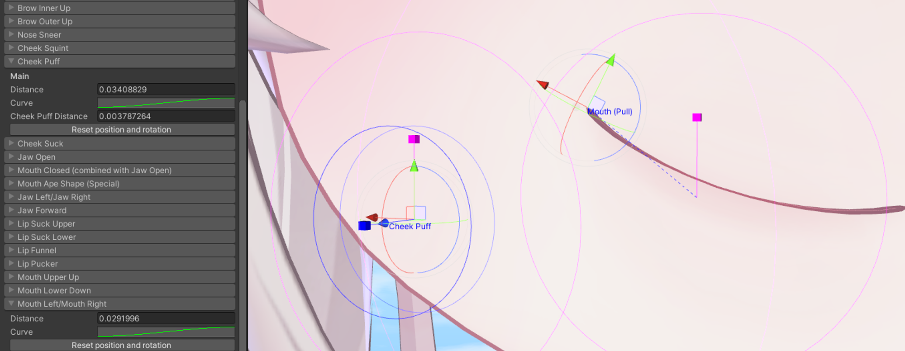

---
title: ⭐ FaceTra Shape Creator
---

# Haï's FaceTra Shape Creator

FaceTra Shape Creator is an Unity Editor tool that lets you create face tracking blendshapes on an avatar by morphing meshes. The original mesh asset is not modified, and the process is non-destructive, automating a large portion of this laborious process.

:::tip
This does not require VRChat to run. It has been tested to work on Unity 2019, and should work on newer versions.

*To install without VRChat support, you must follow special installation instructions below.*
:::

## Download

The tool is available to [Patreon supporters](https://www.patreon.com/vr_hai), **but it is currently a work in progress** as part of the [Face Tracking Trials](https://www.notion.so/f4032b4827e146fe9d2d3776e5da0f3b?pvs=21).

If you use this tool, it is highly recommended that you join the [Discord server](https://discord.com/invite/58fWAUTYF8) in order to stay up to date and get support as this tool will be rough to use at first.

## Documentation

The [documentation for *Haï's FaceTra Shape Creator* is currently located in a different page](https://hai-vr.notion.site/hai-vr/Ha-s-FaceTra-Shape-Creator-f1d95d4459e54fc3b2f166d9ebb5ebf3).

## Examples

The tool has been designed primarily for anime-like avatars.

It should also perform well with kemono avatars, and it has been used with furry avatars with some success.

### Anime-like avatar

<video controls width="816">
    <source src={require('./img/haolan-facetra-test-f.mp4').default}/>
</video>
*Haolan*

### Kemono avatar

<video controls width="816">
    <source src={require('./img/foshunia-facetra-f-an.mp4').default}/>
</video>
*Foshunia*

### Furry avatar

<video controls width="816">
    <source src={require('./img/actias-demo-f-an.mp4').default}/>
</video>
*Actias*