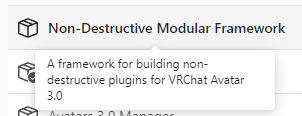

# Install

:::tip
This does not require VRChat to run. It has been tested to work on Unity 2019 and Unity 2022, and should work on newer versions.

*To install without VRChat support, you must follow special installation instructions described below.*
:::

# Download

The tool is available to [Patreon supporters](https://www.patreon.com/vr_hai), **but it is currently a work in progress** as part of the [Face Tracking Trials](https://www.notion.so/f4032b4827e146fe9d2d3776e5da0f3b?pvs=21).

If you use this tool, it is highly recommended that you join the [Discord server](https://discord.com/invite/58fWAUTYF8) in order to stay up to date and get support as this tool will be rough to use at first.

### For VRChat

This requires the use of the VRChat Creator Companion in order to automatically build the mesh before upload.

- Add **[Modular Avatar listing](https://modular-avatar.nadena.dev/)** by clicking on *Download (using VCC).*
- In VCC, add the **"Non-Destructive Modular Framework"** package to your project.

Open the downloaded archive and install the .unitypackage in your project.

### For Resonite or other apps

You can start a new Unity project in Unity 2022, or reuse a VRChat project in Unity 2022 or Unity 2019.

Open the downloaded archive and install the .unitypackage in your project, but during installation, uncheck the folder called *dev.hai-vr.facetra-shape-creator<u><strong>.vrc</strong></u>*

If you want to install for Resonite or other apps, I’m interested, please ping me on the [Discord server](https://discord.com/invite/58fWAUTYF8).
