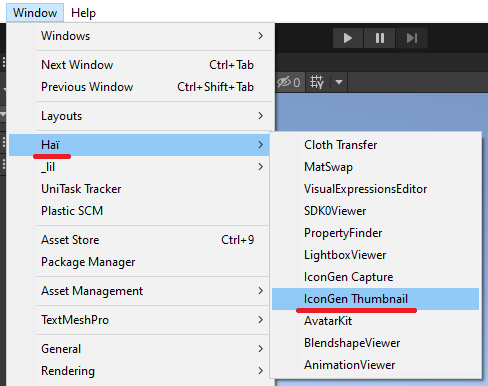
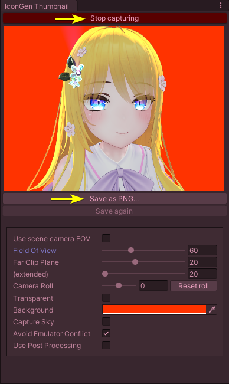

---
title: 🔒 IconGen
---

# IconGen

*IconGen* is an Unity Editor tool that lets you capture icons and generate icons.

:::tip
This does not require VRChat to run. It has been tested to work on Unity 2019, and should work on newer versions.
:::

## Download ⭐

IconGen is not currently available for download, please check again later!

However, *IconGen Thumbnail* is free for download.

- Booth.pm ([IconGen Thumbnail (Play mode) - hai-vr - BOOTH](https://hai-vr.booth.pm/items/5092126))

## How to use

### Capture thumbnails for VRChat in Play Mode

<video controls width="816">
    <source src={require('./img/icon-gen/2023-09-13_17-27-18_ShareX.mp4').default}/>
</video>

To capture thumbnails for VRChat in Play Mode, go to *Window > Haï > IconGen Thumbnail*.

In the window, click *Start capturing*.

Move your scene camera to an angle that you like.

Click *Save as PNG...* to save the thumbnail.

The *Save again* button will save the picture at the previously saved location.

:::caution
Click *Stop capturing* when you're done, as the tool will consume resources during use.
:::

#### Options

The thumbnail size will be 1200x900, the size of a VRChat thumbnail.

For other sizes, use *[IconGen Capture](#capture-icons-for-the-expressions-menu)* instead.

- **Use scene camera FOV:** Use the FOV of the scene camera.
- **Field Of View:** Set Field Of View of the capture camera.
- **Far Clip Plane:** Hide objects beyond this distance by setting the far clip plane of the capture camera.
- **(extended):** Same as Far Clip Plane, but the slider goes to an extended range.
- **Camera Roll:** Tilts the capture camera.
- **Transparent:** Take a transparent screenshot if you want to edit it in an external program.
- **Background:** Change the background color of the capture camera.
- **Capture Sky:** Make the sky visible in the capture camera.
- **Avoid Emulator Conflict:** Hides the Player and MirrorReflection layers from the capture camera, which avoids a conflict with Av3 Emulator in Play mode.
- **Use Post Processing:** Make post processing volumes affect the capture camera.

### Capture icons for the Expressions Menu

:::note
This feature is not available yet, please check back later!
:::

[//]: # (### Capture new icons from the scene)

[//]: # (To capture new icons from the scene, open *Window > Hai > IconGen Capture*.)

### Create new icons using layers

:::note
This feature is not available yet, please check back later!
:::

## Changelog

### IconGen Thumbnail

- 1.0.1: Temporarily fix a memory leak by destroying the texture resource
- 1.0.0: First release