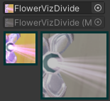

# IconGen

*IconGen* is an Unity Editor tool that lets you capture icons from objects in your scene, and then decorate and crop them.

:::tip
This does not require VRChat to run. It has been tested to work on Unity 2019, and should work on newer versions.
:::

<video controls width="816">
    <source src={require('./img/icon-gen/2023-09-22_07-31-44_ShareX.mp4').default}/>
</video>

## Download ⭐

- *IconGen* is currently available to Patreon supporters at any tier ([https://www.patreon.com/vr_hai](https://www.patreon.com/vr_hai)).
  - This tool will remain exclusive to supporters for a minimum of 8 months (meaning at least until the beginning of June 2024). After this 8-month period is complete, I will decide what to do with this tool.
    - See [Patreon rewards](../other/patreon).
    - Patreon ([Access to IconGen tool](https://www.patreon.com/posts/access-to-tool-89653332))
  - For users using Japanese currency:
    - Patreonをご利用になりたくないサポーターの方は、同じコンテンツにアクセスするために[pixivFANBOX (https://hai-vr.fanbox.cc/)](https://hai-vr.fanbox.cc/)でサポートを選択できます。
      - ソフトウェアへのアクセスの最低ティアは1000JPY 🌙⭐ です。

- *IconGen Thumbnail* only contains the [VRChat Play Mode thumbnail capture tool](#capture-thumbnails-for-vrchat-in-play-mode), and is distributed for free.
  - Booth.pm ([IconGen Thumbnail (Play mode) - hai-vr - BOOTH](https://hai-vr.booth.pm/items/5092126))

## Capture icons for the Expressions Menu

Capture icons directly from the selected objects in the scene, with transparency.

### How to use

:::tip
You can change the editor language at the bottom of the panel.

パネルの下部でエディターの言語を変更できます。

:::

<video controls width="816">
    <source src={require('./img/icon-gen/2023-09-21_08-34-13_ShareX.mp4').default}/>
</video>

To capture new icons from the scene:

- Open *Window > Hai > IconGen Capture*.
- In the window, click *Start capturing*.
- Move your scene camera to an angle that you like.
- If you select objects in your scene, then only those objects will be captured.
- Click *Save as PNG...* to save the icon.
- The *Save again* button will save the picture at the previously saved location.
- Click *Stop capturing* when you're done, as the tool will consume resources during use.

### Options

- **Icon Size:** Change the size of the icon/picture.
- *Buttons*
  - **Capture:** Capture the picture once.
  - **Start capturing:** Capture pictures continuously.
  - **Save as PNG...:** Save the captured icon as a PNG. This does not include the icon preview.
  - **Save again:** Save the picture at the previously saved location.
- *Capture settings*
  - **Only Scene Selection:** Only selected objects in the scene are shown.
  - **Use scene camera FOV:** Use the FOV of the scene camera.
  - **Field Of View:** Set Field Of View of the capture camera.
  - **Far Clip Plane:** Hide objects beyond this distance by setting the far clip plane of the capture camera.
  - **(extended):** Same as Far Clip Plane, but the slider goes to an extended range.
  - **Camera Roll:** Tilts the capture camera.
  - **Transparent:** Choose the transparency of the picture.
    - *Transparent* will make the background transparent.
    - *Opaque* will force the image to be opaque.
    - *Transparent with Background* is an advanced mode that puts a transparent background of a specific color. Shaders can cause areas to be transparent, even when the background color is itself opaque.
  - **Background:** Change the background color of the capture camera.
  - **Capture Sky:** Make the sky visible in the capture camera.
  - **Avoid Emulator Conflict:** Hides the Player and MirrorReflection layers from the capture camera, which avoids a conflict with Av3 Emulator in Play mode.
  - **Use Post Processing:** Make post processing volumes affect the capture camera.
- *Preview*
  - **Show Grid:** Show a grid on the picture to assist in alignment. 
  - **Preview Generator:** Select an existing IconGen assets to test how layers would be applied to this picture.
  - **Preview Icon:** Preview the picture with the IconGen asset applied. 
  - **Save baked preview as PNG...:** Save the preview as a PNG (grid is not included).
  - **Save baked preview again:** Save the preview at the previously saved location.

## Decorate and crop icons using layers

After capturing your icons, you can decorate and crop all of them in bulk to give them an unified style.

:::tip
You can change the editor language at the bottom of the panel.

パネルの下部でエディターの言語を変更できます。

:::

### Create an IconGen asset

Create a new asset by right-clicking into the Project tab and selecting *Create > Haï > IconGen*.

### Add multiple icons at once

Drag and drop a group of icons by selecting the IconGen asset, then locking the Inspector tab, and then drag-and-drop the group of icons into the *Source icons* field.

<video controls width="816">
    <source src={require('./img/icon-gen/2023-09-21_07-32-58_ShareX.mp4').default}/>
</video>

### Add icons one by one

To add icons one by one, you can do the same as *Add multiple icons at once*, or you can alternatively add it in the *+* field and press the *+ Add* button.

### Rename your icons

By default, the name of your icons will be suffixed so that you can search for them in other interfaces.

You can change the *Name Prefix* and *Name Suffix*.

### Use a template for layers

*IconGen* comes shipped with pre-built templates which serve as examples on how to build layers.

Browse the templates in *Assets/Hai/IconGen/Templates/*.

You can reuse an existing template by selecting one in the *Template* field.

<video controls width="816">
    <source src={require('./img/icon-gen/2023-09-22_06-50-21_ShareX.mp4').default}/>
</video>

### Build layers yourself

You are encouraged to browse the existing templates shipped with IconGen to serve as inspiration on how to use the layers.

Layers are processed in the order from bottom to top, like Photoshop layers.

On each layer, you can choose how that element is applied to the picture.

In this example, there are 3 layers:

- The bottom layer is a white circle using Mask mode. This cuts the picture into the shape of that white circle.
- The middle layer is a white ring using Overlay mode, colored blue. This draws a blue ring on top of the picture.
- The topmost layer is a red strike using Overlay mode. This draws a red strike on top of the blue ring.

### Choose a layer mode

Layers can be set into different modes which determines how that layer will affect the existing picture.

- **Overlay**: The element is drawn on top. 
- **Mask**: The picture is cut into the shape of the element. 
- **Draw Under**: The element is drawn below. 
- **Gray Out**: The picture is grayed out. If there is an element, then only the similar pixels will be grayed out. 
- *Position modes*
  - **Bottom Left**: The element is drawn at the bottom left. 
  - **Bottom Right**: The element is drawn at the bottom right.
  - **Top Left**: The element is drawn at the top left.
  - **Top Right**: The element is drawn at the top right.
- *Advanced modes*
  - **Inverse Mask**: The picture is cut away from the shape of the element.
  - **Custom Material**: The layer uses a custom material of your choice.

## Capture thumbnails for VRChat in Play Mode

### How to use

<video controls width="816">
    <source src={require('./img/icon-gen/2023-09-13_17-27-18_ShareX.mp4').default}/>
</video>

To capture thumbnails for VRChat in Play Mode, go to *Window > Haï > IconGen Thumbnail*.

In the window, click *Start capturing*.

Move your scene camera to an angle that you like.

Click *Save as PNG...* to save the thumbnail.

The *Save again* button will save the picture at the previously saved location.

:::warning
Click *Stop capturing* when you're done, as the tool will consume resources during use.
:::

### Options

The thumbnail size will be 1200x900, the size of a VRChat thumbnail.

For other sizes, use *[IconGen Capture](#capture-icons-for-the-expressions-menu)* instead.

- **Use scene camera FOV:** Use the FOV of the scene camera.
- **Field Of View:** Set Field Of View of the capture camera.
- **Far Clip Plane:** Hide objects beyond this distance by setting the far clip plane of the capture camera.
- **(extended):** Same as Far Clip Plane, but the slider goes to an extended range.
- **Camera Roll:** Tilts the capture camera.
- **Transparent:** Take a transparent screenshot if you want to edit it in an external program.
- **Background:** Change the background color of the capture camera.
- **Capture Sky:** Make the sky visible in the capture camera.
- **Avoid Emulator Conflict:** Hides the Player and MirrorReflection layers from the capture camera, which avoids a conflict with Av3 Emulator in Play mode.
- **Use Post Processing:** Make post processing volumes affect the capture camera.
- *Buttons*
  - **Capture:** Capture the picture once.
  - **Start capturing:** Capture pictures continuously.
  - **Save as PNG...:** Save the captured thumbnail as a PNG. This does not include the icon preview.
  - **Save again:** Save the picture at the previously saved location.

## Changelog

### IconGen Thumbnail

- 1.0.1: Temporarily fix a memory leak by destroying the texture resource
- 1.0.0: First release