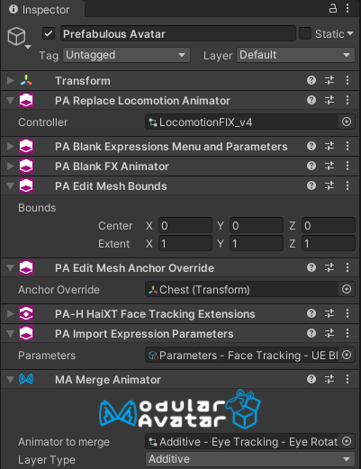

# Prefabulous Avatar

*Prefabulous Avatar* contains **non-destructive** components to automate invasive tasks in your personal avatar.

Meant to be used primarily by users of **[Modular Avatar](https://modular-avatar.nadena.dev/)** components,
our components can be reused across multiple avatars when you turn them into a prefab.

- Improve the [shading of blendshape normals](./prefabulous-avatar/hai-components/recalculate-normals).
- [Delete polygons](./prefabulous-avatar/hai-components/delete-polygons) hidden by conflict prevention blendshapes.
- Edit all [mesh bounds](./prefabulous-avatar/component-reference/edit-all-mesh-bounds)
and all [mesh anchor override](./prefabulous-avatar/component-reference/edit-all-mesh-anchor-override) for consistent visibility and lighting.
- [Change the avatar scale](./prefabulous-avatar/component-reference/change-avatar-scale) and viewpoint without rescaling the avatar in the scene.
- [Import an existing VRC Expression Parameters](./prefabulous-avatar/component-reference/import-expression-parameters) asset, such as face tracking parameters.
- Reset parts of the VRC Avatar Descriptor component without modifying it.
- Add a [menu item to lock locomotion](./prefabulous-avatar/hai-components/lock-locomotion-menu-item).

Although *Prefabulous Avatar* is meant to be used alongside **[Modular Avatar](https://modular-avatar.nadena.dev/)**, our components are not
really destined to be used inside distributed assets:

Unlike *Modular Avatar* components, most of our components are **invasive**. They will affect many components across the entire avatar,
or may not be able to coexist with other components.

Therefore you are encouraged to use these components only within personal avatars, and not as part of assets distributed to other users.

## Download

The tool is free for download using VCC.

### VCC

You need to add **two** listings:

- Add **[Modular Avatar listing](https://modular-avatar.nadena.dev/)** by clicking on *Download (using VCC)*, and
- also **[install Haï~'s listing to VCC](vcc://vpm/addRepo?url=https://hai-vr.github.io/vpm-listing/index.json)**.

Then, add *Haï ~ Prefabulous Avatar* to your project using VCC.

## How to use

Add any of those components to any location inside your avatar. It is recommended that you put them in one or several child objects
so that you can reuse them on other avatars as a prefab:

- **[Component reference](./prefabulous-avatar/component-reference)** lists components that accomplish general tasks.
- **[Haï~ Components](./prefabulous-avatar/hai-components)** lists components that are either entire systems or integrations with other systems.
