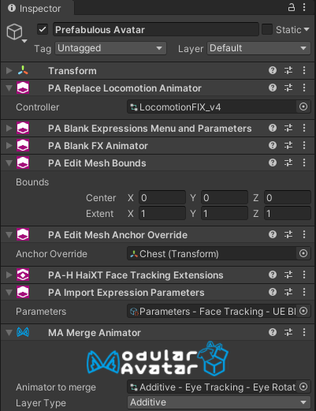

---
title: Prefabulous
---
import {HaiTags} from "/src/components/HaiTags";
import {HaiTag} from "/src/components/HaiTag";

# Prefabulous

<HaiTags>
<HaiTag isUniversal={true} />
</HaiTags>

*Prefabulous* contains **non-destructive** components to automate invasive tasks in your personal avatar.

[//]: # (Meant to be used primarily by users of **[Modular Avatar]&#40;https://modular-avatar.nadena.dev/&#41;** components,)
[//]: # (our components can be reused across multiple avatars when you turn them into a prefab.)

- On <HaiTag isUniversal={true} short={true} />:
  - **Improve the [shading of blendshape normals](./prefabulous/universal/recalculate-normals).**
  - **Generate [twist bones](./prefabulous/universal/generate-twist-bones).**
  - [Delete polygons](./prefabulous/universal/delete-polygons) hidden by conflict prevention blendshapes.
  - Edit all [mesh bounds](./prefabulous/universal/edit-all-mesh-bounds)
  and all [mesh anchor override](./prefabulous/universal/edit-all-mesh-anchor-override) for consistent visibility and lighting.
- Also, on <HaiTag requiresVRChat={true} short={true} />: 
  - [Change the avatar scale](./prefabulous/universal/change-avatar-scale) and viewpoint without rescaling the avatar in the scene.
  - [Import an existing VRC Expression Parameters](./prefabulous/vrchat/import-expression-parameters) asset, such as face tracking parameters.
  - Reset parts of the VRC Avatar Descriptor component without modifying it.
  - Add a [menu item to lock locomotion](./prefabulous/vrchat/lock-locomotion-menu-item).

Although *Prefabulous* is meant to be used alongside **[Modular Avatar](https://modular-avatar.nadena.dev/)**, our components are not
really destined to be used inside distributed assets:

Unlike *Modular Avatar* components, most of our components are **invasive**. They will affect many components across the entire avatar,
or may not be able to coexist with other components.

Therefore you are encouraged to use these components only within personal avatars, and not as part of assets distributed to other users.

:::tip[Compatibility notes]
Compatible with Modular Avatar for <HaiTag requiresResonite={true} short={true} /> starting from version 2.2.0-alpha.0.
:::

## Download

The tool is free for download using ALCOM.

### ALCOM

You need to add **two** listings:

- Add **[Modular Avatar listing](https://modular-avatar.nadena.dev/)** to ALCOM by clicking on *Download (using V<!-- -->CC)*, and
- also **[install Haï~'s listing to ALCOM](vcc://vpm/addRepo?url=https://hai-vr.github.io/vpm-listing/index.json)**.

Then:
- <HaiTag requiresVRChat={true} short={true} /> Add *Haï ~ Prefabulous for VRChat* to your project using ALCOM.
- <HaiTag requiresChilloutVR={true} short={true} /> Add *Haï ~ Prefabulous Universal* to your project using ALCOM.

## How to use

Unless stated otherwise, **you can place the components anywhere inside your avatar**, and *Prefabulous* will try its best to affect all
eligible components on your avatar without needing you to manually target individual components.

For example, most of our blendshape manipulation components such as [Recalculate Normals](./prefabulous/universal/recalculate-normals)
or [Delete polygons](./prefabulous/universal/delete-polygons) will target all SkinnedMeshRenderers of your avatar by default as long as that
SkinnedMeshRenderer has one of the blendshapes in question, in order to keep manual labor to a minimum.

Check out the **[Reference manual](./prefabulous/reference)** for more details.

Add any of those components to any location inside your avatar. It is recommended that you put them in one or several child objects
so that you can reuse them on other avatars as a prefab:

- <HaiTag isUniversal={true} short={true} /> **[Universal Components](./prefabulous/universal)** lists components that can be used on any platform.
- <HaiTag requiresVRChat={true} short={true} /> **[VRChat Platform](./prefabulous/vrchat)** lists components that can only be used on the VRChat Platform.
- <HaiTag requiresVRM={true} short={true} /> **[VRM and VTubing](./prefabulous/vrm)** lists components that can only be used on the VRM-compatible apps and derived formats, such as VNyan, Warudo, and VSeeFace.
