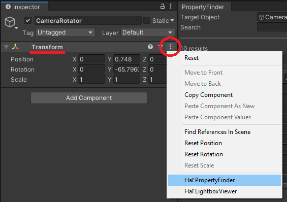

---
title: Property Finder
---
import {HaiTags} from "/src/components/HaiTags";
import {HaiTag} from "/src/components/HaiTag";
import {HaiVideo} from "/src/components/HaiVideo";

<HaiTags>
<HaiTag isUniversal={true} />
</HaiTags>

*Property Finder* lets you view the animatable properties of an object.

:::tip[Compatibility notes]
This does not require VRChat to run. It has been tested to work on Unity 2019, and should work on newer versions.
:::

<HaiVideo src="./img/property-finder/sx_2022-05-19_23-47-37_jKkVpl9QvX.mp4" autoWidth={true}></HaiVideo>

## Download

The tool is free for download. It can also be downloaded using ALCOM.

### Direct download

- GitHub ([hai-vr/property-finder](https://github.com/hai-vr/property-finder))

### ALCOM

- Use this link to **[install our listing to ALCOM](vcc://vpm/addRepo?url=https://hai-vr.github.io/vpm-listing/index.json)**.
- Add *Haï ~ Property Finder* to your project using ALCOM.

## How to use

To begin, choose an object, and click the three vertical dots `⋮` next to the Transform component, and select *Haï Property Finder*.

You can also open it through *Window > Haï > PropertyFinder*.

Drag and drop the object to inspect in the *Target Object* field.

Filter the results further by adding search terms. You can separate search terms with a space, so the search query `color rim` can find results such as `material._RimLitTexColor`.