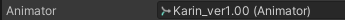

import ochgB1a5VG from './visual-expressions-editor-img/sx_2022-03-08_16-17-04_ochgB1a5VG.mp4';
import Kza0kEYwsf from './visual-expressions-editor-img/sx_2022-04-14_23-17-52_Kza0kEYwsf.mp4';

# Visual Expressions Editor

*Visual Expressions Editor* lets you edit face expression animations.

:::tip
This does not require VRChat to run. It has been tested to work on Unity 2019, and should work on newer versions.
:::

<video controls width="816" autostart="false">
    <source src={ochgB1a5VG}/>
</video>

## Download

The tool is free for download. It can also be downloaded using VCC.

### Direct download

- GitHub ([hai-vr/visual-expressions-editor-vcc](https://github.com/hai-vr/visual-expressions-editor-vcc))

### VCC

- Use this link to **[install our listing to VCC](vcc://vpm/addRepo?url=https://hai-vr.github.io/vpm-listing/index.json)**.
- Add *Haï ~ Visual Expressions Editor* to your project using VCC.

## How to use

- Select your Animator. In the inspector, click the three dots, and select “Haï VisualExpressionsEditor”.
- Select an animation clip in the Project window.
- Move the camera in the scene, and click the window to refresh the pictures.

## Options

- **Animator**: The animator to use for editing clips.

- **Clip**: The animation clip to edit.
- **Auto Select**: The window will update when a new clip is selected in the Project view.

- **Thumbnail Size**: Size of the pictures.
- **Update button**: Click to refresh the pictures.
- **Loop Edit**: See “Loop Edit” section below in the manual.
- *Show Advanced options...*
    - **Advanced/Show Differences**: Highlight the differences against the current settings of the Skinned Mesh.
    - **Advanced/Show Hotspots**: Draw the differences in red.
    - **Advanced/Auto Update On Focus**: If you change the scene camera position, clicking the VisualExpressionsEditor window will refresh the pictures.
    - **Advanced/Use Compute Shader**: Accelerates difference calculation when checked.
    - **Advanced/Focused Bone**: When animations are playing, the animator’s muscles will move.
    This option specifies on which bone to attach the camera. By default, it is focusing on the Head bone.
    - **Advanced/Normalized Time**: The normalized time at which the animation will be sampled. By default, the first frame of the animation will be sampled.
    - **Advanced/Base Pose**: Animator pose to use before the animation is applied.
    This lets you display the main preview of the avatar in a different pose than the bicycle pose.

## Edit a clip

Selecting a clip in the Project view will display it in the Visual Expressions Editor (unless you uncheck “Auto Select”).

Changing a slider value will cause the animation clip to be modified with the new values on all of its keyframes.

If a blendshape has multiple keyframes with different values, it will not be modifiable in Visual Expressions Editor.

## Changing the camera position

The scene camera will be used to change the camera position for capturing the blendshapes.

Click the “Update” button to refresh the thumbnails.

## Add or delete blendshapes

At the bottom of the window, there is a gallery of all blendshapes present in the model. By clicking the thumbnail of the blendshape, you can add that blendshape to the animation.

It will insert 2 keyframes lasting 1/60 of a second.

Clicking the thumbnail again will delete it from the animation.

On the top view, you can also click the X button to delete it.

## Dealing with 0-values

Animation clips sometimes are filled with animated blendshapes that have a constant value of 0.

These blendshapes are displayed differently in the editor:

- They show up with a yellow outline.
- They do not show up in the blendshapes at the top unless modified.

There is a button that lets you delete all 0-values.

## “Loop Edit “Mode

Version V1.1.0 introduces “Loop Edit” mode.

<video controls width="816" autostart="false">
    <source src={Kza0kEYwsf}/>
</video>

“Loop Edit” mode was specifically designed to facilitate the creation of looping face expression animations.

**It is recommended to keep “Loop Edit” disabled if you have no intention of creating or editing a looping animation.** The editor behaves slightly differently when "Loop Edit” is enabled, especially in regards to how new blend shapes are added.

This mode is intended to be used simultaneously with the default Animation editor window.

- **Quick Preview**: Scrub the animation timeline without affecting the currently active frame being edited.
- **Edit Frame**: Change the active frame being edited.
- **Play**: Play the animation in the preview pane.
- **Edit during play**: Allow editing the animation while the animation is being played in the preview pane. Depending on your scene, this may result in a slower editor.

Under the thumbnails, you will see additional buttons and behaviours.

When a slider number is blue, this means the first and last keyframe of that blend shape will be edited simultaneously.

- **“+” sign**: Add a keyframe.
- **“x” sign**: Remove a keyframe.
- **“\<” arrow**: Select the previous keyframe of that blend shape.
- **“>” arrow**: Select the next keyframe of that blend shape.

Remember that animations assets must be set to looping so that they will loop in the animator. The checkbox under the preview pane called “Is Looping Animation” changes that setting.

## Additional notes

- Remember you can change the field of view of the scene camera.

- The text of the blendshape labels can be selected and copied.

## Special thanks

- [Pema](https://github.com/pema99/) for the [Compute Shader](https://github.com/hai-vr/blendshape-viewer/commit/46db696df8be42d251f59c3f0fb240b117905c76)!