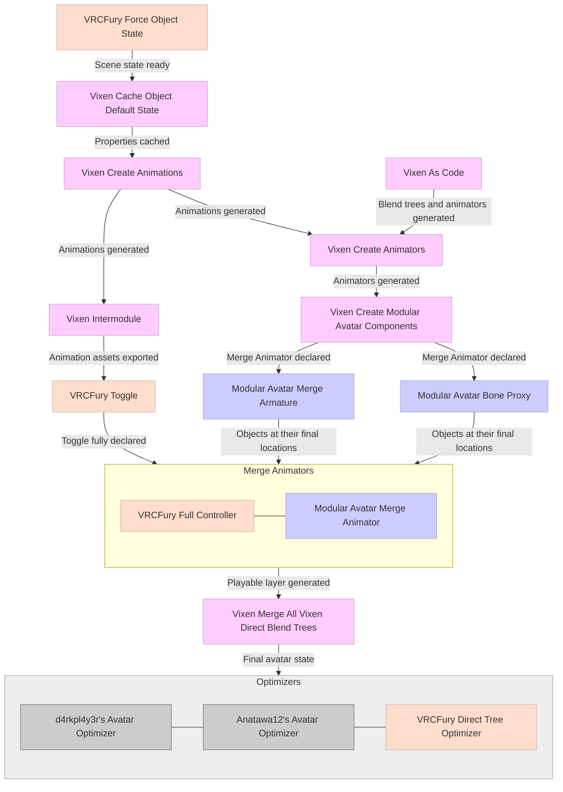

---
title: Non-Destructive Dependencies
---

# Non-Destructive Dependencies

:::note
This page is only destined for module developers.
:::

The following sections describe parts of the Vixen Processor.

## Vixen Cache Object Default State

This is part of the main Vixen Processor.

- Vixen will cache all needed object default states, which will be used to generate animations for the inactive states (i.e. when a toggle is turned off).
    - This includes material changes, as the default values within those materials will be sampled.
    - This includes turning on or off GameObject or Components.
    - Vixen does not treat objects differently whether they're tagged EditorOnly or not in the scene.
- For this reason, Vixen needs to run *after* properties are changed in the scene.

## Vixen Intermodule

This is part of the main Vixen Processor.

- Vixen exports animations into known asset references for other modules to use.
- For this reason, Vixen needs to run *before* other modules that rely on those asset references.

## Vixen Create Modular Avatar Components

This is part of the main Vixen Processor.

- Vixen creates Modular Avatar components to be used by Modular Avatar.
- For this reason, Vixen needs to run *before* Modular Avatar.

## Vixen Merge all Vixen Direct Blend Trees

This is a separate processor which is **not** part of the Vixen Processor.

- Vixen may create layers with only one blend tree inside of it.
- Since Vixen may create animators with paths relative to an embedded prefab, rather than with paths relative to the avatar root, these blend trees are not immediately merged into a single animator.
    - **TODO: Evaluate if there's an alternative way to do this, or if we could just leave all paths absolute by design, even within embedded prefabs, since we don't need a pre-existing animator asset.**
        - *This may become a problem when we'll allow Vixen Control to contain animations references with paths relative to the prefab.*
- Vixen will merge all Vixen Direct Blend Trees after all of them have been merged into a single animator playable layer.
- For this reason, this specific Vixen processor needs to run *after modules* that merge multiple animator into a single playable layer.
