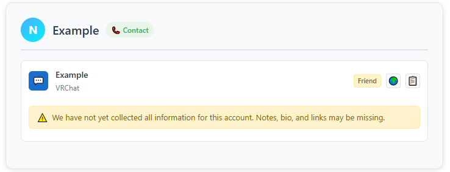
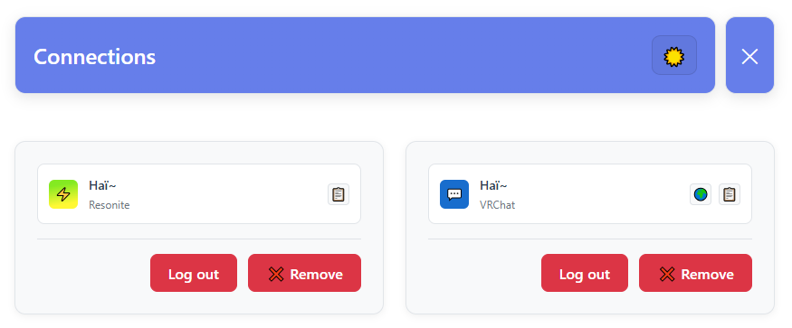
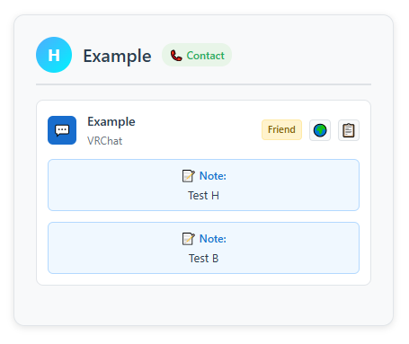

# XYVR

*This page is a placeholder for a future free product called XYVR. Please check back another time.*

## Connecting your account

When connecting your account for the first time, it can take a long time for the list to update,
so keep the application open for a while.

You will see a lot of entries like this, as getting the links and bio of an account will take longer
than just getting your list of friends.

## Connecting from multiple accounts

Connect to multiple of your accounts at the same time in the **Connections** view.

You can add your accounts from different social VR apps, but you can also add multiple of your accounts from the same
social VR app if you have alt accounts or bot accounts.

If your accounts have different notes attached to someone else's account, we will show all of them.

## Why is the number of contacts different from what I was expecting?

The number of contacts can be different for any of the following reasons:

- Your own account is included in that contact list.
- If you have merged alt accounts and bot accounts: All of those accounts count as one user.
- You had connected multiple accounts that share some contacts with each other.
- One or more of your connected accounts is set to offline mode in the **Connections** view and is not getting updates.
- When the address book is in *Contacts & Notes* mode, non-contacts who have notes are also shown.
- There is a possible flaw when using the VRChat API in that offline friends and online friends are obtained separately.
  If a friend not in the address book goes online or offline exactly during the first data collection, it may be missed the first time
  that data collection is performed.
