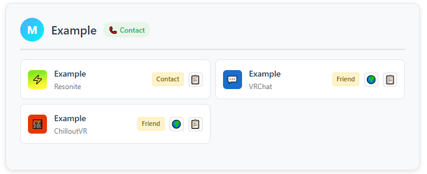
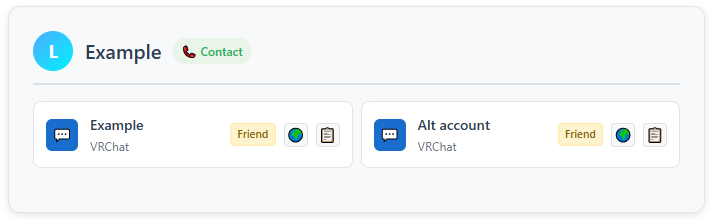
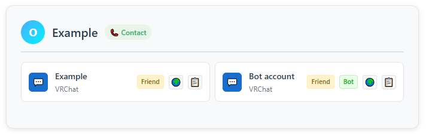

# Multi-accounts

*XYVR* fully embraces the use of multiple accounts, especially across different social VR platforms.

You should group accounts belonging to the same user.

## Grouping accounts

If one of your contacts has multiple accounts across different social VR apps, you should group them.

In the other account, click the ⋯ button and select **Merge with...**, then select the first account.

Users with multiple accounts can be searched using `accounts:>1`

### Alt accounts

If a user has an alt account on the same social VR app, you can also associate it with that user.

Users with alt accounts can be searched using `has:alt`

### Bot accounts

If a user has a bot account (such as a party invitation bot), you can mark it as a bot account and associate it with the actual user.

Bot accounts are not considered to be alt accounts; they will not show up when searching for `has:alt`

