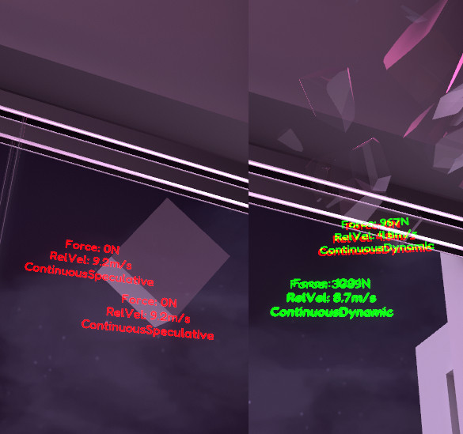

import {HaiTags} from "/src/components/HaiTags";
import {HaiTag} from "/src/components/HaiTag";
import {HaiVideo} from "/src/components/HaiVideo";

# 2025-02-07 Material collision effects and breakable objects

I was building a new home world after being bored by the one that I had been using for over a year.

Initially, I just wanted to make sure that shooting walls would produce decals and the correct sound effects depending on the material being hit,
after being inspired by a **Half-Life 1 documentary** starring Gabe Newell on the topic of fun, reinforcement, and **world interactivity** ([2-minute watch, between 15:08-17:03](https://www.youtube.com/watch?v=TbZ3HzvFEto&t=908s)).
I was thinking it was odd I never spent time to implement such a basic game functionality within the Unity engine.

However, the whole idea went out of control and I ended up building an analogue of throwable and breakable objects.

Below is a random assortment of things I have learned while building this system.
Some items may be specific to the <HaiTag requiresVRChat={true} short={true} /> platform and may not be relevant to other social VR apps
and other games.

## Avoiding Continuous Speculative for important collisions

When a rigidbody is thrown and hits another collider, we need to apply an appropriate sound effect volume and damage amount, using the collision force.
Collision events are raised through  `OnCollisionEnter`, containing this information.

The issue is that depending on the collision detection type of the rigidbody, the reported amount may equal to **0 newton** too often, even on objects that are thrown hard onto walls.
This especially happens when the rigidbody is set to *Continuous Speculative*.

The fix is to set the collision detection type to *Continuous Dynamic*, as long as we care about these objects reporting the correct forces to produce sounds or be damaged on impact.
For instance, this is not necessary on the individual debris emitted out of breakable objects.

<HaiTag requiresVRChat={true} short={true} /> A [tweet also suggests that](https://x.com/MMMaellon/status/1732068213780103650) objects with VRCObjectSync *"forces your rigid bodies to continuous speculative"*,
so you may need to force the collision detection type to be *Continuous Dynamic* through an Udon script.



## Don't bounce away from broken objects

If you throw a bowling ball against a fragile window, the bowling ball should go through the window because it conserves most of its energy.

Collisions with all non-moving objects will cause the thrown object to bounce away from it, even if that non-moving object breaks the moment it is hit.
This also applies to some heavy breakable objects that can be moved.

The fix that I chose is to save the velocity and angular velocity of thrown objects every physics frame in `FixedUpdate`.
When an object breaks apart, it needs to inform the other object that collided with it, so that it cancels the bounce and re-applies most of
its energy based on the velocity and angular velocity of the last saved physics frame.

## Getting the material hit in a multi-material mesh

If an environment mesh/world mesh is made out of multiple materials, hitting it with bullets or collisions should
produce different sounds based on what that material represents, for example if it's glass.

This information can be encoded in the Physics Material type of the collider, but there is another approach.

When a mesh has multiple materials, **it is possible** to use Mesh Colliders with raycasts to get the material that is hit.
Whether you should use this approach is a different question.

To do this, raycasts will report a triangle index if a Mesh Collider has been hit by the raycast.

To convert the triangle index to a material, you need to get the mesh asset of that Mesh Collider, and for each sub-mesh of that mesh,
use `triangleCount[subMeshIndex] = mesh.GetSubMesh(subMeshIndex).indexCount / 3;` to get the number of triangles for that sub-mesh (notice how we divide by three).

If a mesh has 3 sub-meshes, and their triangle count are `70, 50, 40` in that order, then a triangle index of 74 will mean you hit the sub-mesh at index 1 (which is the second one),
so you can get the material slot at index 1. A triangle index of 122 would be index 2, because it is greater or equal to `70 + 50`.

<HaiTag requiresVRChat={true} short={true} /> Submesh data is not accessible with Udon, so you need to bake this data in Edit mode however you like.

[//]: # (In addition, batching might cause issues with this technique as you *might* not be able to bake the triangle data because the mesh will have changed.)

Again, it may be more reasonable to split into different meshes, or use different colliders for each material.

## Preventing objects from breaking too early for remote players

<HaiTags>
<HaiTag requiresVRChat={true} short={true} />
</HaiTags>

### Using Player pools to send and receive packets (Player Objects)

When an object is damaged, this information arrives through Manual Sync information which is located outside the VRCObjectSync hierarchy.

The way I have designed the damage networking in my world is through the use of many player pools (now known as Player Objects, in this case non-persistent ones).

- Each player gets their own set of Manual Sync objects, one for each specialized *"packet"* it needs to send.
- To damage an object, players would submit a packet containing all the individual pieces of damage instances this player has dealt since last serialization.
  That packet contains information about which one of the many damageable objects has been hit in the scene.
- Everyone receives that packet and applies the damage to the corresponding object.
- The default network owner (also known as master) would track the actual health of these objects, and makes sure everyone else agrees on the actual health of the object.

*Example of one of the several packets that can be sent.*

```csharp
[UdonBehaviourSyncMode(BehaviourSyncMode.Manual)]
public class DamageableSyncMessage : UdonSharpBehaviour
{
    [HaiInjectable] [SerializeField] private DamageManager manager;

    [UdonSynced] public int[] bundle_entityId;
    [UdonSynced] public int[] bundle_healthReduction;

    private readonly List<DamageableSyncMessageBundle> _queued = new List<DamageableSyncMessageBundle>();
    
    // [...]
    
    public override void OnPreSerialization()
    {
        var queuedMessageCount = _queued.Count;
        bundle_entityId = new int[queuedMessageCount];
        bundle_healthReduction = new int[queuedMessageCount];
        
        for (var index = 0; index < queuedMessageCount; index++)
        {
            var bundle = _queued[index];
            bundle_entityId[index] = bundle.entityId;
            bundle_healthReduction[index] = bundle.healthReduction;
        }

        _queued.Clear();
    }
    
    public override void OnDeserialization()
    {
        // [...]
            manager._InternalReceiveDamageableSyncMessage(entityId, healthReduction);
        // [...]
    }
    
    // [...]
}
internal class DamageableSyncMessageBundle { /* ... */ }
```

**Each player individually tracks the health of those objects locally.** This has the advantage of:

- avoiding ownership transfers altogether, letting multiple players damage the same object simultaneously,
- it also avoids a round-trip between the person dealing the damage, and the default network owner confirming that the damage has been dealt,
- if the local player performs an action that breaks the object, it breaks instantly **without waiting for any response from the network**.

As a consequence, the objects break as soon as the message is received, and if the local player breaks the object, it also breaks locally with no delay, even if they do not own the object itself,
making for a very responsive system that emphasizes visual effects over correctness and over proper damage attribution.

### Damage packets arrive too soon, before the visual cause of damage happens

This works great with damage coming from bullets.

However, damage caused by collisions with walls are always transmitted by the network owner of the rigidbody itself,
but the damage packets from this collision often arrive to other players before the object is even close to hitting the walls.

This causes objects to break in midair, or worse, break before they are even thrown. This visual disconnect between the consequence
and the cause of the object breaking is jarring.

The solution I chose to fix this is to create a 2nd specialized damage packet, dedicated to collisions with walls. The network owner of the rigidbody
will submit those specialized damage packets, containing the position of the rigidbody when it collides with anything.

### Breaking objects from collisions are intentionally delayed

On other clients, if receiving that specialized damage packet would have resulted in the health going from a non-zero value to zero, then the breaking visual effect
would be **intentionally delayed** until any one of the following happens:
- The rigidbody position reaches the position indicated within that specialized packet, or
- A maximum time limit of 1 second since receiving that packet is reached, or
- The object ends up damaged by any other reason than a collision, such as a bullet hitting it.

There are edge cases to this approach, for instance if the object breaks from a collision, but not as a result of itself being thrown,
instead as a result of another object being thrown into it. ~~This is still something I may have to fix.~~ *Edit 2025-02-09: This case has been handled by
estimating the network delay of the damage dealer (i.e. if a volleyball is thrown onto glass, and the glass breaks, we want the network delay of the volleyball
physics object owner who dealt the damage), and using that delay to break the object later.*

In addition, **this approach is really sensitive to deserialization order**, which is a flaw. In particular, the default network owner will submit updates
about the actual health of the objects so that other players may try to resync in case of a disagreement on the health of the object.

There is a special case when the default network owner declares that the health went from non-zero to zero,
causing the object to break instantly if it was not already broken by a damage packet; this is a problem if the default network owner also happens to be the
rigidbody owner, because the damage packets will often be received at the same time as the confirmations of changes in health.

This specific issue has not currently been solved in a sane way; in this case, I chose to move some of the deserialization handling code to the Update loop,
so that damage packets are handled first, but this quick fix is not sustainable.

:::info
I have not tried other approaches yet, such as using Udon Continuous sync, or abusing the state of another VRCObjectSync,
or using some alternative to VRCObjectSync or a custom implementation.
:::

<HaiVideo src="./img/collision-effects-mpc-hc64_E4NcbSBnVq.mp4"></HaiVideo>

## Disabling the broken object interrupts its networking

<HaiTags>
<HaiTag requiresVRChat={true} short={true} />
</HaiTags>

When the object gets broken, the GameObject that contains the VRCObjectSync must not be disabled, otherwise the rigidbody
state updates may not reach other clients and will freeze in midair. For this reason, I disable the renderer and colliders, and on the rigidbody owner,
I force the position, rotation, velocity, and angular velocity of the rigidbody to be constants while it's in a broken state.

This object is also respawned invisibly with an advance delay on the rigidbody owner, before it is enabled back on all clients,
so that the non-owners will not interpolate the position of the rigidbody and cause unintentional collisions with other objects.

## Avoiding ownership transfers

<HaiTags>
<HaiTag requiresVRChat={true} short={true} />
</HaiTags>

If a player shoots at a movable object, that object should be pushed away a little.

When two or more players shoot at the same object simultaneously, we want to avoid intensive ownership transfers.

For this reason, when a player shoots an object, that player transmits a specialized packet in the same way as described in the previous section using Player Objects.
This packet describes where the bullet was shot from, what was the direction of that bullet, and where the bullet hit in the local space of that object.

When that packet is received by the owner of the rigidbody, it reapplies the force of that bullet onto the object, along with sound effects and decals.
This allows the object to be pushed away a little by both players, without ownership transfers, although there is a visible delay from the shooter's perspective.

## Collision sounds while picked up

<HaiTags>
<HaiTag requiresVRChat={true} short={true} />
</HaiTags>

When an object is picked up, the object should still produce sounds whenever that object collides with walls.

This works correctly on the user that picked up the object, but it appears that collision events do not happen on remote users
while the object is picked up.

To remediate this, only while an object is picked up, the owner will submit a limited number of networked sound effects to be played back
on other clients.

## Lookup tables

In order to do this project, I ended up having a bunch of lookup tables which are baked in Edit mode:
- When a bullet hits a collider, the decals needs to stick to the visual representation of that collider, even if it's a moving object.
  - Moving objects are not necessarily object-synced. For instance, the logic behind doors use networking, but the rigidbody of the door is not itself a networked object,
    so **even some non-networked objects need to have a way to identify them**.
- If an object can be damaged, then we need to identify this object for transmission of damage packets, so that damage effects can be applied back on every client.
- Therefore, I associated a numerical identifier to every object that may need one, creating a parallel Network ID of some sorts. 
  A single behaviour centralizes all those identifiers, so that prefabs and objects that are routinely copied don't need to carry this information.
- Those identifiers are updated using a script in Edit mode, which also happens to be the same script that handles dependency injection in Edit mode.
- When a collider is hit for any reason, we need to produce a sound effect, so each collider is associated with a collision sound effect identifier
  based on either its Physics Material or the materials of the renderer; or multiple ones if there are sub-meshes, so the triangle index lookup table is part of that too.

## Getting the velocity of the hands

In order to detect a flicking of the hand to emulate a similar interaction style to Half-Life Alyx gloves, we need to get the velocity of the hands.
However, I do not want locomotion using the analog stick to be interpreted as a flicking of the hands.

Every frame, I create a tracking space origin TRS matrix using the position and rotation of <HaiTag requiresVRChat={true} short={true} /> `Networking.LocalPlayer.GetTrackingData(VRCPlayerApi.TrackingDataType.Origin)`,
and record the hand positions relative to that space.

Then, on the current frame, I reapply the relative hand position of last frame onto the current frame's tracking space origin matrix.
This gives us two world space positions, which can be used to get the hand velocity in world space.

World space allows the use of the dot product to detect the hand flicking in a specific direction (i.e. opposite of head direction, or away from a specific object).
