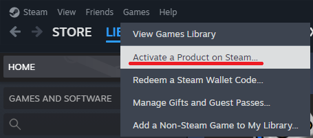

---
sidebar_position: 2
title: "Getting started"
---

# Early testers: Getting started

:::warning
ResilienceVR is not a good place to start discovering social VR; it is better suited for seasoned social VR users who want to try complementary ways to explore and communicate.

If this is your first time in social VR, you should try other social VR applications.
:::

The ResilienceVR client is currently only available to a closed group of testers.

As an early tester, here's how to start running ResilienceVR.

## Adding the product key

After receiving your product key, add it to your Steam account.

:::danger
Product keys are handed out individually to early testers. They are not review copies.

They do not constitute a gift nor a sale, and may be revoked in the future for any reason.
:::

If you start the application immediately, you will be wearing a default avatar.

## Using a custom avatar

To use a custom an avatar, download the SDK that was handed to you personally through direct messages.

Please follow the instructions in [Avatars and Belongings](./sdk/avatars-and-belongings).

Contact me directly if you are encountering any issues with the setup!
