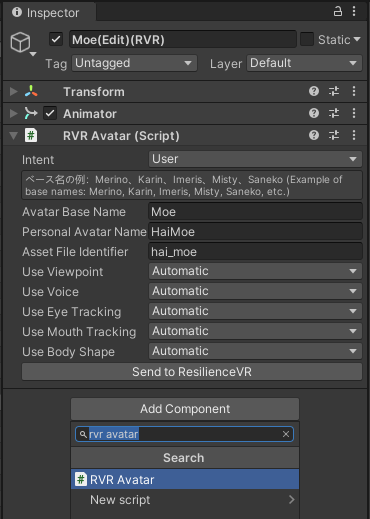

---
sidebar_position: 2
---

# Avatars and Belongings

:::warning
The ResilienceVR SDK is only available to testers.
:::

**Avatars** is a representation of yourself. Your avatar appears when you join a server, and disappears when you leave it.

**Belongings** are objects that belong to you. Some belongings appear when you join a server, and they all disappear when you leave it.

You can only wear one avatar at any point in time, but you can have multiple belongings visible simultaneously. Since avatars and belongings are so similar, they are usually thought of as being *one thing* in other social VR apps.

However, keep in mind that **belongings disappear when you leave a server**, therefore you should not use belongings for things that need to continue existing after leaving the server. Think of belongings as objects that you do not want to leave behind when leaving a restaurant, like your phone or your car keys.

## Create an avatar

This tutorial assumes that **you are already familiar with other social VR applications**: You need an avatar!

Add or select an avatar in your Unity scene.

:::tip
The ResilienceVR SDK can be installed inside projects made for other applications and platforms, however it is recommended to use Unity 2021.
:::

To create a ResilienceVR avatar, click *Add component > RVR Avatar*.

There are three name fields that you need to fill:
- **Avatar Base Name**: This is the name of the base of your avatar that you are using. For example, "Merino", "Karin", or "Imeris" are base names.
  - These base names are used to carry configurations across multiple avatars that share the same base, such as the viewpoint.
  - You can leave this field empty, and the configuration will not carry over.
- **Personal Avatar Name**: This is the name that will be displayed when you select your avatar in the menu.
  - If you keep this field empty, the file identifier will be displayed instead.
- **Asset File Identifier**: This is the part of the filename of the avatar on-disk.

Leave all the other fields to "Automatic". Your avatar is now ready to be built.

You can configure and customize the avatar after it has been built.

## Build the avatar

Select your avatar, and in the *RVR Avatar* component, click the *Send to ResilienceVR* button.

If ResilienceVR is running, this will immediately wear the avatar.

## Where are avatars uploaded?

ResilienceVR **does not have content servers**. We do not host your content, and we have no idea of what content you create.

Avatars are stored on your computer, and your current one will be sent to other people when you meet them.

If you always join the same users, they will not need to redownload your avatar.
