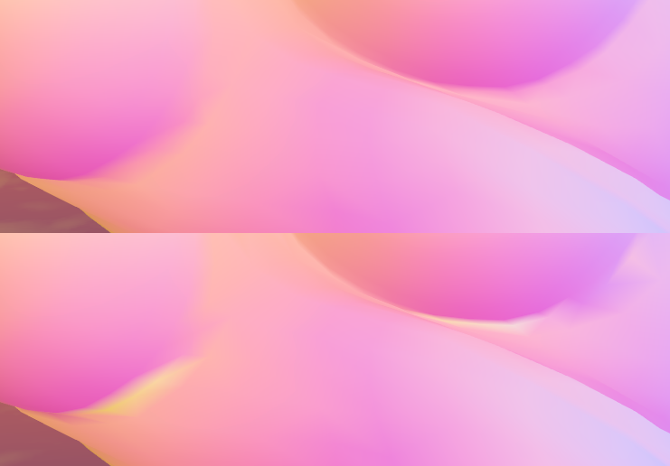

import {HaiTags} from "/src/components/HaiTags";
import {HaiTag} from "/src/components/HaiTag";
import HaiSupport from "/docs/_support.mdx";
import {HaiVideo} from "/src/components/HaiVideo";
import HaiLocalization from "/src/components/HaiLocalization";

# 法線の再計算 (Recalculate Normals)

<HaiTags>
<HaiTag isUniversal={true} />
</HaiTags>

<HaiLocalization languages={['en', 'ja']} />

選択した BlendShapes の法線（および接線）を再計算することで、SkinnedMeshRenderer のシェーディングを改善します。

<HaiVideo src="../img/mS1cQ7EheE.mp4"></HaiVideo>

*左：Recalculate Normals 有効。右：オリジナルのアバター。 オリジナルのアバターのリムライトのシェーディングが、胸が平らになっていないかのように振る舞っていることに注目してください。*

## 使い方

このコンポーネントは、BlendShapes の法線を再計算することでアバターのシェーディングを改善します。
ライト、反射、リムライト、Matcap、およびその他多くのシェーダー機能は、変更されたメッシュ表面の影響を受けます。

このコンポーネントを使用するには：
- アバターのどこかに "PA Recalculate Normals" コンポーネントを追加します。
- 再計算したい BlendShapes を追加します。その BlendShape を持つすべての SkinnedMeshRenderer が影響を受けます。

Play モードに入るか、アバターをアップロードして結果を確認してください。これは非破壊的なコンポーネントであるため、元のメッシュはそのまま残ります。

<HaiVideo src="../img/uI4KB1Gj4Y.mp4" autoWidth={true}></HaiVideo>

<HaiSupport/>

## その他の注意点

以下の BlendShapes には Recalculate Normals を使用すべきでは**ありません**：

- 一般的に、トゥーンスタイルのアバターの表情の BlendShapes は指定しないでください。
  - 表情の BlendShapes は顔の頂点を大きく移動させますが、（ほとんどの場合）法線は変更しないままにしておく方が好ましいです。
  - 自身の判断で使用してください。フォトリアル（物理ベース）な顔や、顔の大部分が連動して動く動物をモデルにしたアバターでは、法線を再計算した方が有利な場合があります。
- ヒップ、脚、足、耳を隠すなど、体の一部を隠すための干渉防止用 BlendShapes には Recalculate Normals を使用しないでください。
- フリル、包帯、靴下、ピアスを隠すなど、衣服の一部を隠すように設計された BlendShapes には Recalculate Normals を使用しないでください。

以下の BlendShapes には Recalculate Normals を使用すべきです：

- 体の肉体や衣服に関わらず、体の一部を平らにしたり、浮き上がらせたり、大きくしたりする体型カスタマイズ用の BlendShapes。
- ヒールアダプターや、体を締め付ける衣服など、衣服をフィットさせるための体型調整用 BlendShapes。

<HaiVideo src="../img/JiHvKYMj8A.mp4"></HaiVideo>

*左：Recalculate Normals 有効。右：オリジナルのアバター。 Recalculate Normals が有効な場合、影が胸の形により良く一致していることに注目してください。*

## オプション: Erase Custom Split Normals

元のメッシュには Custom Split Normals が設定されている場合があります。これは、アーティストがベースポーズでのシェーディングを改善するために手動で法線を編集したことを意味します。

ほとんどの場合、これらの Custom Split Normals は BlendShapes で問題を引き起こすことはありませんが、**稀なケース**として、体型を大きく変化させる BlendShapes と負の干渉を起こすことがあります。

特に、**体の一部を平らにする BlendShape がある場合**、デフォルトの再計算された法線は、デフォルトの形状でその部分に最適に設計された Custom Split Normals の存在により、目に見えるティアリング（表示の乱れ）を引き起こす可能性があります。

Erase Custom Split Normals を有効にすると、指定した BlendShapes が**アクティブな間のみ**、その BlendShapes の影響を受ける頂点の Custom Split Normals データが消去されます。

指定した BlendShapes が非アクティブな間、Custom Split Normals データはメッシュ上に維持されます。

*上：Erase Custom Split Normals 有効。下：無効。 このケースでは、下部が Custom Split Normals の影響を受けていました。この特定のケースで Erase Custom Split Normals を有効にすると、一部の領域の汚れや不適切な表面の向きが解消され、シェーディングが改善されます。*

:::danger
Erase Custom Split Normals を有効にすると、Custom Split Normals を持たないメッシュでは**結果が悪化**する可能性があります。

このオプションをオフにした状態で Recalculate Normals を試した後、シェーディングの欠陥が明らかに視認できる BlendShapes にのみ試してください。

それ以外のすべてのケースでは、**このオプションはオフのままにしてください！**
:::

Custom Split Normals がシェーディングに悪影響を及ぼしている疑いがある場合は、以下を試して改善されるか確認できます：

- アバターに**別の** "PA Recalculate Normals" コンポーネントを作成します。
  - 同じオブジェクトにこのコンポーネントを複数追加することが許可されています。
- その新しいコンポーネントで、Erase Custom Split Normals を有効にします。
- Custom Split Normals を削除しながら再計算したい BlendShape を追加します。
- その BlendShape が複数の SkinnedMeshRenderer に存在する場合、**Custom Split Normals を持つ SkinnedMeshRenderer のみに選択を制限する必要があります**：
  - "Limit to Specific Meshes"（特定のメッシュに限定）を有効にします。
  - "Renderers" リストに、Custom Split Normals を持つ SkinnedMeshRenderer のみを追加します。

:::tip
同じ BlendShape を複数の "PA Recalculate Normals" コンポーネントに指定できます。

SkinnedMeshRenderer の BlendShape が複数のコンポーネントの影響を受ける場合、"Erase Custom Split Normals" オプションが優先されます。
:::

改善が見られない場合は、変更をキャンセルし、BlendShape を元の "PA Recalculate Normals" コンポーネントに戻してください。

## 詳細情報

- [技術回顧録 (英語)](https://hai-vr.notion.site/Recalculate-Normals-Retrospective-e8b319e25c5a4b779c220a4d8286ded4)
  これは私が書いた記事で、このツールを構築するために克服しなければならなかった特異点について説明し、BlendShape の法線がどのように関連しているかについての背景を提供します。

## バージョン

- **1.8.0**: モデルのようにポーズをとっていないアバターや、モデルと異なる向きのアバターでも、Recalculate Normals が正しく動作するようになりました。
- **1.4.0**: "Erase Custom Split Normals" オプションを追加。
- **1.3.0**: 追加。

分類：*このコンポーネントはアプリケーションに依存しません。*
