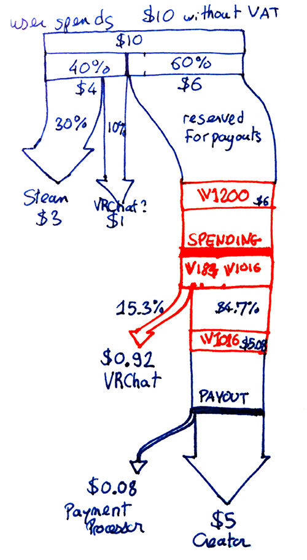
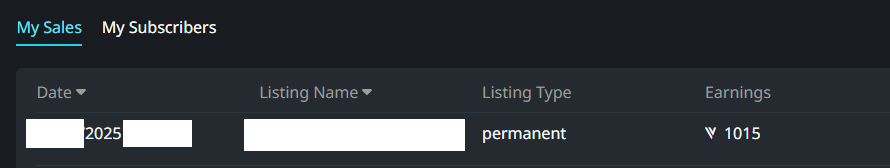

import {VBucksCalc} from "/src/components/VBucksCalc";

# VRChat Credits calculator (Experimental)

**VRChat Credits do not have one conversion rate:** The value of VRChat Credits depend on whether you are a user spending money,
a seller looking to earn money, or the company VRChat itself looking to take a commission from sales.

This page lets you compare the *perceived value* of VRChat Credits between the various parties involved.

---

This is an interactive spreadsheet/conversion table. You can edit any field below.

I tried my best, but there may be inaccuracies. Use your due diligence.

<VBucksCalc />

----

*\*VRChat keeps earning transaction fees when a seller reuses credits earned from sales to purchase from someone else's store, see [VRChat Credits](#vrchat-credits) section below.* <br/>
*\*\*The VRC+ estimates assume that VRChat earns 70% of the subscription price, see [VRChat Plus](#vrchat-plus) section below.*

----

## Sources

The calculations on this page is based on the official documentation regarding fees:

- [Creator Economy/Payout/Fees](https://creators.vrchat.com/economy/payout#fees).
  - [Screenshot 1](chrome_xR98WSTVET.png)
- [Creator Economy/Welcome to the Creator Economy](https://creators.vrchat.com/economy/welcome-to-the-ce#-revenue-split).
  - [Screenshot 2](chrome_lPDdXpzfSG.png)
  
The following sankey diagram attempts to illustrate the information above:



### Formulas

You can find the formulas used in the [source code](https://github.com/hai-vr/documentation/blob/main/src/components/VBucksCalc/index.tsx#L17).

```js
const c = {
    // Only the ratio between usdPaidByUser and vrchatCreditsGranted must remain correct
    usdPaidByUser: 10,
    vrchatCreditsGranted: 1200,
    // Other constants
    STEAM_OR_APPSTORE_REVENUE_SHARE: 0.3,
    VRCHAT_PLUS_MONTHLY_SUBSCRIPTION_PRICE_USD: 10,
    VRCHAT_PLUS_YEARLY_SUBSCRIPTION_PRICE_USD: 100,
    // Source used for fees: https://creators.vrchat.com/economy/payout/#fees
    PURCHASE_FEE: 0.4, // Note: PURCHASE_FEE must be higher or equal to STEAM_OR_APPSTORE_REVENUE_SHARE.
    TRANSACTION_FEE: 0.153,
    PAYOUT_FEE: 0.015,
    // Source used for minimum price: https://hello.vrchat.com/avatar-marketplace
    VRCHAT_AVATAR_MARKETPLACE_MINIMUM_PRICE_CREDITS: 1200,
};
// Credit purchase
const usdPaidByUser = c.usdPaidByUser;
const vrchatCreditsGranted = c.vrchatCreditsGranted;
const usdEarnedBySteam = c.STEAM_OR_APPSTORE_REVENUE_SHARE * c.usdPaidByUser;
const usdCreatorEconomy = (1 - c.PURCHASE_FEE) * c.usdPaidByUser;
// Sales and payout
const usdEarnedByVRChat = (c.usdPaidByUser - usdEarnedBySteam - usdCreatorEconomy) + c.TRANSACTION_FEE * usdCreatorEconomy;
const vrchatCreditsPayout = (1 - c.TRANSACTION_FEE) * c.vrchatCreditsGranted;
const usdPaymentProcessor = (usdCreatorEconomy - c.TRANSACTION_FEE * usdCreatorEconomy) * c.PAYOUT_FEE;
const usdPaidOutToCreator = usdCreatorEconomy - c.TRANSACTION_FEE * usdCreatorEconomy - usdPaymentProcessor;
// Estimations
const avatarsSoldAtMinPrice = c.vrchatCreditsGranted / c.VRCHAT_AVATAR_MARKETPLACE_MINIMUM_PRICE_CREDITS;
const vrcPlusMonthlySubs = usdEarnedByVRChat / ((1 - c.STEAM_OR_APPSTORE_REVENUE_SHARE) * c.VRCHAT_PLUS_MONTHLY_SUBSCRIPTION_PRICE_USD);
const vrcPlusYearlySubs = usdEarnedByVRChat / ((1 - c.STEAM_OR_APPSTORE_REVENUE_SHARE) * c.VRCHAT_PLUS_YEARLY_SUBSCRIPTION_PRICE_USD);
const employeesAt100kPerYear = usdEarnedByVRChat / 100_000;
```

### Revenue split and credit payout rate

The information about the Creator Economy revenue split is not used for those calculations, they only serve for verification.

The [revenue split](https://creators.vrchat.com/economy/payout/#revenue-split) of 30%/50%/20% is a proportion that naturally falls out
from applying the fees; or, more likely, some of the fees were selected to obtain this specific revenue split.

Similarly, the [credit payout rate](https://creators.vrchat.com/economy/welcome-to-the-ce/#-revenue-split) documented as *200 Credits ≈ 1 USD*
is a consequence of fees being removed from the original amount that the user had initially paid for the purchase of credits.

### Steam/Meta/Google/Apple revenue share

The revenue share varies between Steam, Meta, Google, and Apple, and it can even vary depending on [the total revenue generated by the app](https://steamcommunity.com/groups/steamworks/announcements/detail/1697191267930157838),
or [during the current year](https://support.google.com/googleplay/android-developer/answer/112622), or during its lifetime, or depending on whether transactions are a result of a recurring payment from a subscription.

Additionally, this does not include the possibility of commercial deals and contracts between VRChat and those platforms that we may not know about.

VRChat documents the [revenue split](https://creators.vrchat.com/economy/payout/#revenue-split) as being 30% for the platform; and
the **upper bound** for those app stores do seem to be 30%.

It is likely that VRChat's cut may be higher in cases where Steam, Meta, Google, or Apple apply a cut lower than 30%.

### Discrepancies

According to the official docs, the transaction fee is 15.3%, leading to 1,016.4 VRChat Credits being
transferred to the seller. However, it appears that the amount that the seller receives may actually be 1015 according to the screenshot below.

This makes it unclear whether VRChat's transaction fee is 15.4166…% (=185/1200) or 15.333…% (=186/1200);
this page may use one of those estimated fees.



## VRChat Credits

**When a user purchases $10 USD** worth of credits (without VAT):

- That user gets 1,200 VRChat Credits.
- 60% may be reserved for eventual payout (original value $6).
- Steam/Meta/Google/Apple get at most 30% (original value $3).
- A minimum of 10% goes to VRChat (original value $1).

**When a user spends 1,200 VRChat Credits**:

- The seller gets 1,015 VRChat Credits
(original value $8.45833…; payout value $5.075).
- VRChat keeps 185 VRChat Credits
(original value $1.54166…; payout value $0.925).
- This makes VRChat’s fee closer to 15.4166…% (=185/1200) than 15.333…% (=186/1200)
- Including the purchase fee, VRChat’s cut so far is $1.925 (= $1 +$0.925).
- If the seller also spends VRChat Credits on someone else’s store, VRChat keeps earning fees.

**When a seller requests a payout, the 1,015 VRChat Credits ($5.075 payout value)** they obtained results into:

- The payment processor gets $0.076125.
- The seller gets $4.998875.

Meaning that (with some rounding):

- When a user pays $10 USD
- Steam/Meta/Google/Apple get $3
- VRChat gets $1.925 ([not accounting for sellers who cannot request a payout](https://creators.vrchat.com/economy/payout#payout-requirements))
- The payment processor gets $0.075
- Seller gets $5

Put in another way:

- The value of 1,200 VRChat Credits *paid* is $10 USD for the user.
- The value of 1,200 VRChat Credits originally paid by the user leads to a $5 USD *payout* for the seller (*the seller receives 1,015 VRChat Credits*).
- The value of 1,200 VRChat Credits *entering circulation* is $2 USD for VRChat.
- This seems consistent with the claimed revenue share.

:::warning
The credit payout rate is *[200 Credits = 1 USD](https://creators.vrchat.com/economy/welcome-to-the-ce/#-revenue-split)*:
- This payout rate is based on **the amount of VRChat Credits that the seller receives after the sale**, which is 1,015 VRChat Credits out of a 1,200 VRChat Credits sale.
- If you consider the VRChat Credits originally paid by the user **before the transaction fee**, a user spending 1,200 VRChat Credits will lead to
the seller earning $5, which would be closer to *240 VRChat Credits before sale = 1 USD for the seller*.
:::

Put in dollars first:

- When VRChat earns $1,000,000 from CE:
    - The users have paid $5,000,000, and sellers have earned $2,500,000.
- When a seller earns $1,000,000 from CE:
    - The users have paid $2,000,000, and VRChat has earned $400,000.
- When users have paid $1,000,000 into CE:
    - VRChat may be earning $200,000, and sellers may earn $500,000.


## VRChat Plus

- A monthly subscription is $10 per month.
    - Steam gets at most 30% ($3).
    - VRChat gets minimum 70% ($7).
- A yearly subscription is $100 per year.
    - Steam gets at most 30% ($30).
    - VRChat gets minimum 70% ($70).

## Comparing VRChat Plus and VRChat Credits

A monthly subscription costs the user $10 that month:

- VRChat earns $7 from a month of a monthly subscription.
- It takes around 4,375 VRChat Credits for VRChat to earn that same amount.
- 4,375 VRChat Credits costs the user around $36.46.

A yearly subscription costs the user $100 that year:

- VRChat earns $70 from a year of a yearly subscription.
- It takes around 43,750 VRChat Credits for VRChat to earn that same amount.
- 43,750 VRChat Credits costs the user around $364.58.

## Comparing with the Avatar Marketplace

The minimum price of an avatar\* is 1,200 VRChat Credits.

- One month of a monthly VRChat Plus subscription is the equivalent of 3.65 avatars sold at minimum price for VRChat to earn the same amount.
- One year of a yearly VRChat Plus subscription is the equivalent of 36.46 avatars sold at minimum price for VRChat to earn the same amount.

Also:

- 1,000 avatars sold at minimum price is the equivalent of 274.29 total months of VRChat Plus monthly subscriptions sold for VRChat to earn the same amount.
- 1,000 avatars sold at minimum price is the equivalent of 27.43 total years of VRChat Plus yearly subscriptions sold for VRChat to earn the same amount.

*\*Source: [Avatar Marketplace, FAQ, "Is there a minimum price that avatar creators have to abide by?"](https://hello.vrchat.com/avatar-marketplace)* 

## Comparing with an hypothetical US salary

Assuming an employee earns $100K USD per year:

- 1 such employee requires 1,428 total years of yearly VRChat Plus subscriptions sold for VRChat to earn the same amount that year.
- 1 such employee requires $520,833 paid by users to purchase 62,500,000 VRChat Credits for VRChat to earn the same amount that year.

Assume 10 employees are paid $100K USD per year each:

- 10 such employees requires 14,285 total years of yearly VRChat Plus subscriptions sold for VRChat to earn the same amount that year.
- 10 such employees requires $5,208,333 paid by users to purchase 625,000,000 VRChat Credits for VRChat to earn the same amount that year.

Assuming a company of 100 people with an average 50K USD per year salary:

- Such a company requires 71,428 total years of yearly VRChat Plus subscriptions sold for VRChat to earn the same amount that year.
- Such a company requires $26,041,667 paid by users to purchase 3,125,000,000 VRChat Credits that year for VRChat to earn the same amount that year.

## Additional notes

This document does not account for the possibility of low-performing sellers who cannot request a payout because
[they are below the payout threshold](https://creators.vrchat.com/economy/payout#payout-requirements) and don't spend it elsewhere,
and users who leave the platform without spending their remaining credits.

In these cases, there may be credits that will in practice never be used, where VRChat could claim the amount that is normally
reserved for payouts in the Creator Economy.
