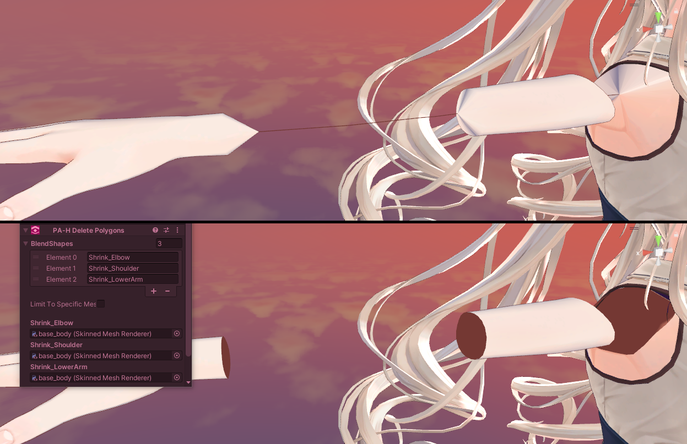

# ☀️ Delete Polygons (Prefabulous V1.6)

### New component: [Delete Polygons](/docs/products/prefabulous/universal/delete-polygons)

A new component, [Delete Polygons](/docs/products/prefabulous/universal/delete-polygons), has been added to Prefabulous Avatar.

Use it to delete polygons affected by conflict prevention blendshapes, and other unused decorations hidden inside the mesh.

🗒️ [Open documentation](/docs/products/prefabulous/universal/delete-polygons)

🔍 [View changelog](/docs/changelogs/prefabulous#160)

